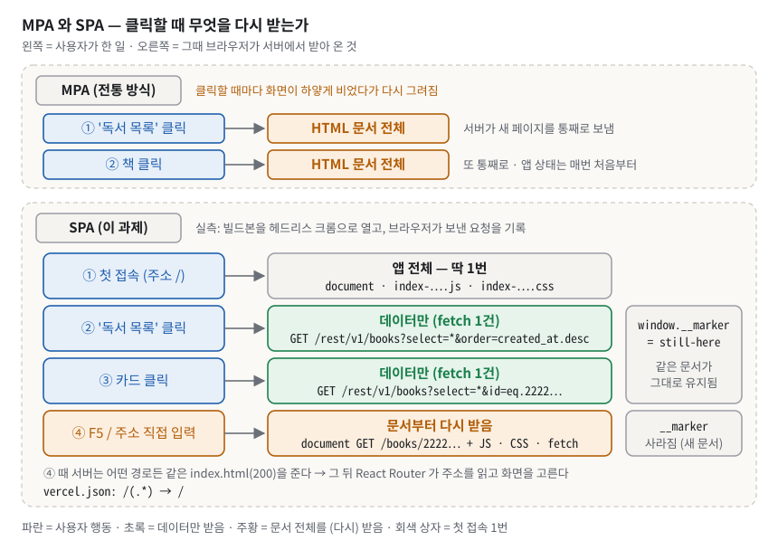
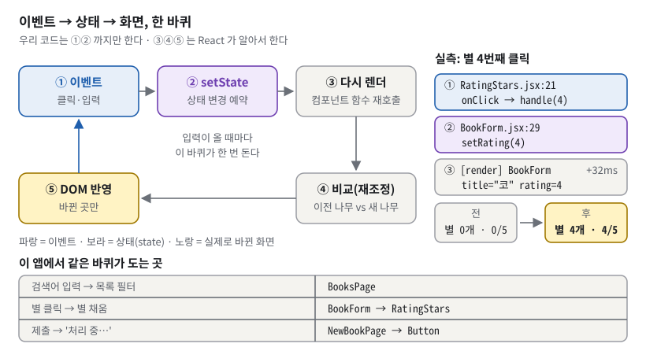
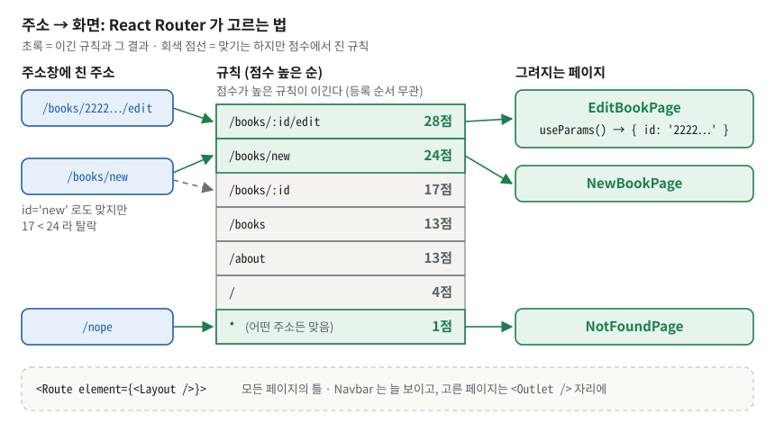
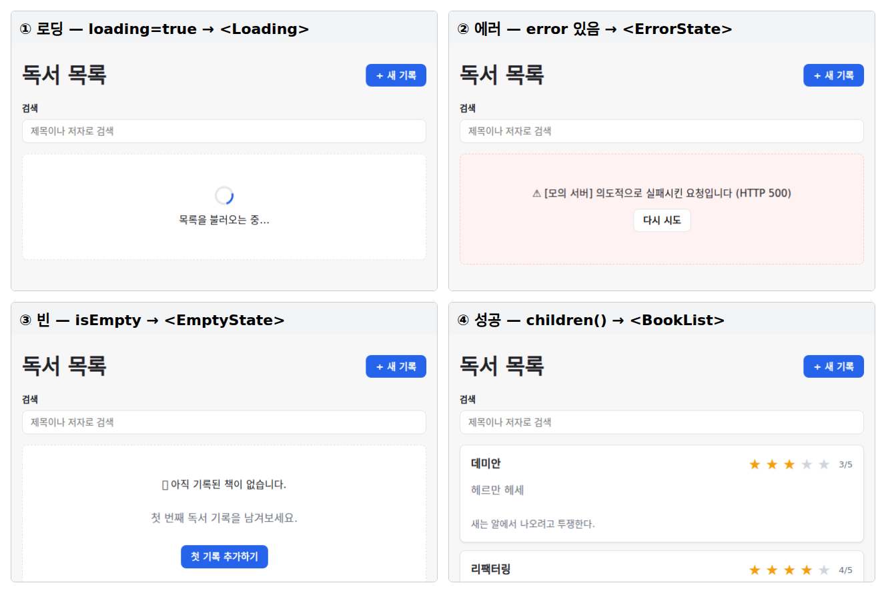
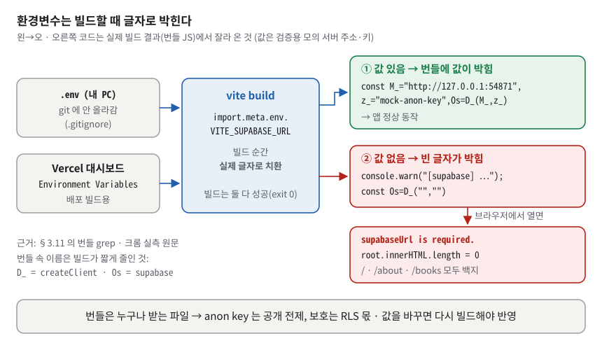
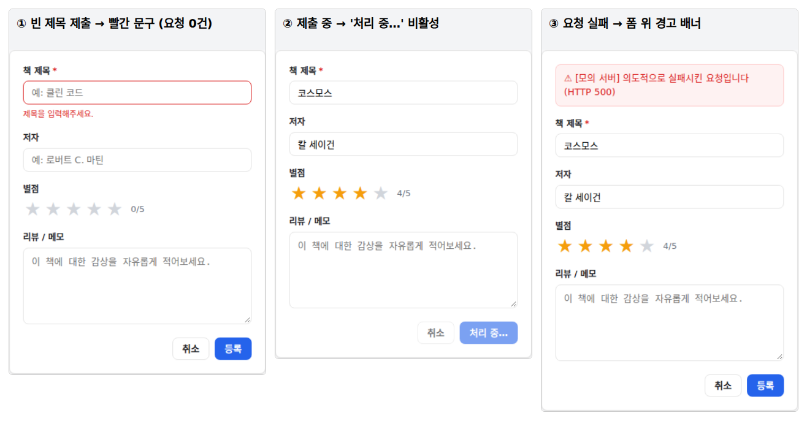

# B4-2 · 버튼 누르면 화면이 스르륵 바뀌는 요즘 웹사이트 만들기 — 구술 평가 대비 학습 문서

> 도서관 대출 카드함을 떠올려 보자. 예전 방식은 손님이 "목록 보여 주세요", "이 책 카드 보여 주세요"라고 할 때마다 사서가 건물 전체를 새로 지어서 안내했다. 이 과제의 방식은 다르다. 손님은 방 하나(웹 페이지 하나)에 계속 머물고, 사서는 칸막이(컴포넌트)만 바꿔 끼운다. 카드 원본은 멀리 있는 중앙 서고(Supabase)에 있고, 서고에 전화할 수 있는 사람은 사서 한 명(`src/lib/books.js`)뿐이다.
>
> 정확히 말하면: **React 18** 로 라우트 6개(+404)를 가진 **SPA(Single Page Application)** 'Reading Log' 를 만들고, **Supabase** 의 `books` 테이블 하나를 등록·조회·수정·삭제(CRUD)하면서 "사용자 이벤트 → 상태 변화 → 렌더링 변화"와 로딩/에러/빈 상태 처리를 결과물로 증명하는 과제다. 평가는 백엔드가 아니라 **React 구조와 데이터 흐름**을 본다(원문: "UI 고퀄리티보다 'React 구조와 데이터 흐름'이 우선이다.").

**읽는 법.**
① 처음이면 §1 부터 끝까지 정독한다(약 195분. 하루에 다 읽기 어렵다면 1일차 §1~§3.8, 2일차 §3.9~§5, 3일차 §6~§8. 각 절의 "한 칸 아래"와 §6.5 의 심화 문답은 첫 독서에서 건너뛰어도 된다). ② 평가 전날이면 §1 · §5 · §6 · §7 만 다시 본다. ③ 평가 30분 전이면 §8 만 본다.
§6 의 접이식 문답은 **질문만 보고 먼저 소리 내어 답해 본 뒤** 펼친다. 펼쳐서 읽기만 하면 평가장에서 입이 열리지 않는다.

> [!IMPORTANT]
> **이 문서의 실행 결과는 진짜 Supabase 대신 흉내 낸 '모의 서버'로 잰 것이다.** 앱 코드·라이브러리·브라우저 요청은 진짜이고, 화면의 "[모의 서버] …" 문구와 렌더 순서 로그(`[render] …`)만 검증용으로 덧붙은 것이다(자세한 방법은 §4.4). 원본 저장소는 한 글자도 바꾸지 않았다.

## 1. 한눈에 보기

### 1.1 이 과제를 한 문장으로

**비유.** 머리말의 도서관을 이어 가자. 손님(사용자)이 창구 벨을 누르면(이벤트) 사서(React)가 안내판 메모(state)를 고치고, 방 안 칸막이(화면)가 메모대로 바뀐다. 방(HTML 문서)은 처음 한 번만 짓는다. 책 카드(데이터)는 멀리 있는 중앙 서고(Supabase)에 전화(HTTP 요청)해서 받아 온다.

**정확한 정의.** 브라우저가 처음 한 번 받는 빌드된 `index.html`(481바이트, 사실상 빈 상자. 저장소의 원본 `index.html` 은 383바이트이고, 빌드가 개발용 `/src/main.jsx` 줄을 완성된 JS·CSS 파일 연결 줄 두 개로 바꿔 조금 커진다) 안에서, React 가 주소(URL)에 맞는 페이지 컴포넌트를 골라 그리고, 페이지는 커스텀 훅을 통해 Supabase 에 데이터를 요청하며, 요청의 진행 상황(로딩·에러·빈·성공)을 공통 컴포넌트 `AsyncView` 가 한 곳에서 화면으로 바꾸는 웹 애플리케이션이다.


*그림 1. Reading Log 전체 구조 — 브라우저 안의 React 앱은 `lib/books.js` 한 곳을 통해서만 Supabase 와 대화한다*

그림 1 에서 봐야 할 것은 네 가지다(REST API·GET/POST·JSON 같은 말은 §3.10 에서 푼다. 지금은 "앱이 서버에 부탁하고 답을 받는다"로만 읽으면 된다).

- **가운데 다섯 칸은 화면이 겹쳐 그려지는 순서다.** 라우팅이 `Layout` 을 고르고, `Layout` 안에 페이지가 들어가고, 페이지가 훅을 부르고, 훅이 데이터 함수를 부른다. 사용자 이벤트 중 **링크 클릭·주소 입력만** '라우팅'으로 들어간다. 별 클릭·글자 입력은 그 버튼·입력 칸을 가진 컴포넌트가 바로 받는다(§3.5). 코드의 import 방향 규칙은 이것과 조금 다르다. `lib` ← `hooks` ← `pages` 이고 `components` 는 `pages` 를 모른다. 이 규칙은 문서가 아니라 `scripts/check.mjs` 가 검사로 강제한다(`scripts/check.mjs:103-109`, §3.14 의 그림 11). 경로표 `routes.js` 는 페이지·`Navbar`·`BookList` 가 함께 읽는 공용 상수 표라서 이 방향 규칙 밖이다. 그래서 그림에서도 라우팅 칸 밖에 따로 그렸다.
- **UI 컴포넌트 상자의 두 숫자.** `src/components/` 파일은 13개이고, 그중 prop 을 받아 모양·동작이 달라지는 **재사용 컴포넌트는 11개**다(§3.3). 평가장에서는 11개라고 말한다.
- **오른쪽으로 나가는 파란 화살표는 딱 한 칸에서만 나간다.** Supabase 에 말을 거는 코드는 `src/lib/books.js` 뿐이다. 페이지·컴포넌트·훅 어디에도 Supabase 문법이 없다. 그래서 백엔드를 바꿔도 이 파일 하나만 고치면 된다(§6.4 의 Firebase 질문).
- **오른쪽 위 Vercel 에서 사용자로 가는 점선.** 배포하면 사용자는 여기서 `index.html` 과 JS 를 처음 한 번 받는다. 점선인 이유는 **아직 배포 URL 이 없기 때문**이다. 이것이 이 과제의 가장 큰 약점이다(§7.1).

### 1.2 평가자는 무엇을 보나

평가 체크리스트(`checklists_md/react_crud_app.md`)는 4영역 16문항이다. 이 문서는 16문항 전부를 §6 에 그대로 옮겨 두었다.

| 영역 | 문항 수 | 평가자가 확인하는 것 | 대비하는 곳 |
|---|---|---|---|
| 1. 기능 동작 검증 | 5 | 라우트 5개+·404, CRUD 5종, 로딩/에러/빈 상태, 폼 검증·제출 중, **배포 URL** 을 직접 보여 주는가 | §5 시연, [§6.1](#61-기능-동작-검증) |
| 2. 구현 구조 설명 | 5 | 커스텀 훅 분리 이유, 폴더 구조 이유, 재사용 컴포넌트 8개+와 나눈 기준, 상태 UI 통일을 코드로 | §3.3, §3.8, §3.9, §3.14, §4, [§6.2](#62-구현-구조-설명) |
| 3. 핵심 개념 이해 | 4 | props/state 와 상태 위치, useEffect 실행 시점·의존성, 비동기 4상태, 상태→화면 변화 3곳+ | §3.4~§3.8, [§6.3](#63-핵심-개념-이해) |
| 4. 확장 사고·트러블슈팅 | 2 | 한 기능의 라우팅→컴포넌트→상태→이벤트→렌더링, Supabase 선택 이유와 어려움 | §4.2, §3.10, §3.11, [§6.4](#64-확장-사고--트러블슈팅) |

**현재 상태를 한 줄로.** 16문항 중 15문항은 코드와 실측으로 답할 수 있다. **1-5(배포 URL)는 지금 미충족**이다 — URL 이 저장소 어디에도 없다. 평가 전에 학습자가 직접 배포해야 한다(§7.1). 4-2(Supabase 선택 이유)는 README 에 적혀 있지 않으므로 이 문서의 후보를 참고해 **본인 말로** 준비해야 한다.

**평가자 성향 (이 학습자가 실제로 받은 피드백에서).** 평가자는 기능이 아니라 **메커니즘을 한 칸 아래까지** 묻는다("그게 내부적으로 어떻게 되나요?"). 이름이 아니라 **선택 기준**을 묻는다("대안 대신 왜 이걸?"). 주석 없이 코드를 **읽는 속도**를 본다. 동작과 별개로 **코드 품질**(실패가 조용한가, 규칙이 검사인가 문서인가, 배포 형태)을 지적한다. 그래서 이 문서의 모든 답은 "첫 문장에 결론 → 근거 숫자 → 코드 위치" 순서로 짜여 있다. 주석 없이 코드 읽기는 §5.8 에서, 이전 평가에서 실제로 받은 DB 질문(CHECK 의 동작, 인덱스의 저장·탐색)은 §3.12 와 Q6.5-17·Q6.5-18 에서, 대안과의 비교는 §4.3 에서 대비한다.

### 1.3 30초 자기소개 스크립트

평가가 시작되면 아래를 그대로 말한다. 소리 내어 읽으면 약 30초다.

> "React 18 과 Supabase 로 독서 기록 SPA 'Reading Log' 를 만들었습니다. 라우트 여섯 개와 404 가 있고, 책 기록을 등록, 조회, 수정, 삭제합니다. 핵심 설계는 두 가지입니다. 첫째, Supabase 를 부르는 코드는 `lib/books.js` 한 파일에만 두고, 훅은 상태만, 페이지는 화면만 맡겼습니다. 둘째, 로딩·에러·빈·성공 화면을 `AsyncView` 한 곳에서 고르게 해서 모든 화면이 똑같이 동작합니다. 이 층 구조는 `npm run lint` 검사 10종이 강제합니다."

§5.1 에서 **본인 Supabase 프로젝트에 연결해 직접 확인했다면** 마지막에 한 문장을 붙인다: "제 Supabase 프로젝트에 연결해 등록부터 삭제까지 확인했습니다." 이 문서의 브라우저 실측은 모의 서버로 한 것이라, 본인이 해 보지 않았으면 이 문장은 말하지 않는다.

> [!WARNING]
> 배포를 마치기 전이라면 마지막 문장 뒤에 한 문장을 덧붙인다: "배포 URL 은 아직 제출하지 못했습니다. 오늘은 로컬 프로덕션 빌드로 같은 흐름을 보여 드리겠습니다." (**프로덕션 빌드** = 배포용으로 묶고 줄인 결과물. 그것을 내 PC 에서 띄워 보여 준다는 뜻이다, §3.1.) 숨기다 들키는 것보다 먼저 말하는 편이 낫다.

## 2. 명세 정독 — 무엇을 요구받았나

### 2.1 요구사항 지도

ID 는 README 0.4 절의 ID 이고 PDF 순서와 같다. 상태: ✅ 충족 · ⚠️ 부분 · ❌ 미충족 · 🔍 이 환경에서 검증 불가. '왜' 열에 나오는 전문용어는 §3 에서 차례로 풀이한다(부록 A 용어집 참고).

| ID | 원문 요지 (PDF 그대로) | 쉬운 말 | 왜 이런 요구를? | 내 구현 | 상태 |
|---|---|---|---|---|---|
| `결과물1` | "최소 5개 이상의 페이지 라우트가 존재한다." (예: `/`, `/login`, `/items`, `/items/:id`, `/items/new`, `/profile`) | 주소가 5개 이상 | SPA 라우팅을 직접 겪게 | `src/routes.js:14-22` | ✅ 6개 + 404 |
| `결과물2` | 핵심 데이터를 "등록/조회/수정/삭제할 수 있다." "목록 페이지와 상세 페이지가 존재한다." | CRUD 전부 | 데이터 흐름 전 구간 | `src/lib/books.js:85-129` | ✅ 충족 |
| `결과물3` | "유효성 검증 + 에러 표시 + 제출 중 상태가 UI로 드러난다." | 폼 UX 3종 | 사용자 입력 흐름 | `src/components/BookForm.jsx:31-48` | ✅ 충족 |
| `결과물4` | "로딩/에러/빈 상태가 모든 핵심 화면에서 일관된 방식으로 처리된다." "컴포넌트 단위로 상태가 적절히 분리" | 상태 화면 통일 | 비동기 UI 패턴 | `src/components/AsyncView.jsx:25-28` | ✅ 충족 |
| `결과물5` | "외부에서 접속 가능한 제출 URL(예: Vercel/Netlify 등)", GitHub URL, README 에 "실행 방법"과 "기술 스택" | 배포 + 문서 | "동작하는 것"을 증명 | 스택 `README.md:530-539`, 실행 `README.md:541-601`, 배포 절차 `README.md:616-624` | ❌ 배포 URL 없음 / README ✅ |
| `R1-1` | "React 프로젝트로 시작한다." | React 로 | — | `package.json:18` | ✅ 설치본 18.3.1 |
| `R1-2` | pages / components / hooks 또는 lib 역할 분리 | 폴더 역할 분리 | 관심사 분리(§3.14) | `src/` 트리 | ✅ + 검사로 강제 |
| `R1-3` | "공통 레이아웃(헤더/네비게이션)이 주요 페이지에 적용" | 헤더 공통 | 틀 하나에 페이지를 끼워 재사용 | `src/App.jsx:15`, `src/components/Layout.jsx:4-12` | ✅ 404 포함 전 라우트 |
| `R1-4` | "단일 핵심 데이터 CRUD가 가능한 수준으로 제한" | 데이터 1종 | 범위 제한 | `src/lib/supabase.js:14` `'books'` | ✅ 충족 |
| `R2-1` | "최소 5개 라우트가 동작해야 한다." | 5개 이상 | — | `src/App.jsx:16-21` | ✅ 6개(404 제외) |
| `R2-2` | "목록/상세 라우트가 포함" (예: `/items`, `/items/:id`) | 목록·상세 주소 | URL 이 곧 상태 | `src/routes.js:16`, `src/routes.js:18` | ✅ `/books`, `/books/:id` |
| `R2-3` | "잘못된 주소 접근 시 Not Found 페이지" | 404 | 나머지 주소 처리 | `src/App.jsx:22`, `src/pages/NotFoundPage.jsx:8-16` | ✅ (HTTP 는 200, §3.2) |
| `R2-4` | "네비게이션을 통해 주요 라우트로 이동 가능한 링크" | 메뉴 | 이동 수단 | `src/routes.js:45-50`, `src/components/Navbar.jsx:13-24` | ✅ 링크 4개 + 로고 |
| `R3-1` | "최소 8개 이상의 '재사용 컴포넌트'" | 8개 이상 | 추출 기준을 생각하게 | `src/components/` | ✅ prop 수용 11개 |
| `R3-2` | 재사용 컴포넌트 = "최소 1개 이상의 prop을 받아 동작이나 표시가 달라지는 컴포넌트" | 세는 규칙 | 무엇을 prop 으로 받을지 정하기 | §6.2 Q6.2-3 표 | ✅ `Navbar`·`Layout` 은 빼고 셈 |
| `R3-3` | "'페이지 컴포넌트'와 'UI 컴포넌트'가 섞이지 않도록 분리" | 섞지 않기 | 재사용·테스트 | `scripts/check.mjs:87-118` | ✅ 충족 |
| `R3-4` | "동일한 UI 패턴(로딩/에러/빈 상태)은 … 재사용 가능한 컴포넌트로 통일" | 페이지마다 안 만들기 | 중복 제거 | `src/components/AsyncView.jsx:16-29` | ✅ (폼 실패 배너만 예외, §7) |
| `R4-1` | "폼 입력 상태 (controlled input)" | value + onChange | 입력값의 주인을 state 한 곳으로 | `src/components/BookForm.jsx:20-27`, `src/components/Input.jsx:26-27` | ✅ 충족 |
| `R4-2` | "목록/상세 데이터 상태" | 데이터 state | — | `src/hooks/useBooks.js:11`, `src/hooks/useBookDetail.js:6` | ✅ 충족 |
| `R4-3` | "로딩/에러 상태" | 진행·실패 state | 기다리는 중·실패를 state 로 표현 | `src/hooks/useBooks.js:12-13`, `src/hooks/useBookDetail.js:7-8` | ✅ 충족 |
| `R4-4` | "최소 1개 이상은 커스텀 훅으로 분리" (예: `useItems()`, `useItemDetail(id)`) | 훅 분리 | 로직 재사용 | `src/hooks/` 2개 | ✅ 충족 |
| `R5-1` | "CRUD는 반드시 Supabase 또는 Firebase의 원격 데이터 기준으로 동작" | 진짜 서버 | 비동기의 본질 | `src/lib/supabase.js:12`, `src/lib/books.js:85-129` | ✅ 코드·모의 서버로 실제 HTTP 확인 / 🔍 실제 Supabase 왕복 |
| `R5-2` | "목록 조회: 리스트 UI가 렌더링된다." | 목록 | — | `src/pages/BooksPage.jsx:57`, `src/components/BookList.jsx:7-27` | ✅ 충족 |
| `R5-3` | "상세 조회: 라우트 파라미터로 특정 데이터를 불러와 렌더링" | `:id` 로 조회 | URL → 요청 | `src/pages/BookDetailPage.jsx:13-15`, `src/lib/books.js:95-103` | ✅ 충족 |
| `R5-4` | "등록/수정: 폼 입력 → 제출 → 성공 시 이동/갱신 흐름" | 저장 후 이동 | — | `src/pages/NewBookPage.jsx:16-17`, `src/pages/EditBookPage.jsx:21-22` | ✅ 충족 |
| `R5-5` | "삭제: 삭제 후 목록 갱신 또는 이동 흐름" | 지우고 이동 | 화면과 서버 맞추기 | `src/pages/BookDetailPage.jsx:19-30` | ✅ 충족 |
| `R6-1` | "필수값 검증이 존재" (예: 제목/내용 비어있으면 제출 불가) | 빈칸 막기 | — | `src/lib/books.js:37`, `src/components/BookForm.jsx:36` | ✅ 요청 0건 |
| `R6-2` | "에러 메시지가 입력 필드 근처 또는 상단에 표시" | 어디가 틀렸는지 | — | `src/components/Input.jsx:31`, `src/components/BookForm.jsx:44-48` | ✅ (고쳐도 다음 제출까지 남음, §7) |
| `R6-3` | "제출 중에는 버튼 비활성화 또는 스피너 등 '진행 중' 상태" | 중복 제출 방지 | — | `src/components/BookForm.jsx:93`, `src/components/Button.jsx:45-49` | ✅ 충족 |
| `R6-4` | "요청 실패 시(네트워크/권한/기타 오류) … 실패 사실이 화면에 표시" | 실패 알림 | — | `src/pages/NewBookPage.jsx:18-21`, `src/pages/EditBookPage.jsx:23-26`, `src/pages/BookDetailPage.jsx:26-29` | ✅ 등록·수정·삭제·조회 실패 모두 실측 |
| `R7-1` | "사용자 이벤트(클릭/입력/제출 등)가 상태 변경으로 이어지고, 렌더링이 변하는 흐름이 명확" | 선언적 렌더링(§3.5) | React 의 핵심 | §3.5 | ✅ 충족 |
| `R7-2` | "상태 변경이 렌더링 변화로 이어지는 지점이 최소 3군데 이상" | 3곳 이상 | — | Q6.3-4 의 5곳 | ✅ 충족 |
| `R8-1` | 배포 URL 에서 "목록/상세 조회" | 배포본 동작 | — | — | ❌ URL 없음 |
| `R8-2` | 배포 URL 에서 "등록/수정/삭제" | 〃 | — | — | ❌ URL 없음 |
| `R8-3` | "환경변수 등 설정 누락으로 인해 배포 환경에서 기능이 일부라도 동작하지 않으면 요구사항을 충족하지 못한다." | 설정 누락 = 불합격 | 빌드할 때 값이 박힘(§3.11) | `src/lib/supabase.js:3-12`, `vercel.json:2-4` | ⚠️ 준비는 됨, 누락 시 **앱 전체 백지**(§3.11) |

README 0.10 의 자체 판정은 "필수 38개 중 충족 34 / 부분 1 / 미충족 0 / 로컬검증불가 3"(`README.md:351`)이다. 이 문서는 R8-1·R8-2 를 ❌ 로 본다. 이유: "검증 불가"는 URL 이 있는데 접속만 못 할 때 쓰는 말이고, 지금은 **검증할 대상 자체가 없다**. 검수 기록(`review/review_all.md` B4-2 절)도 같은 이유로 체크리스트 1-5 를 미충족으로 판정했다.

### 2.2 지켜야 할 제약과 그 이유

| 원문 (PDF 그대로) | 왜 이런 제약을 거나 | 이 저장소 | 근거 |
|---|---|---|---|
| "React 18 이상" | `createRoot`·자동 배칭·StrictMode 의 effect 이중 실행 등 React 18 의 동작이 전제(훅 자체는 16.8 부터 있었다) | ✅ 18.3.1 | `package.json:18` |
| "Supabase 또는 Firebase 사용한다." | 원격 데이터여야 로딩·에러가 실제로 생긴다 | ✅ Supabase 하나만 | `scripts/check.mjs:140-161` 가 firebase 를 막음 |
| "백엔드 고급 기능(권한/RLS/Rules, 복잡한 관계 설계)은 필수가 아니다." | 평가 초점은 React | RLS(행마다 누가 읽고 쓸 수 있는지 정하는 DB 규칙, §3.11)를 끔(실습용) | `README.md:564-568` |
| "라우팅이 존재해야 한다." · "페이지/컴포넌트/훅(또는 lib)이 분리되어야 한다." | 구조를 학습하게 | ✅ 충족 | §3.14 |
| "UI 고퀄리티보다 'React 구조와 데이터 흐름'이 우선이다." | 꾸미기보다 흐름 | CSS Modules 로 최소 스타일 | — |
| "백엔드 서버를 직접 구현하는 방식은 요구하지 않는다." | 프론트엔드 과제 | ✅ 서버 코드 0줄 | — |
| "TypeScript 사용은 선택 사항이다." | — | JavaScript | — |
| "반응형 디자인은 필수가 아닌 선택 사항이다." | — | — | — |
| "API Key 등 민감 정보는 .env 파일에 저장하고, .gitignore 에 .env 가 포함되어 있는지 반드시 확인한다." | 키가 GitHub 에 올라가는 사고 방지 | ✅ 충족 | `.gitignore:11-14`, `scripts/check.mjs:163-167` |
| "API Key가 포함된 코드를 GitHub에 절대 푸시하지 않는다." | 한 번 푸시되면 히스토리에 영원히 남는다 | ✅ 전 커밋에서 `.env` 이력 0건, JWT(`eyJ…` 로 시작하는 긴 토큰, Supabase 키의 모양) 모양 문자열 0건(직접 `git log`/`git grep` 확인) | `scripts/check.mjs:168-173` |
| "배포 시에는 Vercel/Netlify 등의 대시보드에서 Environment Variables를 별도로 등록한다." | `.env` 는 git 에 없으니 배포 서버도 모른다 | 안내만 있음 | `README.md:621` |
| "환경변수 등 설정 누락으로 인해 배포 환경에서 기능이 일부라도 동작하지 않으면 요구사항을 충족하지 못한다." | 로컬에서만 되는 것은 결과물이 아니다 | ⚠️ 누락 시 전면 백지 | §3.11, §7.2 |

### 2.3 출력·형식 규칙

이 과제는 정해진 출력 형식이 없다. PDF 8절은 "정답이 아니라 참고 예시"로 아래 다섯 줄을 준다(원문 그대로).

```text
/items 에서 카드 리스트가 보이고, 로딩 중에는 스피너가 보인다.
리스트 항목 클릭 시 /items/123 로 이동하고 상세가 뜬다.
/items/new 에서 폼을 작성하고 저장하면 목록 또는 상세로 이동한다.
빈 데이터면 “표시할 데이터가 없습니다.”가 보인다.
에러면 “요청에 실패했습니다. 다시 시도하세요.”가 보인다.
```

이 저장소의 대응:

- `/books` 에서 카드 리스트, 로딩 중 스피너 ✅ (`src/pages/BooksPage.jsx:41-58`)
- 카드 클릭 → `/books/<uuid>` 상세 ✅ (`src/components/BookList.jsx:12`)
- `/books/new` 저장 → **상세**로 이동 ✅ (`src/pages/NewBookPage.jsx:17`)
- 두 문구는 **기본값**으로 들어 있다: `src/components/EmptyState.jsx:4`, `src/components/ErrorState.jsx:5`. 다만 실제 화면은 더 구체적인 문구를 prop 으로 넘기므로 기본값이 보일 일은 거의 없다. 평가자가 "예시 문구 어디 있나요?"라고 물으면 이 사실을 그대로 말한다.

이 앱이 실제로 쓰는 화면 문구(실측, 철자 그대로): "목록을 불러오는 중…", "기록을 불러오는 중…", "아직 기록된 책이 없습니다.", "첫 번째 독서 기록을 남겨보세요.", "첫 기록 추가하기", "검색 결과가 없습니다.", "해당 기록을 찾을 수 없습니다.", "수정할 기록을 찾을 수 없습니다.", "404 - 페이지를 찾을 수 없습니다.", "다시 시도", "처리 중…", "제목을 입력해주세요.", "이 기록을 삭제하시겠습니까?", "남긴 메모가 없습니다.", "저자 미상".

### 2.4 보너스 과제

| 보너스 (PDF 5절) | 했나 | 근거 |
|---|---|---|
| 1. 전역 상태 도입 — "로그인 사용자, 테마, 알림 중 하나를 전역 상태(Context 등)로" | ❌ 안 함 | `src/` 에서 `createContext`·`useContext` 0건(grep = 파일에서 글자를 찾는 명령) |
| 2. 성능 최적화 — "메모이제이션(useMemo/useCallback/React.memo) 중 1개 이상" | ✅ 함 | `useMemo` `src/pages/BooksPage.jsx:14-21`, `useCallback` `src/hooks/useBooks.js:15`, `src/hooks/useBookDetail.js:10`. `React.memo` 는 없음 |
| 3. 인증 추가 — "Supabase/Firebase Auth로 로그인 흐름 … 보호 라우트" | ❌ 안 함 | `supabase.auth` 0건(grep) |

보너스 2 는 조심해서 말한다. 여기서 `useCallback` 은 "성능"보다 **정확성** 때문에 필요하다. 빼면 요청이 무한히 반복된다(§3.7, §3.13).

## 3. 배경 개념 — 처음부터 차근차근

개념은 쉬운 것에서 어려운 것 순서로 14칸이다. 3.1~3.3 은 "웹 페이지가 무엇인가", 3.4~3.8 은 "React 가 화면을 어떻게 바꾸나"(체크리스트 3절의 핵심), 3.9~3.11 은 "데이터를 어떻게 가져오나", 3.12~3.14 는 "품질을 어떻게 지키나"다.

### 3.1 웹 페이지와 DOM — 브라우저가 받는 HTML 은 빈 상자 하나

**비유로 먼저.** 텅 빈 무대를 받았다고 하자. 무대(HTML)에는 "여기에 공연하시오"라는 표시 하나만 있다. 무대 감독(JavaScript)이 도착해서 소품을 들여놓아야 비로소 관객이 뭔가를 본다. 감독이 오지 않으면 관객은 빈 무대만 본다.
비유의 한계: React 는 소품을 매번 새로 만들지 않는다. 이전 무대와 비교해 바뀐 소품만 교체한다(§3.5 의 재조정).

**정확히 말하면.** 브라우저는 서버에 **요청**(request, "이 파일 주세요")을 보내고 **응답**(response, 파일 내용)을 받는다. 받은 **HTML**(뼈대)을 읽어 메모리에 나무 모양의 구조를 만드는데, 이것이 **DOM**(Document Object Model, 문서 객체 모델)이다. **CSS** 는 모양, **JavaScript(JS)** 는 동작을 맡는다. JS 가 DOM 나무를 바꾸면 화면이 바뀐다.

**빌드**는 우리가 쓴 여러 소스 파일(`src/` 의 27개)을 브라우저가 받을 몇 개 파일로 묶고 줄이는 작업이고, 그 결과 파일을 **번들**(bundle)이라 한다. **개발 서버**(`npm run dev`)는 코드를 고치면 바로 반영하고 경고·검사(StrictMode 이중 실행 등, §3.7)를 켜 둔 개발용 실행이다. **프로덕션 빌드**(`npm run build`)는 그런 개발용 코드를 빼고 압축해 `dist/` 폴더에 만든 배포용 결과물이다. `npm run preview` 는 그 결과물을 내 PC 에서 띄워 본다. 이 과제의 빌드 도구는 **Vite** 다.

**구체적인 숫자로.** 이 앱을 빌드하면(`vite build`, 직접 실행) 결과가 셋이다.

```text
dist/index.html                   0.47 kB │ gzip:   0.34 kB
dist/assets/index-CP4j40kQ.css    5.54 kB │ gzip:   1.78 kB
dist/assets/index-BDIUlBz-.js   401.16 kB │ gzip: 117.05 kB
```

오른쪽 `gzip` 열은 서버가 전송할 때 한 번 더 압축한 크기다. HTML 은 481바이트뿐이다. 화면에 보이는 모든 것 — 메뉴, 목록, 폼 — 은 401 kB 짜리 JS 가 만든다. 그래서 JS 가 실행 도중 죽으면 화면은 완전히 비어 버린다. 실제로 환경변수 없이 빌드한 앱을 크롬으로 열면 `root.innerHTML.length = 0` 이 찍힌다(§3.11).

**이 과제에서는.** `index.html:10` 의 `<div id="root"></div>` 가 빈 상자이고, `index.html:11` 이 JS 를 불러온다. JS 의 시작점은 `src/main.jsx:7-13` 이다.

```jsx
ReactDOM.createRoot(document.getElementById('root')).render(   // 빈 상자를 찾아 React 에게 맡긴다
  <React.StrictMode>          // 개발 중 버그를 드러내는 검사 모드 (§3.7)
    <BrowserRouter>           // 주소창 URL 을 React 가 읽게 한다 (§3.6)
      <App />                 // 앱 전체
    </BrowserRouter>
  </React.StrictMode>,
)
```

이 앱에서 DOM 을 직접 찾는 코드는 이 한 줄(`document.getElementById`)뿐이다. 나머지는 전부 React 에게 "이렇게 보여야 한다"고 선언만 한다(§3.5).

**한 칸 아래.** 브라우저는 HTML → DOM, CSS → CSSOM(스타일 나무)을 만들고, 둘을 합쳐 각 요소의 위치를 계산(layout)한 뒤 픽셀로 칠한다(paint). `<script type="module">` 을 받으면 내려받아 실행하고, 이때 `createRoot(…).render(…)` 가 root 안에 DOM 요소를 넣는다. DOM 을 바꿀 때마다 브라우저는 위치 계산과 칠하기를 다시 할 수 있으므로, **바뀐 곳만 고치는 것**이 성능에 중요하다. React 가 "바뀐 부분만 반영"하는 이유다.

> [!WARNING]
> **흔한 오해.** "React 앱은 페이지마다 HTML 파일이 있다." ✗ — 이 앱의 HTML 파일은 `index.html` 하나다. `/books`, `/about` 같은 "페이지"는 JS 가 같은 상자 안에 다른 컴포넌트를 그린 결과다.

### 3.2 SPA 와 MPA — 문서는 한 번, 그다음은 데이터만

**비유로 먼저.** 식당에서 메뉴를 바꿀 때마다 테이블을 치우고 새로 차리는 곳(MPA)과, 테이블은 그대로 두고 접시만 바꿔 주는 곳(SPA)이 있다. 미션 제목 "버튼 누르면 화면이 스르륵 바뀌는"의 정체가 뒤쪽이다.
비유의 한계: SPA 도 처음 한 번은 테이블 전체(앱 JS 401 kB)를 차려야 해서 첫 로딩이 무겁다.

**정확히 말하면.** **MPA**(Multi Page Application)는 링크를 누를 때마다 서버가 새 HTML 문서를 보내는 전통 방식이다. **SPA**(Single Page Application)는 문서 하나를 받은 뒤, JS 가 주소와 화면을 바꾸고 필요한 **데이터만** 서버에 따로 요청한다. 데이터만 요청할 때 쓰는 브라우저 기능이 **fetch** 이고, 읽기 요청의 종류를 **GET** 이라고 부른다(HTTP 는 §3.10 에서 자세히).


*그림 2. MPA 와 SPA — SPA 는 첫 접속에만 문서를 받고, 이후 클릭은 데이터(fetch)만 받는다 (실측 요청 목록)*

그림 2 의 아래 띠가 이 앱에서 실제로 잰 요청 목록이다. ①에서만 문서(document)·JS·CSS 세 개를 받는다. ②·③ 클릭 때는 초록 상자로 표시된 **데이터 요청 하나씩만** 나간다. 오른쪽 회색 상자의 `window.__marker` 는 실험을 위해 첫 화면에서 페이지에 심어 둔 표식인데, ②·③ 뒤에도 그대로 남아 있다 — **같은 문서가 계속 살아 있다**는 증거다. 주황색 ④(F5)에서만 문서를 다시 받고 표식이 사라진다.

**구체적인 숫자로.** 헤드리스 크롬(화면 없이 코드로 조종하는 브라우저)으로 프로덕션 빌드를 열고 브라우저가 보낸 요청을 기록한 결과다(원문. `MOCK` 은 모의 서버 주소이고, 마지막 줄의 `…` 는 윗줄과 같은 내용을 줄인 것).

```text
[spa] 첫 진입 / : [('document', 'GET', '/'), ('script', 'GET', '/assets/index-B_tNs2sn.js'), ('stylesheet', 'GET', '/assets/index-CP4j40kQ.css')]
[spa] 네비 클릭 → /books : [('fetch', 'GET', 'MOCK/rest/v1/books?select=*&order=created_at.desc')] | window.__marker = still-here
[spa] 카드 클릭 → 상세 : [('fetch', 'GET', 'MOCK/rest/v1/books?select=*&id=eq.22222222-2222-4222-8222-222222222222')] | window.__marker = still-here
[spa] 새로고침(F5) : [('document', 'GET', '/books/22222222-2222-4222-8222-222222222222'), ('script', …), ('stylesheet', …), ('fetch', 'GET', …)] | window.__marker = undefined(새 문서)
```

**이 과제에서는.** `src/main.jsx:9` 의 `BrowserRouter` 가 주소창을 React 와 연결한다. 메뉴와 카드는 `<a href>` 대신 React Router 의 `<Link>`·`<NavLink>` 를 쓴다(`src/components/BookList.jsx:12`, `src/components/Navbar.jsx:14-21`). 서버 쪽 준비는 `vercel.json:2-4` 한 규칙이다.

```json
{ "rewrites": [ { "source": "/(.*)", "destination": "/" } ] }
```

"어떤 경로(`/(.*)`)로 와도 루트의 `index.html` 을 준다"는 뜻이다.

**한 칸 아래.** `<Link>` 는 화면에는 평범한 `<a href="/books">` 를 그리지만, 클릭을 가로채 기본 동작(문서 새로 받기)을 막고(`preventDefault`), 브라우저의 **History API** `history.pushState` 로 주소만 바꾼 뒤 React Router 에게 다시 그리라고 알린다. 뒤로/앞으로 버튼은 `popstate` 이벤트로 같은 일을 한다. 그런데 **주소창에 직접 입력하거나 F5 를 누르면** 요청이 서버로 간다. 서버에 `/books/2222…` 라는 파일은 없으므로, 서버가 모든 경로에 `index.html` 을 돌려주도록 설정(**SPA fallback**, rewrite)하지 않으면 호스팅이 404 를 낸다. 로컬 `vite preview` 도 같은 방식으로 동작해 `/nope/deep` 까지 전부 `200 text/html 481B` 를 준다(실측. 200 은 서버가 "정상 처리했다"고 답하는 상태 번호다, §3.10).

> [!WARNING]
> **흔한 오해.** "SPA 의 404 화면은 서버가 준다." ✗ — 서버는 모든 주소에 200 과 같은 `index.html` 을 준다. "없는 페이지" 판단은 브라우저 안의 React Router 가 한다. 그래서 화면은 404 인데 HTTP 는 200 인 **소프트 404** 가 된다.
> "SPA 는 서버가 필요 없다." ✗ — 정적 파일 서버와 fallback 설정이 필요하다. `vercel.json` 이 그 설정이다.

### 3.3 컴포넌트와 JSX — 화면 조각을 만드는 함수

**비유로 먼저.** 레고 블록이다. 같은 모양의 블록(`Button`)을 일곱 곳에 끼운다. 블록을 새로 깎지 않는다.
비유의 한계: 레고 블록은 모양이 고정이지만, 컴포넌트는 끼울 때 주는 설정값(props)에 따라 색·글자·동작이 달라진다.

**정확히 말하면.** **컴포넌트**(component)는 설정값(**props**)을 받아 "화면이 이렇게 생겨야 한다"는 설명을 돌려주는 **함수**다. 이름은 대문자로 시작한다. 그 설명을 쓰는 문법이 **JSX** 다. HTML 처럼 생겼지만 JS 안에서 쓰고, 빌드할 때 함수 호출로 바뀐다.

**구체적인 숫자로.** `src/components/` 에 13개가 있다. 그중 **prop 을 받아 표시·동작이 달라지는 것이 11개**다(`Navbar`, `Layout` 은 prop 이 없다). `Button` 은 7개 파일이 import 한다(grep). 명세 R3-2 의 셈법이 "prop 으로 달라지는 것"이므로 평가장에서는 **11개**라고 답한다. README 는 13개로 적는다(`README.md:502`) — 이 차이를 알고 있어야 한다.

**이 과제에서는.** `Button` 이 대표 예다(`src/components/Button.jsx:16-24`, `:41-50`).

```jsx
export default function Button({ children, variant = DEFAULT_VARIANT, type = 'button',
                                 disabled = false, loading = false, onClick, ...rest }) {
  let variantClass = VARIANT_CLASS[variant]          // primary/secondary/danger/ghost 표에서 찾기
  // (표에 없는 variant 면 개발 모드 console.error 후 primary 로 대체 — :30-39)
  return (
    <button type={type} className={`${styles.button} ${variantClass}`}
      disabled={disabled || loading}                 // 처리 중이면 누를 수 없다
      onClick={onClick} {...rest}>
      {loading ? '처리 중…' : children}              // 처리 중이면 글자도 바뀐다
    </button>
  )
}
```

같은 함수가 `variant="danger"` 면 빨간 삭제 버튼, `loading={true}` 면 "처리 중…" 비활성 버튼이 된다. 이것이 "prop 으로 동작이나 표시가 달라진다"의 실제 모습이다.

**한 칸 아래.** `<Button variant="danger">삭제</Button>` 은 빌드 후 대략 `jsx(Button, { variant: "danger", children: "삭제" })` 호출로 바뀐다. 결과는 `{ type: Button, props: {…} }` 모양의 **평범한 JS 객체**(React element)다. React 는 `type` 이 함수면 그 함수를 호출해 또 다른 element 를 얻고, 소문자 문자열(`'button'`)이면 실제 DOM 요소를 만든다. 컴포넌트 이름을 대문자로 쓰는 이유가 이것이다 — 소문자면 React 가 HTML 태그로 여긴다.

> [!WARNING]
> **흔한 오해.** "잘게 쪼갤수록 좋다." ✗ — 나누는 기준은 **재사용**(두 곳 이상에서 같은 모양)과 **책임**(하는 일이 다름)이다. 이 앱의 기준은 Q6.2-3 에 있다.
> "컴포넌트 하나 = 파일 하나." ✗ — 관례일 뿐 규칙이 아니다.

### 3.4 props 와 state, 단방향 데이터 흐름 — 받은 것과 가진 것

**비유로 먼저.** props 는 부모가 건넨 **주문서**다. 받은 쪽은 주문서를 고쳐 쓰지 않는다. state 는 각자 들고 있는 **메모장**이다. 자기 메모장은 마음대로 고친다. 자식이 부모의 주문을 바꾸고 싶으면 주문서에 적힌 부모의 **전화번호(콜백 함수)**로 전화한다.
비유의 한계: 메모장을 고치면 React 가 그 사람이 맡은 무대를 **알아서 다시 그린다**는 점은 비유에 없다.

**정확히 말하면.** **props** 는 부모 컴포넌트가 자식에게 주는 **읽기 전용** 입력이다. **state** 는 컴포넌트가 스스로 기억하고 `setX` 함수로만 바꾸는 값이다. state 가 바뀌면 그 컴포넌트와 그 아래 자식들이 다시 그려진다. 데이터는 **위(부모) → 아래(자식)** 로 props 를 타고만 흐르고, 아래 → 위 알림은 부모가 내려 준 함수를 자식이 호출해서 한다. 이것을 **단방향 데이터 흐름**이라 한다. 여러 컴포넌트가 같은 state 를 써야 하면, 그들의 **가장 가까운 공통 부모**로 state 를 옮긴다(**상태 끌어올리기**).


*그림 3. `/books/new` 의 컴포넌트 나무 — 데이터는 props 로 내려가고, 자식은 부모가 준 함수를 불러 위로 알린다*

그림 3 에서 보라색 배지가 붙은 곳이 **state 를 가진 컴포넌트**다. 딱 두 층뿐이다. `NewBookPage` 는 "요청이 진행 중인가·실패했는가"(`submitting`, `submitError`)를, `BookForm` 은 "지금 입력된 값·검증 에러·제출 시도 여부"(`values`, `errors`, `touched`)를 가진다. 파란 화살표(props)는 전부 아래로만 간다. 위로 가는 것은 초록 화살표 두 개뿐인데, 둘 다 **부모가 내려 준 함수를 자식이 호출**하는 것이다: 별을 누르면 `RatingStars` 가 `onChange(4)` 를, 제출하면 `BookForm` 이 `onSubmit(normalizeBook(values))` 를 부른다.

**구체적인 숫자로.** 계측 복사본에서 `/books/new` 에 들어가 제목 칸에 '코' 한 글자를 쳤을 때 찍힌 렌더 로그는 **한 줄**이다.

```text
=== E. 제목 칸에 '코' 입력
  +   11ms [render] BookForm title="코" rating=0 touched=false submitting=false
```

`NewBookPage` 는 다시 그려지지 않았다. 입력값 state 가 `BookForm` 안에 있으니, 바뀐 쪽만 다시 그린 것이다. 반대로 "등록"을 누르면 `NewBookPage` 의 `submitting` 이 바뀌므로 두 컴포넌트가 같은 시각(+32ms)에 한 번씩 그려진다(§4.2).

**이 과제에서는.** 상태를 어디에 두었는지가 체크리스트 3-1 의 핵심이다.

| 상태 | 주인 | 위치 | 왜 거기에 |
|---|---|---|---|
| 목록 `items`·`loading`·`error` | `useBooks` → `BooksPage` | `src/hooks/useBooks.js:11-13` | 목록 화면만 쓴다 |
| 상세 `item`·`loading`·`error` | `useBookDetail` → 상세·수정이 각자 | `src/hooks/useBookDetail.js:6-8` | 화면마다 자기 몫을 가진다 |
| 검색어 `keyword` | `BooksPage` | `src/pages/BooksPage.jsx:12` | 서버에 안 보내고 목록 화면 안에서만 쓴다 |
| `filtered` | **state 아님**(파생값) | `src/pages/BooksPage.jsx:14-21` | `items`+`keyword` 로 계산할 수 있으면 state 로 두지 않는다 |
| 폼 `values`·`errors`·`touched` | `BookForm` | `src/components/BookForm.jsx:20-22` | 입력 중 사정은 폼 내부의 일 |
| `submitting`·`submitError` | 등록·수정 페이지 | `src/pages/NewBookPage.jsx:9-10`, `src/pages/EditBookPage.jsx:14-15` | 요청을 보내는 쪽이 결과를 안다 |
| `deleting`·`deleteError` | `BookDetailPage` | `src/pages/BookDetailPage.jsx:16-17` | 삭제 요청을 보내는 쪽 |
| 어떤 책인가(`id`) | **URL** | `src/pages/BookDetailPage.jsx:13` `useParams()` | 새로고침·링크 공유에도 남는다 |
| 활성 메뉴 | **URL** | `src/components/Navbar.jsx:18-20` `isActive` | 따로 state 가 필요 없다 |

`submitting` 이 내려가는 길은 `src/pages/NewBookPage.jsx:32-38` 에서 시작한다.

```jsx
<BookForm
  submitLabel="등록"          // 글자만 다르게 (수정 페이지는 "수정 저장")
  onSubmit={handleSubmit}     // ▲ 자식이 부를 전화번호
  onCancel={() => navigate(ROUTES.books)}
  submitting={submitting}     // ▼ 페이지 state → 폼 prop → Button 의 disabled·loading
  submitError={submitError}   // ▼ 실패 문구 → 폼 상단 배너
/>
```

**한 칸 아래.** React 개발 빌드는 props 객체를 `Object.freeze` 로 얼린다(react 18.3.1 의 jsx 런타임 개발판에서 확인). 그래서 자식이 `props.title = 'x'` 처럼 대입하면 개발 중에는 **항상 `TypeError`** 가 난다. 이 앱의 소스는 전부 ES 모듈(`import`/`export` 로 쓴 파일, `package.json:5` 의 `"type": "module"`)이고, ES 모듈은 JavaScript 의 'strict mode'(엄격 모드) 규칙이 늘 켜져 있어서 얼린 객체에 대입하면 조용히 무시되지 않고 오류가 나기 때문이다(Node 로 확인한 메시지: `TypeError: Cannot assign to read only property 'title' of object`). React 의 `StrictMode` 와는 다른 것이다. 배포 빌드는 props 를 얼리지 않아 대입이 되긴 하지만, 부모는 모르고 화면도 다시 그려지지 않는다. state 는 컴포넌트 함수 **바깥**, React 가 컴포넌트마다 관리하는 내부 객체(**파이버**, fiber)에 저장된다. 컴포넌트 함수는 렌더마다 처음부터 다시 실행되지만, `useState` 가 파이버에서 지난번 값을 꺼내 주므로 값이 유지된다. 이때 React 는 "몇 번째로 호출된 훅인가"라는 **순서**로 값을 찾는다. 훅을 `if` 안에서 부르면 안 되는 이유다(§3.9).

> [!WARNING]
> **흔한 오해.** "`setSubmitting(true)` 를 부르면 바로 다음 줄에서 `submitting` 이 true 다." ✗ — 지금 실행 중인 함수의 `submitting` 은 그대로다. 새 값은 **다음 렌더**에서 보인다.
> "계산 결과도 state 로 두면 편하다." ✗ — `filtered` 를 state 로 두면 `items` 나 `keyword` 가 바뀔 때마다 손으로 맞춰야 하고, 하나라도 빠뜨리면 화면이 어긋난다. 계산할 수 있는 값은 렌더 중에 계산한다.

### 3.5 렌더링 — 이벤트 → 상태 → 화면 (제어 컴포넌트 포함)

**비유로 먼저.** 야구장 전광판이다. 기록원은 점수표(state)만 고친다. 전구를 하나하나 켜고 끄는 일은 전광판 기계(React)가 한다. 기록원이 "3점 칸 전구를 켜라"고 지시하지 않고 "점수는 3점이다"라고만 적는 방식을 **선언적**이라고 한다.
비유의 한계: 전광판은 화면 전체를 다시 켤 수도 있지만, React 는 이전 화면과 비교해 **달라진 칸만** 바꾼다.

**정확히 말하면.** 사용자 **이벤트**(클릭·입력·제출)가 이벤트 처리 함수를 부르고, 그 함수가 `setState` 로 상태 변경을 **예약**한다. React 는 그 컴포넌트 함수를 다시 호출해 새 화면 설명(element 나무)을 얻는다 — 이것이 **렌더**다. 새 나무를 이전 나무와 비교해 달라진 곳을 고르는 과정이 **재조정**(reconciliation), 골라낸 변경을 실제 DOM 에 적용하는 단계가 **커밋**(commit)이다. React 가 렌더마다 만드는 이 "화면 설명 객체 나무"(§3.3 의 React element 들)를 흔히 **가상 DOM**(virtual DOM)이라 부른다. 진짜 DOM 을 바로 고치지 않고, 가벼운 이 복사본끼리 먼저 비교한 뒤 달라진 곳만 진짜 DOM 에 반영한다. 입력 칸의 값을 state 가 쥐고(`value={…}`), 입력 이벤트(`onChange`)로만 바뀌게 만든 입력 칸을 **제어 컴포넌트**(controlled component)라 한다.


*그림 4. 이벤트 → 상태 → 화면 — 코드는 상태만 바꾸고, React 가 다시 렌더해 바뀐 DOM 만 고친다 (별 4개 클릭 실측)*

그림 4 의 원을 한 바퀴 따라가자. ① 파란 '이벤트'(별 클릭)에서 시작해 ② 보라 'setState' 로 상태 변경을 예약하면, ③ React 가 `BookForm` 함수를 다시 부르고 ④ 이전 나무와 비교한 뒤 ⑤ 노란 칸 — **바뀐 DOM 만**(별 4개의 색과 "4/5" 글자) 고친다. 우리 코드가 하는 일은 ②까지다. ③~⑤는 React 가 한다. 오른쪽 세로 줄은 이 한 바퀴를 계측 복사본에서 실제로 찍은 기록이다.

**구체적인 숫자로.** 별 4번째를 누르면 이런 사슬이 된다.

1. `src/components/RatingStars.jsx:21` `onClick={() => handle(n)}` — n=4
2. `src/components/RatingStars.jsx:6-9` `handle` 가 `readOnly` 가 아니면 `onChange?.(4)`
3. `onChange` 는 부모가 준 `setRating` 이다(`src/components/BookForm.jsx:73`) → `src/components/BookForm.jsx:29` `setValues((v) => ({ ...v, rating: 4 }))`
4. 계측 로그: `+32ms [render] BookForm title="코" rating=4 touched=false submitting=false`
5. `src/components/RatingStars.jsx:15` `filled = n <= value` 로 별 1~4가 채워지고, `:30` 이 `4/5` 를 그린다. 실측 화면 글자: "rating label now: 4/5".

**이 과제에서는.** 제어 컴포넌트는 `src/components/BookForm.jsx:24-27` 과 `src/components/Input.jsx:22-30` 이 짝을 이룬다.

```jsx
// BookForm.jsx
const change = (e) => {
  const { name, value } = e.target            // 어느 칸(name)에 무엇(value)이 입력됐나
  setValues((v) => ({ ...v, [name]: value })) // 그 칸만 바꾼 새 객체로 교체
}
// Input.jsx
<input value={value} onChange={onChange} name={name} … />  // 값은 state 가 쥐고, 바꾸는 길은 onChange 하나
```

**한 칸 아래.** React 는 한 이벤트 처리기 안에서 일어난 여러 `setState` 를 모아 **렌더 한 번**으로 처리한다(**배칭**, batching — 이것은 React 17 에도 있었다). 실측: "등록" 클릭 한 번에 `setErrors`·`setTouched`(폼, `src/components/BookForm.jsx:34-35`)와 `setSubmitting`·`setSubmitError`(페이지, `src/pages/NewBookPage.jsx:13-14`)가 모두 같은 submit 처리기 안에서 `await` **전에** 불렸고, 두 컴포넌트는 각각 **한 번씩만** 렌더됐다(+32ms, §4.2). React 18 에서 새로 생긴 것은 **자동 배칭**(automatic batching)이다. `await` 뒤나 타이머 안처럼 이벤트 처리기를 벗어난 곳의 `setState` 도 묶는다. 이 앱의 증거는 목록 응답이 온 뒤(`await` 뒤) `setItems` 와 `setLoading(false)` 가 렌더 한 번(663ms)으로 묶인 것이다(`src/hooks/useBooks.js:19`, `:24`, §3.7). React 17 이었다면 이 두 줄은 렌더 두 번이었다. 또 새 값이 이전 값과 `Object.is`(두 값이 같은지 따지는 JS 규칙. 숫자·글자는 값이 같으면 같고, 객체·함수는 같은 객체일 때만 같다, §3.13)로 같으면 렌더를 건너뛴다. `setValues((v) => …)` 처럼 **함수**를 넘기는 이유는 "지금 가장 최신 state 를 받아 계산"하기 위해서다. 같은 이벤트 안에서 여러 업데이트가 묶여도 앞의 결과를 잃지 않는다. 목록의 `key={book.id}`(`src/components/BookList.jsx:11`)는 재조정 때 "이전 목록의 이 항목과 새 목록의 저 항목이 같은 책"임을 알아보는 이름표다.

> [!WARNING]
> **흔한 오해.** "`document.querySelector` 로 DOM 을 직접 바꿔도 같다." ✗ — React 는 다음 렌더 때 자기 state 기준으로 다시 덮어쓴다. 직접 바꾼 내용은 사라지거나 state 와 어긋난다.
> "`setState` 한 번 = 렌더 한 번." ✗ — 같은 이벤트 안의 여러 `setState` 는 묶여서 한 번 렌더된다(배칭). React 18 부터는 `await` 뒤의 것도 묶인다(자동 배칭).

### 3.6 라우팅 — URL 을 화면으로 바꾸는 규칙표

**비유로 먼저.** 큰 건물 1층의 안내판이다. 방문자가 "books 동 2222호"라고 말하면 안내판이 "상세실로 가세요"라고 알려 준다. 호수(`:id`)는 방문자가 말한 번호를 그대로 적어 두는 칸이다. 어느 방에 가든 복도(메뉴)는 똑같이 있다.
비유의 한계: 보통 안내판은 위에서부터 읽지만, React Router 는 **가장 구체적인 안내**를 고른다(적힌 순서와 무관).

**정확히 말하면.** **라우팅**은 주소(URL)를 화면(컴포넌트)에 연결하는 일이고, 규칙 한 줄을 **라우트**라 한다. `<Routes>` 가 현재 URL 과 여러 `<Route path>` 를 비교해 하나를 고르고 그 `element` 를 그린다. `path` 없이 `element` 만 있는 부모 Route 는 **레이아웃 라우트**로, 공통 틀을 그리고 자식 페이지는 그 안의 **`<Outlet/>`** 자리에 넣는다. `:id` 처럼 콜론으로 시작하는 부분은 **동적 세그먼트**(바뀌는 부분)이고 `useParams()` 로 읽는다. `*` 는 "나머지 전부"(catch-all)다.


*그림 5. 주소가 화면이 되는 과정 — 여러 규칙이 맞으면 점수가 높은(더 구체적인) 규칙이 이기고, 모든 페이지는 Layout 의 `<Outlet/>` 자리에 들어간다*

그림 5 에서 핵심은 회색 점선이다. `/books/new` 는 `/books/:id` 규칙에도 `id = "new"` 로 들어맞는다. 그런데도 등록 화면이 뜨는 이유는 가운데 표의 **점수** 때문이다. 24점짜리 `/books/new` 가 17점짜리 `/books/:id` 를 이긴다. 아래 띠는 모든 규칙이 `<Route element={<Layout/>}>` 안에 들어 있어서, 어떤 페이지든(404 까지) 메뉴가 항상 보인다는 뜻이다.

**구체적인 숫자로.** 점수는 설치된 `@remix-run/router` 1.23.4 의 `computeScore` 규칙으로 직접 계산했다. 경로를 `/` 로 쪼갠 조각 수에서 출발해, 조각마다 정적 글자 +10, 동적 `:x` +3, 빈 조각 +1 을 더하고, `*` 가 있으면 −2 한다. 맨 앞 `/` 앞의 빈칸도 조각 `""` 하나로 센다(`"/books".split("/")` 는 `["", "books"]` 이다).

| 규칙 | 조각 | 계산 | 점수 |
|---|---|---|---|
| `/books/:id/edit` | `""`, `books`, `:id`, `edit` | 4 + 1 + 10 + 3 + 10 | 28 |
| `/books/new` | `""`, `books`, `new` | 3 + 1 + 10 + 10 | 24 |
| `/books/:id` | `""`, `books`, `:id` | 3 + 1 + 10 + 3 | 17 |
| `/books`, `/about` | `""`, `books` | 2 + 1 + 10 | 13 |
| `/` | `""`, `""` | 2 + 1 + 1 | 4 |
| `*` (전체 경로 `/*`) | `""`, `*` | 2 − 2 + 1 | 1 |

순서가 정말 상관없는지 확인하려고, 라우트를 일부러 `'*'` 를 맨 앞에 두고 섞은 순서로 `matchRoutes` 를 돌렸다(원문).

```text
/books/new           -> /books/new       {}
/books/abc           -> /books/:id       {"id":"abc"}
/books/abc/edit      -> /books/:id/edit  {"id":"abc"}
/nope                -> *                {"*":"nope"}
/books/abc/edit/x    -> *                {"*":"books/abc/edit/x"}
```

**이 과제에서는.** 경로 문자열은 `src/routes.js:14-22` 의 `ROUTES` 표 **한 곳**에만 있고, `src/App.jsx:14-24` 가 그 표를 그린다.

```jsx
<Routes>
  <Route element={<Layout />}>                       {/* path 없음 = 레이아웃 라우트 */}
    <Route path={ROUTES.home} element={<HomePage />} />
    <Route path={ROUTES.books} element={<BooksPage />} />
    <Route path={ROUTES.newBook} element={<NewBookPage />} />
    <Route path={ROUTES.bookDetail} element={<BookDetailPage />} />  {/* '/books/:id' */}
    <Route path={ROUTES.editBook} element={<EditBookPage />} />
    <Route path={ROUTES.about} element={<AboutPage />} />
    <Route path={ROUTES.notFound} element={<NotFoundPage />} />      {/* '*' */}
  </Route>
</Routes>
```

`Layout`(`src/components/Layout.jsx:4-12`)은 `<Navbar />` 와 `<main><Outlet /></main>` 뿐이다. 상세 페이지는 `src/pages/BookDetailPage.jsx:13` `const { id } = useParams()` 로 주소의 id 를 읽는다. 링크를 만들 때는 문자열을 이어 붙이지 않고 `bookPath(id)` 를 쓴다(`src/routes.js:41`). `routes.js` 를 따로 둔 이유: 리팩터링 커밋(fab330b) 전 코드를 세어 보면 `App.jsx` 밖 **8개 파일에 22곳** 같은 경로 문자열이 리터럴로 흩어져 있었다(`git grep` 으로 직접 셈. 파일 머리 주석 `src/routes.js:4-7` 의 숫자와 같다). 지금은 이 표 밖에 `'/books'` 같은 리터럴이 있으면 검사가 실패한다(`scripts/check.mjs:120-127`).

**한 칸 아래.** 코드로 이동할 때는 `useNavigate()` 가 준 `navigate(path)` 를 쓴다. 기본은 `history.pushState`(방문 기록에 한 칸 **추가**)이고, `{ replace: true }` 를 주면 `history.replaceState`(현재 칸을 **교체**)다. 실측: 등록 후 뒤로 가기를 누르면 폼이 아니라 `/books` 로 간다 — 폼 칸이 기록에서 교체됐기 때문이다. `NavLink` 는 현재 주소가 링크 경로로 **시작**하면 활성 표시를 한다(`end` 옵션이 없을 때). 그래서 `/books/new` 에서는 '독서 목록'(`/books`)과 '새 기록'이 **동시에** 활성이다(실측 `active=['독서 목록', '새 기록']`, `src/routes.js:47` 에 `end` 없음). `bookPath` 는 내부의 `fillPath`(`src/routes.js:31-39`)가 id 를 `encodeURIComponent` 로 채우고, 값이 비어 있으면 예외를 던진다. 예전처럼 `/books/undefined` 로 조용히 이동하는 일을 막으려는 것이다.

> [!WARNING]
> **흔한 오해.** "선택한 책 id 는 state 로 들고 다닌다." ✗ — URL 이 진실이다. 그래야 새로고침·링크 공유·뒤로 가기에도 같은 책이 뜬다.
> "`<Route>` 를 적은 순서가 우선순위다." ✗ — React Router v6 는 점수로 고른다. `*` 를 맨 위에 둬도 결과가 같다(위 실험).

### 3.7 useEffect 와 의존성 배열 — "그리고 나서" 할 일

먼저 **비동기**를 짚고 가자. 서버에 요청을 보내면 답이 오기까지 수백 ms 가 걸린다. 그동안 화면이 멈추면 안 되므로, JS 는 "답이 오면 이어서 하겠다"는 약속(**Promise**)을 받아 두고 다른 일을 계속한다. `async` 함수 안에서 `await 약속` 이라고 쓰면 "답이 올 때까지 이 함수만 잠깐 멈춘다"는 뜻이다. 실패하면 `try { … } catch (e) { … }` 의 `catch` 로 가고, 성공이든 실패든 마지막에 `finally` 가 실행된다.

**비유로 먼저.** 식당 종업원은 손님이 앉으면 **먼저 물과 메뉴판을 놓고**(화면을 그린다), **그다음에** 주방에 주문을 넣는다(effect). 의존성 배열은 "이 값이 바뀌면 주문을 다시 넣는다"는 메모다. 손님이 테이블을 옮기면(id 가 바뀌면) 새 테이블 기준으로 다시 주문한다.
비유의 한계: 개발 모드에서는 React 가 일부러 주문을 두 번 넣어 본다(StrictMode). 실제 식당이라면 황당한 일이지만, 뒷정리를 빠뜨린 코드를 찾아내려는 검사다.

**정확히 말하면.** `useEffect(fn, deps)` 는 렌더 결과가 DOM 에 반영된 **뒤에** `fn` 을 실행한다. 렌더 바깥 세상(서버 요청, 타이머 등)과 맞추는 일을 하는 곳이다. `deps`(**의존성 배열**)의 각 값을 이전 렌더의 값과 **`Object.is`** 로 하나씩 비교해, 하나라도 다르면 `fn` 을 다시 실행한다. `[]` 이면 처음 한 번, `[id]` 이면 id 가 바뀔 때마다, 배열을 아예 생략하면 매 렌더마다다. 컴포넌트가 처음 화면(DOM)에 붙는 것을 **마운트**(mount), 화면에서 사라지는 것을 **언마운트**(unmount)라 한다. 예: 목록에서 카드를 누르면 `BooksPage` 가 언마운트되고 `BookDetailPage` 가 마운트된다. `fn` 이 함수를 돌려주면 그것이 **정리 함수**(cleanup)로, 다음 실행 전과 컴포넌트가 사라질 때 불린다.


*그림 6. `/books` 첫 진입 실측 타임라인 — 먼저 스피너를 그리고(53ms), 그 뒤 effect 가 요청을 보내며(58ms), 응답의 두 상태 변경은 렌더 한 번(663ms)으로 묶인다*

그림 6 의 시간축에서 순서를 보자. 첫 렌더(53ms)가 **먼저** 일어나 스피너를 그리고, 5ms 뒤(58ms)에 파란 effect 가 요청을 보낸다. 요청이 먼저가 아니다. 회색 막대는 서버를 기다리는 600ms 다(모의 서버에 일부러 준 지연). 초록 응답(662ms) 때 `setItems` 와 `setLoading(false)` 두 변경이 일어나지만 렌더 ②는 **한 번**(663ms)이다(§3.5 의 자동 배칭). 아래 빨간 상자는 `useCallback` 을 뺐을 때 벌어지는 일이다(아래 "한 칸 아래").

**구체적인 숫자로.** 계측 복사본의 원문 로그다(첫 실행은 +66/+108/+713/+714ms 로 실행마다 조금씩 다르다).

```text
=== A. /books 첫 진입 (응답 600ms 지연)
  +   53ms [render] BooksPage loading=true error=null items=0 keyword="" filtered=0
  +   53ms [render] AsyncView → Loading
  +   58ms [effect] useBooks → fetchAll()
  +  662ms [fetch] listBooks 응답 반영(setItems) 직후
  +  663ms [render] BooksPage loading=false error=null items=3 keyword="" filtered=3
  +  663ms [render] AsyncView → children()
```

개발 서버(`React.StrictMode`, `src/main.jsx:8`)와 프로덕션 빌드에서 GET 횟수를 비교한 결과(원문):

```text
[strict] dev(StrictMode 이중 실행)      /books                                           GET 수=2
[strict] preview(프로덕션 빌드)           /books                                           GET 수=1
```

**이 과제에서는.** `src/hooks/useBooks.js:15-30` 이다.

```js
const fetchAll = useCallback(async () => {   // 이 함수 객체를 렌더 사이에 재사용한다
  setLoading(true)
  setError(null)
  try {
    setItems(await listBooks())              // 서버 답을 기다렸다가 목록 state 에
  } catch (e) {
    setError(e.message || '목록을 불러오지 못했습니다.')
    setItems([])
  } finally {
    setLoading(false)                        // 성공이든 실패든 로딩 끝
  }
}, [])                                       // 의존하는 값이 없다 → 항상 같은 함수

useEffect(() => {
  fetchAll()                                 // 그린 뒤에 요청
}, [fetchAll])                               // fetchAll 이 바뀔 때만 다시 → 사실상 처음 한 번
```

상세 훅은 `src/hooks/useBookDetail.js:10-26` 이다. `fetchOne` 이 `useCallback(…, [id])` 라서 **id 가 바뀔 때만** 새 함수가 되고, 그래서 effect 가 다시 돌아 재요청한다. `:11` 의 `if (!id) return` 은 id 가 없을 때 요청을 막는 가드다.

**한 칸 아래.** 왜 `useCallback` 이 필요한가. JS 에서 함수는 **객체**라서, 내용이 같아도 새로 만들면 `Object.is` 비교에서 "다르다"가 된다. `useCallback` 없이 `const fetchAll = async () => {…}` 라고 쓰면 렌더마다 새 함수가 생긴다 → 의존성 `[fetchAll]` 이 매번 달라짐 → effect 재실행 → `setLoading(true)` 등으로 렌더 → 또 새 함수 → … 끝없이 반복된다. 복사본에서 `useCallback` 만 빼고 3초 동안 나간 GET 을 여러 번 세었더니 측정마다 **수백~수천 회**로 크게 달랐다(이 문서를 고치며 잰 세 번은 819·700·648회, 응답 지연이 없는 모의 서버로 다시 잰 세 번은 1,763·1,567·1,839회, 원본은 매번 1회). 수는 서버 응답 속도와 기계가 얼마나 바쁜지에 따라 달라진다. 외울 것은 숫자가 아니라 **"멈추지 않는다"**는 사실이다.

또 하나: 이 훅들에는 **정리 함수가 없다**. 그래서 id 가 빠르게 바뀌면 먼저 보낸 요청의 늦은 응답이 나중 화면을 덮어쓸 수 있다(**경쟁 상태**, race condition). 상세에서 상세로 가는 링크는 없지만, **평범한 조작만으로 재현된다.** 상세 A('클린 코드')에서 메뉴 '새 기록'으로 가서 등록하면 `replace` 이동이라 방문 기록에 상세 A 와 새 상세가 이웃하게 된다. 그다음 브라우저 **뒤로 → 곧바로 앞으로** 를 누르면 같은 `BookDetailPage` 가 재사용되며 id 만 A → 새 책으로 바뀐다. 복사본에서 A 의 응답만 1.5초 늦춰 이 순서로 눌렀더니(원문):

```text
[race-ui] after create url= /books/008e04ef-a945-4c43-9d35-6bb43b940e83 h1= 새 책
[race-ui] back -> url= /books/11111111-1111-4111-8111-111111111111
[race-ui] forward t=0.4s url= /books/008e04ef-a945-4c43-9d35-6bb43b940e83 h1= 새 책
[race-ui] t=2.2s url= /books/008e04ef-a945-4c43-9d35-6bb43b940e83 h1= 클린 코드
```

주소는 새 책인데 2.2초 뒤 제목이 '클린 코드'로 덮였다. 실제 네트워크가 느리면 누구나 겪을 수 있다. 막는 방법:

```js
useEffect(() => {
  let ignore = false                                   // 이 effect 회차가 아직 유효한가
  getBook(id).then((data) => { if (!ignore) setItem(data) })  // .then(fn) = 응답이 오면 fn 실행 (await 와 같은 뜻)
  return () => { ignore = true }                       // 다음 회차·언마운트 때 이전 응답 무시
}, [id])
```

> [!WARNING]
> **흔한 오해.** "`[]` 이면 절대 두 번 안 돈다." ✗ — 개발 모드(StrictMode)에서는 일부러 한 번 더 돈다(실측 GET 2회). 빌드본에서는 1회다.
> "의존성 배열은 성능을 위한 선택 사항이다." ✗ — "언제 다시 동기화할지"를 정하는 **정확성**의 문제다. 빼먹으면 옛 id 로 요청하거나, 잘못 넣으면 무한 반복한다.

### 3.8 비동기 4상태와 AsyncView — 네 화면 중 하나만 고른다

**비유로 먼저.** 택배 조회 화면이다. "배송 준비 중"(로딩), "배송 사고 — 재접수 버튼"(에러), "보낸 물건 없음"(빈), "도착"(성공). 한 번에 **하나만** 보여야 한다. "배송 사고"와 "보낸 물건 없음"이 동시에 뜨면 고객은 무엇을 믿어야 할지 모른다.
비유의 한계: 실제 서비스는 "새로 조회하는 중인데 이전 목록도 보여 주는" 중간 상태를 원할 때도 있다. 이 앱은 그런 상태를 지원하지 않는다.

**정확히 말하면.** 비동기 요청은 정해진 몇 가지 상태를 오간다. `AsyncView` 는 **로딩 > 에러 > 빈 > 성공** 의 우선순위로 물어서 딱 하나를 그린다. **빈 상태는 성공의 한 종류**다 — 요청은 성공했는데 결과가 0건인 것이다. 성공 화면은 `children` 을 **함수**로 받아 성공 분기에서만 호출한다(무엇을 그릴지를 함수로 넘기는 이 방식을 **render prop** 이라 부른다).


*그림 7. AsyncView 의 결정 순서 — 로딩, 에러, 빈 상태를 차례로 묻고 모두 아니면 성공 화면을 그린다*

그림 7 은 위에서 아래로 읽는다. 첫 질문이 '로딩 중인가'인 이유는, 로딩 중에는 이전 에러나 빈 배열이 의미가 없기 때문이다. 두 번째가 '에러인가'인 이유는, 에러가 났는데 "비어 있음"을 보여 주면 사용자가 "데이터가 0건"이라고 오해하기 때문이다. 오른쪽 표가 보여 주듯 페이지마다 다른 것은 **빈 상태의 조건**(`isEmpty`)과 문구뿐이다.


*그림 8. 실제 화면 캡처 — 머리글과 검색창은 그대로 두고 아래 영역만 로딩·에러·빈·성공으로 바뀐다 (검증용 모의 서버로 촬영)*

그림 8 은 그림 7 을 실제 화면으로 확인한 것이다. 네 칸 모두 '독서 목록' 제목과 검색창은 똑같다. `src/pages/BooksPage.jsx:40` 의 주석 그대로 "헤더와 검색창은 로딩·에러 중에도 그대로 둔다. 아래 영역만 4분기로 바뀐다." 두 가지를 알고 보자. ② 칸의 에러 문구 "[모의 서버] 의도적으로 실패시킨 요청입니다 (HTTP 500)" 은 검증용 모의 서버가 만든 문구다. ③ 칸의 📭 가 네모로 보이는 것은 캡처 환경에 이모지 글꼴이 없어서이고, 앱 결함이 아니다.

**구체적인 숫자로.** 목록·상세·수정 세 화면 × 로딩·에러·빈 세 상태 = 9칸을 모두 띄워, 상태 상자에 붙은 CSS 클래스를 읽었다(원문 발췌).

```text
[S3 matrix] list   loading: class='_status_1ao83_1'
[S3 matrix] list   error  : class='_status_1ao83_1 _error_1ao83_14'
[S3 matrix] detail empty  : class='_status_1ao83_1' text='📭 해당 기록을 찾을 수 없습니다. ⏎ 목록으로'
[S3 matrix] edit   loading: class='_status_1ao83_1' text='기록을 불러오는 중…'
[S3 matrix] 404    empty  : class= _status_1ao83_1
```

모든 화면이 같은 `_status_1ao83_1` 클래스를 쓴다. 이 앱은 **CSS Modules**(CSS 파일의 클래스 이름을 빌드 때 파일마다 고유한 이름으로 바꿔 다른 파일과 충돌하지 않게 하는 방식)를 쓰기 때문에 `.status` 가 이런 이름이 된다. 이름의 끝 숫자는 CSS 파일의 줄 번호다: `.status` 는 `src/components/Status.module.css:1`, `.error` 는 `src/components/Status.module.css:14`. 세 상태 컴포넌트가 이 CSS 파일 하나를 공유하므로 모양이 같을 수밖에 없다.

**이 과제에서는.** 결정은 `src/components/AsyncView.jsx:25-28` 네 줄이 전부다.

```jsx
if (loading) return <Loading message={loadingMessage} />             // 1순위
if (error) return <ErrorState message={error} onRetry={onRetry} />  // 2순위 (+ 다시 시도)
if (isEmpty) return <EmptyState {...emptyProps} />                   // 3순위
return typeof children === 'function' ? children() : children       // 성공: 여기서만 데이터 사용
```

세 페이지가 같은 모양으로 쓴다: `src/pages/BooksPage.jsx:41-58`, `src/pages/BookDetailPage.jsx:33-47`, `src/pages/EditBookPage.jsx:30-44`. 페이지는 `Loading` 을 직접 import 하지 않는다 — `Loading` 을 import 하는 파일은 `AsyncView.jsx` 하나뿐이다(grep). 접근성도 챙겼다: `Loading` 은 `role="status" aria-live="polite"`(`src/components/Loading.jsx:5`, 화면낭독기가 조용히 읽음), `ErrorState` 는 `role="alert"`(`src/components/ErrorState.jsx:9`, 즉시 읽음).

`children` 을 함수로 받는 이유(파일 머리 주석 `src/components/AsyncView.jsx:13-14` 에도 있다)는 코드만 봐도 알 수 있다. 상세 페이지의 성공 화면에는 `{item.title}` 이 있다. 이것을 그냥 JSX 로 넘기면 부모가 렌더할 때 **먼저 계산**되므로, `item` 이 아직 `null` 인 로딩 단계에서 `TypeError` 가 난다. 함수로 넘기면 `AsyncView` 가 성공 분기에서만 호출하므로 안전하다.

**한 칸 아래.** 실패는 어디서 시작되나. supabase-js 는 실패해도 예외를 던지지 않고 `{ data, error }` 객체를 돌려준다. 그래서 `src/lib/books.js:90` 이 `if (error) throw new Error(…)` 로 **예외로 바꾸고**, 훅의 `catch` 가 받아 `error` state 에 넣는다. 네트워크가 끊기면 에러가 바로 뜨지 않는다. 실측 **7.4초** 뒤에 "⚠️ TypeError: Failed to fetch" 가 떴다. 설치된 postgrest-js 2.112.4(supabase-js 안에서 REST 요청을 만드는 부품, §3.10)가 GET 을 네트워크 오류 때 1초·2초·4초 간격으로 최대 3번 재시도하기 때문이다(소스의 `DEFAULT_MAX_RETRIES = 3`, 재시도 대상 메서드는 `GET`·`HEAD`·`OPTIONS` 뿐). POST·PATCH·DELETE 는 재시도하지 않는다. **멱등**(같은 요청을 여러 번 보내도 서버 상태가 같은 성질) 기준으로 보면 이유가 조금씩 다르다. POST 는 멱등이 아니라서(두 번 보내면 책이 두 권 생긴다) 다시 보내면 위험하고, PATCH 도 멱등이 보장되지 않는다. DELETE 는 HTTP 규약상 **멱등**이지만(같은 행을 두 번 지워도 결과는 같다), 이 라이브러리는 안전하게 **읽기 요청만** 재시도하도록 정했다.

> [!WARNING]
> **흔한 오해.** "빈 배열 = 에러." ✗ — 빈 상태는 성공의 한 종류다. 에러는 '다시 시도'가 필요하고, 빈 상태는 '첫 기록 추가하기'가 필요하다. 행동이 다르므로 화면도 달라야 한다.
> "로딩은 boolean 하나면 끝." ✗ — 로딩·에러·데이터 세 값의 **조합 규칙**(무엇이 우선인가)이 있어야 "에러와 빈 상태가 동시에 보이는" 화면을 막는다. 이 앱은 그 규칙을 `AsyncView` 한 곳에 두었다.

### 3.9 커스텀 훅 — 상태와 effect 를 묶어 이름 붙이기

**비유로 먼저.** 요리 레시피 카드다. 같은 카드(`useBookDetail`)를 보고 두 집(상세 페이지, 수정 페이지)이 각자 요리한다. 레시피는 공유하지만 **냄비(state)는 집마다 따로**다. 한 집이 국을 태워도 옆집 국은 멀쩡하다.
비유의 한계: 요리는 한 번 하면 끝이지만, 커스텀 훅은 컴포넌트가 다시 그려질 때마다 처음부터 다시 실행된다. 그래도 냄비(state)가 비지 않는 것은 React 가 컴포넌트마다 냄비를 따로 보관해 두기 때문이다(§3.4 의 파이버).

**정확히 말하면.** **훅**(Hook)은 `use` 로 시작하는 React 기능 함수다(`useState`, `useEffect` …). **커스텀 훅**은 이름이 `use` 로 시작하고 안에서 다른 훅을 부르는 **내가 만든** 함수다. 로직을 재사용하지만, 부를 때마다 그 컴포넌트 안에 새 state 가 생기므로 **상태는 공유하지 않는다**. 훅에는 규칙이 있다: 컴포넌트나 다른 훅의 **최상위**에서만 부른다(`if`·반복문 안 금지).

**구체적인 숫자로.** 훅 2개, 사용처 3곳, 반환 모양은 같은 4칸(`{ 데이터, loading, error, refetch }`)이다.

| 훅 | 반환 | 사용처 |
|---|---|---|
| `useBooks()` `src/hooks/useBooks.js:10-33` | `{ items, loading, error, refetch }` | `src/pages/BooksPage.jsx:11` |
| `useBookDetail(id)` `src/hooks/useBookDetail.js:5-29` | `{ item, loading, error, refetch }` | `src/pages/BookDetailPage.jsx:15`, `src/pages/EditBookPage.jsx:13` |

상세 화면에서 '수정'을 누르면 수정 페이지가 같은 책을 **다시 GET** 한다(집필 때 실측: 상세 진입 GET 1건, '수정' 클릭 뒤 같은 주소로 GET 1건 더). 두 페이지가 같은 훅을 쓰지만 state 는 각자이기 때문이다.

**이 과제에서는.** 반환 모양이 같아서 페이지는 받은 값을 `AsyncView` 에 그대로 꽂는다.

```jsx
const { item, loading, error, refetch } = useBookDetail(id)   // BookDetailPage.jsx:15
<AsyncView loading={loading} error={error} onRetry={refetch} … isEmpty={!item}>
```

`refetch` 를 돌려주므로 에러 화면의 '다시 시도' 버튼이 처음 불러올 때와 **같은 함수**를 부른다(실측: 다시 시도 → GET 200 → 목록 3권).

쓰기(등록·수정·삭제)는 훅이 아니라 `src/lib/books.js` 의 평범한 `async` 함수다(`src/lib/books.js:105-129`). 코드를 보면 이유가 드러난다. `createBook` 안에는 `useState` 도 `useEffect` 도 없다 — 렌더 사이에 기억할 값도, 그린 뒤 맞출 일도 없으니 훅일 까닭이 없다. 쓰기는 화면에 계속 보여 줄 데이터가 없고 "한 번 부르고 끝"이다. 진행 중 여부(`submitting`)는 요청을 보내는 페이지가 가진다.

**한 칸 아래.** 훅 규칙의 이유는 §3.4 에서 본 **호출 순서**다. React 는 컴포넌트마다 파이버에 훅의 상태를 "첫 번째 훅, 두 번째 훅 …" 순서로 연결해 둔다. 어떤 렌더에서 `if` 때문에 훅 하나를 건너뛰면, 그 뒤 훅들이 한 칸씩 밀려 **다른 훅의 상태를 읽게** 된다. 그래서 순서가 렌더마다 같아야 한다.

> [!WARNING]
> **흔한 오해.** "커스텀 훅끼리는 상태를 공유한다." ✗ — 공유하려면 공통 부모로 state 를 끌어올리거나 Context 를 써야 한다(보너스 1, 미구현).
> "훅은 그냥 유틸 함수다." ✗ — 일반 함수는 `useState`/`useEffect` 를 쓸 수 없어 렌더 사이에 값을 기억하지 못한다.

### 3.10 HTTP·REST 와 Supabase(PostgREST) — 서고에 보내는 신청서

**비유로 먼저.** 도서관 서고에 보내는 신청서 양식이다. "열람 신청"(GET), "새 카드 등록"(POST), "카드 고치기"(PATCH), "카드 폐기"(DELETE). 신청서에는 "이 번호의 카드"(`id=eq.…`) 같은 조건을 적는다. 서고는 "처리 완료"(200), "새로 만들었음"(201), "처리했고 돌려줄 것 없음"(204) 같은 도장을 찍어 돌려준다.
비유의 한계: 실제로는 신청서마다 "당신이 이 카드를 볼 권한이 있나"를 검사하는 규칙(RLS)이 붙을 수 있다. 이 앱은 그 검사를 꺼 두었다(§3.11).

**정확히 말하면.** **HTTP** 는 브라우저와 서버가 요청·응답을 주고받는 약속이다. 요청에는 **메서드**(GET 읽기 · POST 만들기 · PATCH 고치기 · DELETE 지우기)와 주소가 있고, 응답에는 **상태 코드**(200 성공, 201 생성됨, 204 내용 없음, 400 잘못된 요청, 406 형식 불가, 500 서버 오류)와 본문이 있다. 요청·응답 모두 본문 밖에 **헤더**(header, 인증 키·원하는 응답 형식 같은 부가 정보. 편지 봉투 겉면에 적는 것)를 붙인다. 본문은 보통 **JSON**(데이터를 글자로 적는 형식)이다. **API** 는 프로그램끼리 주고받는 약속된 창구(어떤 주소로 무엇을 보내면 무엇이 돌아오는지의 규칙)다. **REST** 는 "주소는 자원(무엇을), 메서드는 동작(어떻게)"으로 말하는 API 설계 규칙이다. **Supabase** 는 **PostgreSQL**(관계형 데이터베이스)에 REST API·인증 등을 붙여 주는 서비스이고, 그 REST API 를 자동으로 만들어 주는 서버가 **PostgREST** 다. **supabase-js** 는 JS 코드를 그 REST 요청으로 바꿔 주는 라이브러리다.

**구체적인 숫자로.** supabase-js 코드가 실제로 어떤 HTTP 요청이 됐는지 브라우저에서 잰 결과다. 코드는 모두 `supabase.from('books')` 뒤에 이어지는 부분만 적었다.

| `src/lib/books.js` 의 코드 | 실제 HTTP 요청 | 응답 |
|---|---|---|
| `.select('*').order('created_at', …)` | `GET /rest/v1/books?select=*&order=created_at.desc` | 200 배열 |
| `.select('*').eq('id', id).maybeSingle()` | `GET /rest/v1/books?select=*&id=eq.<id>` | 200 배열 |
| `.insert(row).select().single()` | `POST /rest/v1/books?select=*` + 헤더 ①② | 201 객체 |
| `.update(row).eq('id', id).select().single()` | `PATCH /rest/v1/books?id=eq.<id>&select=*` | 200 객체 |
| `.delete().eq('id', id)` | `DELETE /rest/v1/books?id=eq.<id>` | 204 |

등록 요청에만 붙는 헤더는 둘이다. ① `Prefer: return=representation` — 넣은 행을 돌려 달라(`.select()` 가 붙인다). ② `Accept: application/vnd.pgrst.object+json` — 배열 말고 객체 하나로 달라(`.single()` 이 붙인다). 상세 조회의 "200 배열"은 클라이언트(`maybeSingle()`)가 0개면 `null`, 1개면 객체로 바꾼다(아래 "한 칸 아래").

`<id>` 자리에는 책마다 DB 가 만들어 준 **UUID**(겹치지 않게 무작위로 만든 36글자 id, 예: `22222222-2222-4222-8222-222222222222`)가 들어간다. 모든 요청 헤더에는 `apikey: <키>`, `authorization: Bearer <키>`, `x-client-info: supabase-js/2.112.4; runtime=web` 이 붙었다. 제목에 `"  공백 앞뒤  "` 를 넣고 등록하면 실제 POST 본문은 `{"title":"공백 앞뒤","author":"저자","note":"","rating":0}` 이었다 — 앞뒤 공백이 `normalizeBook` 에서 잘렸다.

**이 과제에서는.** 다섯 함수가 `src/lib/books.js:85-129` 에 있다. 등록을 보자(`src/lib/books.js:105-113`).

```js
export async function createBook(values) {
  const { data, error } = await supabase
    .from(BOOKS_TABLE)          // books 테이블에
    .insert(toRow(values))      // 저장 직전 재검증을 통과한 행을 넣고
    .select()                   // 넣은 행을 돌려 달라 (Prefer: return=representation)
    .single()                   // 배열 말고 객체 하나로 (Accept: …object+json)
  if (error) throw new Error(error.message)   // { error } 를 예외로 바꾼다
  return data                   // 서버가 만든 id·created_at 이 들어 있다
}
```

`.select()` 를 빼면 서버는 새 행을 돌려주지 않는다. 그러면 새로 생긴 `id` 를 몰라서 등록 직후 상세 페이지로 이동할 수 없다.

**한 칸 아래.** 앱(예: `localhost:5173`)과 Supabase 는 **출처**(origin, 프로토콜+도메인+포트)가 다르다. 다른 출처로 **CORS 안전 목록**(브라우저가 묻지 않고 보내도 된다고 정해 둔 몇 안 되는 헤더·형식)에 없는 헤더(`apikey`, `authorization`, `prefer`, `Content-Type: application/json` 등)를 붙이거나 PATCH·DELETE 같은 메서드로 요청하면, 브라우저가 먼저 `OPTIONS` 요청으로 "보내도 되나요?"를 묻는다. 이것이 **CORS preflight** 다. `Authorization` 은 HTTP 표준 헤더지만 안전 목록에는 없어서 preflight 를 일으킨다 — 기준은 "표준이냐"가 아니라 "안전 목록에 있느냐"다. 실측에서 GET·POST 마다 `OPTIONS … 204` 가 먼저 찍혔다. 마지막 열은 브라우저가 "이 헤더들을 보내도 되나요?"라고 물은 목록이다(원문).

```text
OPTIONS /rest/v1/books?select=*&order=created_at.desc 204 GET accept-profile,apikey,authorization,x-client-info
OPTIONS /rest/v1/books?select=* 204 POST apikey,authorization,content-profile,content-type,prefer,x-client-info
```

Supabase 가 허락해 주므로 코드로 할 일은 없지만, 개발자 도구에 요청이 두 배로 보이는 이유다. `maybeSingle()` 은 GET 요청 헤더를 바꾸지 않고, 응답 **배열을 클라이언트에서** 0개 → `null`, 1개 → 객체, 2개 이상 → 오류로 처리한다. 반면 `single()` 은 `Accept: application/vnd.pgrst.object+json` 을 보내 서버가 "정확히 1행이 아니면 406"으로 답하게 한다.

> [!WARNING]
> **흔한 오해.** "Supabase 의 서버는 내가 만든 것이다." ✗ — 이 저장소에 서버 코드는 0줄이다. 테이블을 만들면 PostgREST 가 REST API 를 자동으로 연다.
> "DELETE 가 204 면 지워졌다." ✗ — 조건에 맞는 행이 0개여도 204 다. 이 코드는 지워진 행 수를 확인하지 않는다(`src/lib/books.js:126-129`, §7).

### 3.11 환경변수와 빌드 타임 주입, 그리고 보안 — 인쇄된 주소

**비유로 먼저.** 인쇄소다. 책(JS 번들)을 찍을 때 서고 주소를 본문에 **인쇄해 넣는다**. 인쇄가 끝난 뒤 주소록을 바꿔도 이미 찍힌 책은 그대로다 — 다시 찍어야 한다. 주소 칸을 빈칸으로 찍으면 독자는 책을 펴자마자 막힌다.
비유의 한계: 인쇄된 글은 누구나 읽을 수 있다. 번들에 들어간 값은 **비밀이 될 수 없다**.

**정확히 말하면.** **환경변수**는 코드 밖에서 넣어 주는 설정값이다. Vite 는 **빌드할 때** 코드 속 `import.meta.env.VITE_…` 를 실제 문자열로 **치환**한다. 이름이 `VITE_` 로 시작하는 변수만 브라우저 번들에 들어간다(실수로 서버용 비밀이 새지 않게 하려는 장치). **`.env`** 는 내 PC 에만 있는 설정 파일이고 `.gitignore`(git 에 올리지 않을 파일 목록)에 들어 있어 GitHub 에도, 배포 서버에도 올라가지 않는다. 그래서 배포할 때는 호스팅 대시보드에 같은 변수를 따로 등록해야 한다.


*그림 9. 환경변수는 빌드 순간 번들에 글자로 박힌다 — 값이 없으면 빌드는 성공하지만 브라우저에서 앱 전체가 백지가 된다 (실측 번들 발췌)*

그림 9 에서 가운데 파란 상자를 기준으로 왼쪽은 "값이 어디서 오나", 오른쪽은 "빌드 결과물에 무엇이 박히나"다. 초록 번들에는 주소 `"http://127.0.0.1:54871"` 이 문자열 그대로 들어 있다. 빨간 번들에는 `D_("","")` — 빈 문자열이 박혀 있다. 번들은 크기를 줄이려고 이름을 짧게 바꾸기 때문에 `createClient` 는 `D_`, `supabase` 는 `Os`, 주소 변수는 `M_` 처럼 보인다(`src/lib/supabase.js:12` 의 `createClient(url ?? '', anonKey ?? '')` 한 줄이 이렇게 바뀐 것이다). 두 경우 모두 **빌드는 성공**(exit 0)한다는 점이 무섭다. 실패는 빌드가 아니라 사용자의 브라우저에서 드러난다.

**구체적인 숫자로.** 빌드된 JS 번들에서 Supabase 설정 부분을 grep 한 결과(원문).

```text
값 있음: const M_="http://127.0.0.1:54871",z_="mock-anon-key",Os=D_(M_,z_)
값 없음: console.warn("[supabase] VITE_SUPABASE_URL / VITE_SUPABASE_ANON_KEY 환경 변수가 설정되지 않았습니다. .env 파일을 확인하세요.");const Os=D_("","")
```

값이 없을 때 원래 코드의 `if (!url || !anonKey)` 조건문이 빌드 때 이미 참으로 계산돼 사라지고 `console.warn` 만 남았다. 이 번들을 크롬으로 열면(원문):

```text
[S0 no-env] / root.innerHTML.length = 0
[S0 no-env]    pageerror: supabaseUrl is required.
[S0 no-env] /about root.innerHTML.length = 0
[S0 no-env] /books root.innerHTML.length = 0
```

Supabase 와 상관없는 홈(`/`)과 소개(`/about`)까지 **백지**다.

**이 과제에서는.** `src/lib/supabase.js:1-14` 전체다.

```js
import { createClient } from '@supabase/supabase-js'

const url = import.meta.env.VITE_SUPABASE_URL          // 빌드 때 글자로 치환
const anonKey = import.meta.env.VITE_SUPABASE_ANON_KEY

if (!url || !anonKey) {
  console.warn('[supabase] … 환경 변수가 설정되지 않았습니다. .env 파일을 확인하세요.')  // 콘솔에만
}

export const supabase = createClient(url ?? '', anonKey ?? '')   // 빈 문자열이면 여기서 throw
export const BOOKS_TABLE = 'books'
```

준비는 되어 있다: `VITE_` 접두사(`src/lib/supabase.js:3-4`), 예시 파일(`.env.example:6-7`), `.env` 무시(`.gitignore:11-14`), 대시보드 등록 안내(`README.md:621`).

**한 칸 아래.** 왜 홈까지 죽나. `src/lib/supabase.js:12` 의 `createClient` 가 **모듈**(import/export 로 주고받는 JS 파일 하나)의 **최상위**, 즉 함수 안이 아니라 파일을 읽어 들이는 순간 실행되는 자리에 있다. 빈 주소를 받은 supabase-js 는 `supabaseUrl is required.` 예외를 던진다. 이 모듈을 `lib/books.js` 가 import 하고, 그것을 훅과 `BookForm` 이, 그것을 페이지가, 페이지를 `App.jsx` 가 전부 **정적으로** import 한다. 모든 페이지가 한 번들에 묶여 있으므로 이 한 줄의 예외가 **모듈을 읽어 들이는 단계에서** 번들 실행을 멈추고, `src/main.jsx:7` 의 `createRoot(…).render(…)` 까지 가지도 못한다. 그래서 **ErrorBoundary**(React 가 렌더하는 도중 생긴 오류를 잡아 대체 화면을 보여 주는 컴포넌트)로도 막을 수 없다. 복사본에서 `<App/>` 을 ErrorBoundary 로 감싸고 환경변수 없이 빌드해 열어 봐도 결과는 같았다(원문):

```text
[eb] root.innerHTML.length = 0 | #eb: None | pageerror: ['supabaseUrl is required.']
```

(`#eb` 는 ErrorBoundary 가 그렸어야 할 대체 화면인데 `None`, 즉 없다.)

보안 쪽도 한 칸 아래까지 알아 두자. **anon key** 는 브라우저로 가는 값이라 숨길 수 없다 — 번들에 글자로 박히고, 모든 요청 헤더(`apikey`, `authorization: Bearer`)에 실려 간다(실측). 그래서 anon key 는 **공개를 전제**로 만든 키이고, 데이터 보호는 PostgreSQL 의 **RLS**(Row Level Security, 행마다 누가 읽고 쓸 수 있는지 정하는 규칙)가 맡는다. 이 저장소는 실습 편의를 위해 README 의 SQL 에서 `alter table books disable row level security;` 를 실행한다(`README.md:565`). 공개 URL 로 배포하면 **누구나 쓰기·삭제가 가능**하다는 뜻이다. 명세상 RLS 는 필수가 아니지만(§2.2), 이 한계는 먼저 말할 수 있어야 한다. RLS 를 무시하는 관리자 키(**service_role key**)는 절대 프론트엔드에 두면 안 된다.

> [!WARNING]
> **흔한 오해.** "`.env` 에 넣었으니 키가 숨겨진다." ✗ — `.env` 는 **GitHub 에 안 올라갈 뿐**이다. 프론트엔드 번들에 들어간 값은 누구나 볼 수 있다.
> "빌드가 성공했으니 설정도 맞다." ✗ — 환경변수가 없어도 `✓ 110 modules transformed` / exit 0 이다.
> "대시보드에서 값을 바꾸면 바로 반영된다." ✗ — 값은 빌드 때 박히므로 **다시 빌드(재배포)**해야 한다.

### 3.12 폼 UX — 검증·제출 중·실패를 다르게 보여 주기

**비유로 먼저.** 은행 창구다. 서류에 빈칸이 있으면 창구 직원이 **접수 전에** 돌려보낸다(클라이언트 검증). 접수 후 전산이 멈추면 "처리에 실패했습니다"라고 알려 준다(요청 실패). 처리하는 동안에는 "처리 중" 팻말을 세워 같은 서류를 또 내지 못하게 한다(제출 중 상태).
비유의 한계: 이 앱은 폼을 거치지 않는 저장 코드에 대비해 저장 함수 직전에 한 번 더 검사하지만(`toRow`), `toRow` 도 **브라우저(창구 쪽)에서** 돈다. 진짜 금고 앞 검사는 DB 제약뿐이고, 이 앱의 DB 는 별점 0~5(CHECK)와 제목 NULL 금지(NOT NULL)만 막는다. 빈 문자열 제목이나 121자 제목은 anon key 로 REST 를 직접 부르면 저장된다.

**정확히 말하면.** **클라이언트 검증**은 요청을 보내기 전에 브라우저 안에서 막는 것이다. **서버 검증**은 DB 가 규칙(**제약**, constraint)으로 막는 것이다. README SQL(`README.md:555-562`)에는 두 개뿐이다: `title text not null`(`README.md:557`, **NOT NULL** — "값 없음"을 뜻하는 특별한 값 NULL 을 거부)과 `check (rating between 0 and 5)`(`README.md:559`, **CHECK** — 행마다 식이 참인지 검사). 글자 수 제한(120·80·2000자)은 DB 에 없다. **제출 중 상태**(in-flight)는 요청이 가 있는 동안 버튼을 막아 **중복 제출**을 방지한다. 검증 에러와 요청 실패는 원인도 위치도 다르므로 따로 보여 준다.

**구체적인 숫자로.** 검증 함수에 여러 입력을 넣어 본 결과(원문 발췌).

```text
validateBook(빈 제목) = {"title":"제목을 입력해주세요."}
validateBook(공백만) = {"title":"제목을 입력해주세요."}
validateBook(제목 121자) = {"title":"제목은 120자 이내여야 합니다."}
validateBook(별점 6) = {"rating":"별점은 0~5 사이여야 합니다."}
validateBook(메모 2001자) = {"note":"리뷰는 2000자 이내여야 합니다."}
toRow throws: 저장할 수 없는 값입니다 — 제목을 입력해주세요. 별점은 0~5 사이여야 합니다.
```

브라우저에서는(원문 발췌): 빈 제목 제출 → "제목을 입력해주세요." + 빨간 테두리, **POST 수: 0**. 제목 칸에 130자를 치면 실제 값은 120자(`maxLength`). 제출 중에는 `submit 버튼: '처리 중…' disabled= True | 취소 disabled= True`. 서버가 실패하면 폼 위에 ⚠️ 배너가 뜨고 버튼이 '등록'으로 돌아온다. 세 장면을 실제로 찍은 것이 그림 10 이다.


*그림 10. 폼의 세 가지 표시 — 검증 에러는 필드 바로 아래, 제출 중은 버튼, 요청 실패는 폼 맨 위 (검증용 모의 서버로 촬영)*

그림 10 에서 **에러가 뜨는 자리**를 보자. ① 검증 에러는 틀린 칸 바로 아래에 뜨고 요청은 0건이다. ② 제출 중에는 버튼 글자가 '처리 중…'으로 바뀌고 흐려진다(누를 수 없음). ③ 요청 실패는 어느 칸의 잘못도 아니므로 폼 맨 위 배너로 뜬다. ③의 문구 "[모의 서버] …"는 검증용 모의 서버가 만든 것이다. 캡처할 때 찍힌 원문:

```text
[form ①] error text: ['책 제목*', '제목을 입력해주세요.', '저자'] | POST 수: 0
[form ②] submit: '처리 중…' disabled= True
[form ③] banner: ⚠️ [모의 서버] 의도적으로 실패시킨 요청입니다 (HTTP 500) | url: /books/new | submit: '등록'
```

**이 과제에서는.** 규칙은 `src/lib/books.js:15-21`(`BOOK_LIMITS`: 제목 120 · 저자 80 · 메모 2000 · 별점 0~5)과 `src/lib/books.js:32-56`(`validateBook`) **한 곳**에 있다. 제목 필수는 `src/lib/books.js:37` `if (!title.trim())` — 공백만 쳐도 거부한다. 폼의 제출 처리는 `src/components/BookForm.jsx:31-38` 이다.

```jsx
const handleSubmit = (e) => {
  e.preventDefault()                         // 브라우저 기본 전송(문서 새로 받기)을 막는다
  const next = validateBook(values)          // { 필드: 메시지 } — 비었으면 통과
  setErrors(next)
  setTouched(true)                           // "제출을 한 번 시도했다" → 이제부터 에러 표시
  if (Object.keys(next).length > 0) return   // 에러가 있으면 요청 0건
  onSubmit?.(normalizeBook(values))          // 공백 제거·별점 숫자화 후 부모에게
}
```

에러가 보이는 자리는 세 곳이다.

1. 필드 바로 아래 문구: `src/components/Input.jsx:31` (테두리 빨강은 `:23`)
2. 별점 옆 문구: `src/components/BookForm.jsx:74`
3. 요청 실패는 폼 상단 `role="alert"` 배너: `src/components/BookForm.jsx:44-48`

나머지 표시 장치는 이렇다.

- **제출 중**: 페이지의 `submitting` 이 prop 으로 내려와 `<Button disabled loading>`(`src/components/BookForm.jsx:93`) → `src/components/Button.jsx:45` `disabled={disabled || loading}` → `src/components/Button.jsx:49` "처리 중…".
- **`noValidate`**(`src/components/BookForm.jsx:43`): 브라우저 기본 말풍선을 끄고 에러를 우리 방식으로 통일한다.
- **`required`**: `Input` 에서는 별표(*) 표시에만 쓰이고 `<input>` 에는 전달되지 않는다(`src/components/Input.jsx:11`, `:19`).

**한 칸 아래.** 버튼의 `disabled` 는 **다시 렌더된 뒤에야** DOM 에 붙는다. 사람이 마우스로 세 번 빠르게 눌러도 클릭은 각각 별도의 작업이라, 첫 클릭 뒤 React 가 렌더를 끝내 두 번째 클릭부터 막힌다(실측 **POST 1건**). 그러나 한 스크립트가 같은 순간(같은 **틱** — 브라우저가 끊지 않고 이어서 처리하는 작업 한 덩어리. 그 사이에는 화면을 다시 그리지 않는다)에 `click()` 을 세 번 연달아 부르면 렌더 전이라 **POST 3건**이 나간다(실측). 확실히 막으려면 렌더와 상관없이 즉시 바뀌는 `useRef` 플래그로 "진행 중이면 return" 하거나, 서버 쪽 멱등 키를 쓴다. `touched` 는 "한 번이라도 제출을 시도했나"다. 폼을 열자마자 빨간 글씨로 다그치지 않기 위한 장치다(`src/components/BookForm.jsx:40`).

**DB 의 CHECK 는 실제로 어떻게 동작하나.** 이전 평가에서 실제로 받은 질문("CHECK 가 실질적으로 어떻게 작동하는지")이다. PostgreSQL 은 INSERT·UPDATE 때 **행마다** CHECK 식을 계산한다. 결과가 거짓이면 그 문장 전체를 취소하고 오류 코드 **23514**(check_violation)를 낸다. PostgREST 는 이 오류를 HTTP 400 과 JSON 본문(`code`, `message`)으로 돌려주고, supabase-js 는 `{ error }` 로, `src/lib/books.js:111` 은 `throw` 로, 화면에서는 폼 위 배너로 보인다. 두 가지 함정이 있다. 첫째, **식의 결과가 NULL 이면 통과**로 친다(SQL 규칙: CHECK 는 "거짓"일 때만 막는다). 그래서 `rating` 에 NULL 을 넣으면 `between 0 and 5` 가 NULL 이 되어 통과한다. 둘째, **NOT NULL 은 빈 문자열 `''` 을 막지 못한다.** `''` 는 NULL 이 아니라 "길이 0 인 글자"이기 때문이다. 이 환경에는 PostgreSQL 이 없어서, 같은 SQL 규칙을 SQLite 로 돌려 확인했다(원문):

```text
insert ('',3) -> OK
insert ('x',None) -> OK
insert ('x',6) -> IntegrityError: CHECK constraint failed: rating between 0 and 5
insert (None,3) -> IntegrityError: NOT NULL constraint failed: books.title
```

빈 제목까지 DB 에서 막으려면 `check (length(btrim(title)) between 1 and 120)` 같은 제약을 더해야 한다. 23514·HTTP 400 대응은 PostgreSQL·PostgREST 문서 기준 설명이고 실측은 하지 못했다.

> [!WARNING]
> **흔한 오해.** "`maxLength` 가 있으니 검증은 필요 없다." ✗ — 메모 칸(`Textarea`)에는 `maxLength` 가 없어서 2001자가 입력된다(실측). 그것을 `validateBook` 이 잡는다. 또 `maxLength` 는 사용자가 직접 입력할 때만 막고, 코드나 개발자 도구로 넣은 값은 못 막는다.
> "`disabled` 면 중복 제출은 절대 없다." ✗ — 같은 틱 연속 호출은 못 막는다(위 실측).

### 3.13 메모이제이션과 참조 동일성 — 같은 입력이면 지난번 답

**비유로 먼저.** 수학 숙제의 답안 노트다. 전에 푼 문제와 숫자까지 똑같은 문제가 나오면 노트의 답을 그대로 베낀다. 숫자가 하나라도 다르면 다시 푼다. "똑같은가"는 문제지를 한 칸씩 대조해 판단한다(의존성 비교).
비유의 한계: 노트를 적고 대조하는 것 자체도 비용이다. 3권짜리 목록처럼 싼 계산에는 이득이 거의 없다. 또 React 의 노트는 **바로 직전 답 하나만** 기억한다.

**정확히 말하면.** **메모이제이션**은 같은 입력의 결과를 기억해 재사용하는 기법이다. React 에는 세 가지가 있다. `useMemo(fn, deps)` 는 **계산값**을, `useCallback(fn, deps)` 는 **함수 객체**를 의존성이 같으면 재사용한다. `React.memo(Component)` 는 props 가 같으면 그 컴포넌트의 렌더를 건너뛴다(이 저장소는 안 씀). "같다"의 판단은 `Object.is` 다. 숫자·문자열은 값이 같으면 같지만, 객체·배열·함수는 **같은 객체일 때만** 같다(**참조 동일성**).

**구체적인 숫자로.** 책 3권에 검색어 '파' → `filtered=1`, '파울' → `filtered=1`. 키 입력마다 `BooksPage` 렌더 1번(계측 로그 B·C). 그럼 `useMemo` 는 언제 계산을 건너뛸까? 필터 계산 안에 `[memo]` 로그를 심은 계측 복사본의 원문이다.

```text
=== B. 검색창에 '파' 입력
  +   12ms [memo] filtered 다시 계산
  +   13ms [render] BooksPage loading=false error=null items=3 keyword="파" filtered=1
=== E. '다시 시도' 클릭
  +   23ms [render] BooksPage loading=true error=null items=0 keyword="" filtered=0
  +   37ms [memo] filtered 다시 계산
  +   37ms [render] BooksPage loading=false error=null items=3 keyword="" filtered=3
```

글자를 칠 때마다 `keyword` 가 바뀌므로 **매번 다시 계산**한다(B). 건너뛴 것은 E 의 첫 줄뿐이다. '다시 시도'가 `setLoading(true)`·`setError(null)` 로 다시 그렸지만 `items`·`keyword` 는 그대로라서 `[memo]` 줄 없이 지난번 결과를 썼다. `useCallback` 의 효과는 §3.7 에서 본 **1회 vs 수백~수천 회**다.

**이 과제에서는.** `src/pages/BooksPage.jsx:14-21` 이다.

```jsx
const filtered = useMemo(() => {
  const q = keyword.trim().toLowerCase()
  if (!q) return items                                  // 검색어가 없으면 전체
  return items.filter((b) =>
    b.title?.toLowerCase().includes(q) || b.author?.toLowerCase().includes(q))
}, [items, keyword])                                    // 둘 중 하나가 바뀔 때만 다시 계산
```

**한 칸 아래.** `{}`, `[]`, `() => {}` 는 렌더마다 **새 객체**다. 그래서 의존성 배열이나 `React.memo` 비교에서 항상 "달라짐"이 된다. 이 앱에서 `useMemo` 는 3권짜리 필터라 성능 이득이 거의 없고, 키 입력 때는 어차피 다시 계산한다(위 로그 B). 의미는 "이 값은 `items`·`keyword` 로만 정해진다"는 의도를 코드로 선언한 것이다. 반면 `useCallback` 은 여기서 **없으면 안 되는** 코드다 — 성능이 아니라 무한 요청을 막는 정확성 때문이다.

> [!WARNING]
> **흔한 오해.** "useMemo 를 쓰면 항상 빨라진다." ✗ — 계산이 싸면 기억하는 비용이 더 클 수도 있다.
> "useCallback 은 성능 최적화용이다." — 보통은 그렇지만, 이 앱에서는 effect 의존성을 안정시키는 **정확성** 용도다.

### 3.14 설계 규칙을 검사로 — 계층과 의존 방향

**비유로 먼저.** 건물에 "이 벽은 허물지 마시오" 표지판을 붙이는 대신, 허물면 경보가 울리는 센서를 다는 것이다. 표지판은 무시할 수 있지만 경보는 무시할 수 없다.
비유의 한계: 센서가 달린 벽만 지켜진다. 검사 10종 밖의 규칙은 여전히 사람 몫이다.

**정확히 말하면.** **관심사 분리**는 바뀌는 이유가 다른 코드를 다른 파일에 두는 것이다. **의존 방향**은 누가 누구를 import 하는지의 방향이다. 이 앱의 규칙은 `lib` ← `hooks` ← `pages`, 그리고 `components` 는 `pages` 를 모른다. `scripts/check.mjs` 는 Node 내장 모듈만 쓰는 규칙 검사 스크립트로, 10종을 검사하고 하나라도 어기면 **종료 코드 1** 로 끝난다. **종료 코드**(exit code)는 프로그램이 끝나며 남기는 숫자다. 0 이면 성공, 1 처럼 0 이 아니면 실패로 약속돼 있어서, 자동화 도구(배포 서버·CI)는 이 숫자만 보고 통과·실패를 판단한다. `npm run lint` 가 이 스크립트를 부른다(`package.json:13`).


*그림 11. import 방향 규칙 — 위층은 아래층을 가져다 쓸 수 있고, 거꾸로 가져오면 `npm run lint` 가 실패한다 (`scripts/check.mjs:103-109` 의 금지표를 그림으로)*

그림 11 의 화살표 끝은 "가져다 쓰는 파일"이다. 초록 화살표는 모두 **위에서 아래로** 향한다. 빨간 점선처럼 `components` 나 `hooks` 가 `pages` 를 import 하면 검사가 실패한다. `src/lib/` 밖의 파일은 `lib/supabase.js` 를 직접 import 할 수 없다(별도 검사 `layer/supabase`, `scripts/check.mjs:87-95`. `src/lib/` 안의 파일은 검사에서 빠지는데, 지금 그 안에는 `books.js` 와 `supabase.js` 둘뿐이라 실제로 `supabase.js` 를 쓰는 곳은 `books.js` 하나다). 오른쪽 위 `routes.js`·`App.jsx` 는 검사 코드가 `app` 층으로 분류하고 금지 목록이 비어 있어서(`app: []`) 방향 규칙 밖이다. 그래서 페이지·`Navbar`·`BookList` 가 `routes.js` 를 import 해도 위반이 아니다. 그림 1 의 "다섯 칸"은 화면이 겹쳐 그려지는 순서이고, 검사가 강제하는 것은 이 그림의 방향이다.

**구체적인 숫자로.** 원본에서(직접 실행):

```text
✅ 검사 10종 통과 — 소스 27개
exit=0
```

복사본에서 일부러 세 가지를 깨뜨리면(컴포넌트가 supabase 직접 import, 페이지에 '/books' 리터럴, 훅에서 localStorage) — 원문:

```text
❌ 3건 위반

  [layer/supabase] src/components/Card.jsx 가 ../lib/supabase.js 를 직접 import 한다. 데이터 접근은 src/lib/books.js 를 거쳐야 한다.
  [routes/literal] src/pages/BookDetailPage.jsx 에 라우트 리터럴 "/books" 이 있다. src/routes.js 의 ROUTES / bookPath() 를 써라.
  [spec/remote-crud] src/hooks/useBooks.js 가 localStorage 를 쓴다. 명세는 원격 데이터 기준 CRUD 를 요구한다.

exit=1
```

**이 과제에서는.** 10종 목록은 `scripts/check.mjs:209` 에 있다: `layer/supabase`(`:87-95`), `layer/direction`(`:97-118`), `routes/literal`(`:120-127`), `routes/unmounted`·`routes/undeclared`(`:129-138`), `spec/remote-crud`·`spec/single-backend`(`:140-161`), `spec/env-ignored`·`spec/no-secret`(`:163-173`), `docs/refs`(`:175-206`). 의존 방향 검사의 핵심은 금지표다(`scripts/check.mjs:103-109`).

```js
const FORBIDDEN = {
  lib: ['hooks', 'components', 'pages'],   // lib 는 아무 층도 import 못 한다
  hooks: ['components', 'pages'],          // 훅은 화면을 모른다
  components: ['pages'],                   // UI 부품은 페이지를 모른다
  pages: [],
  app: [],
}
```

**한 칸 아래.** 검사는 소스에서 `import … from '…'` 를 **정규식**(글자 패턴을 찾는 규칙)으로 뽑아 실제 경로로 푼다(`scripts/check.mjs:79-85`). 정규식에 `\(?` 가 들어 있어 `import('../lib/supabase.js')` 처럼 **글자 그대로 쓴 동적 import 도 잡는다**(복사본에서 `Loading.jsx` 에 넣자 `[layer/supabase] src/components/Loading.jsx 가 ../lib/supabase.js 를 직접 import 한다.` 가 떴다). 그 전에 주석을 지워(`scripts/check.mjs:52-74`) 주석 속 경로가 오탐되지 않게 한다. `docs/refs` 는 README 0.10 에 적힌 근거(`파일 › 식별자`)가 실제 파일 안에 존재하는지까지 검사한다. 한계도 분명하다. 경로를 **변수로 만든** import(`import(p)`)와 `.` 으로 시작하지 않는 **경로 별칭**(`@/lib/…`)은 못 본다(변수 import 를 넣은 복사본은 이 규칙을 통과했다). 그리고 **동작 테스트가 아니다** — "구조가 규칙대로인가"만 본다. 이 저장소에는 동작을 검사하는 자동 테스트가 0개다(§7).

> [!WARNING]
> **흔한 오해.** "`npm run lint` 는 ESLint 다." ✗ — `package.json:13` 은 `"lint": "node scripts/check.mjs"` 다. 의존성 0 인 자체 규칙 검사다. 평가자가 "ESLint 설정은 어디 있나요?"라고 물으면 이 사실을 바로 말한다.

## 4. 내 코드 투어

### 4.1 폴더·파일 지도

`src/` 는 27개 소스, 1,051줄이다(`wc -l`). 설치된 버전은 react 18.3.1 · react-dom 18.3.1 · react-router-dom 6.30.6 · @supabase/supabase-js 2.112.4 · vite 5.4.21 이다(`node_modules` 의 `package.json` 에서 직접 확인). `package.json:16-25` 에는 `^` 범위(예: `^2.45.4` = 2.x 중 2.45.4 이상 아무 버전)만 적혀 있고, 설치된 정확한 버전을 고정하는 **lockfile** 은 커밋되어 있지 않다(§7).

```text
codyssey_B4-2/
├── index.html              # 빈 상자 <div id="root"> 하나 (§3.1)
├── vercel.json             # SPA fallback: 모든 경로 → index.html (§3.2)
├── .env.example            # VITE_SUPABASE_URL / VITE_SUPABASE_ANON_KEY 자리 (§3.11)
├── scripts/check.mjs       # 규칙 검사 10종 = npm run lint (§3.14)
└── src/
    ├── main.jsx            # 루트 마운트, StrictMode, BrowserRouter
    ├── App.jsx             # 라우트 등록: 레이아웃 라우트 1 + 자식 7
    ├── routes.js           # 경로표 ROUTES, bookPath(), NAV_LINKS
    ├── lib/                # 바깥 세상(Supabase)과 규칙 — 화면을 모른다
    │   ├── supabase.js     #   클라이언트 1개
    │   └── books.js        #   CRUD 5함수 + 검증 규칙
    ├── hooks/              # React 상태 — Supabase 문법을 모른다
    │   ├── useBooks.js
    │   └── useBookDetail.js
    ├── pages/ (7)          # 라우트 하나 = 파일 하나
    └── components/ (13)    # UI 부품(재사용 11 + Navbar·Layout) — 페이지를 모른다
```

| 파일 | 줄 | 한 줄 책임 |
|---|---|---|
| `src/main.jsx` | 13 | 루트에 `App` 을 붙인다. `StrictMode`, `BrowserRouter` 로 감싼다 |
| `src/App.jsx` | 26 | `ROUTES` 표를 `<Route>` 로 그린다(`:14-24`) |
| `src/routes.js` | 50 | 경로표(`:14-22`), `fillPath`(`:31-39`), `bookPath`·`editBookPath`(`:41-42`), 메뉴(`:45-50`) |
| `src/lib/supabase.js` | 14 | 환경변수 읽기, `createClient`, 테이블 이름 |
| `src/lib/books.js` | 129 | 제한값(`:15-21`), 빈 폼(`:24`), `validateBook`(`:32-56`), `normalizeBook`(`:59-67`), `toRow`(`:75-83`), CRUD(`:85-129`) |
| `src/hooks/useBooks.js` | 33 | 목록 state 3개 + `fetchAll` + effect + `refetch` |
| `src/hooks/useBookDetail.js` | 29 | 상세 state 3개 + `fetchOne([id])` + effect |
| `src/pages/HomePage.jsx` | 36 | 소개 카드 + 링크 버튼 2개 |
| `src/pages/BooksPage.jsx` | 61 | 목록 + 검색(`keyword`, `useMemo`) + `AsyncView` |
| `src/pages/BookDetailPage.jsx` | 96 | 상세 + 수정 링크 + 삭제(`handleDelete`, `:19-30`) |
| `src/pages/NewBookPage.jsx` | 41 | 등록 제출(`handleSubmit`, `:12-22`) |
| `src/pages/EditBookPage.jsx` | 70 | 상세 불러오기 + 수정 제출(`:17-27`) |
| `src/pages/AboutPage.jsx` · `NotFoundPage.jsx` | 30 · 18 | 소개 / 404(`EmptyState` 재사용) |
| `src/components/AsyncView.jsx` | 29 | 로딩 > 에러 > 빈 > 성공 결정 |
| `src/components/BookForm.jsx` | 99 | 폼 state·검증·제출 |
| `src/components/Button.jsx` | 52 | variant 표, `loading` → "처리 중…" |
| `src/components/Input.jsx` · `Textarea.jsx` | 34 · 34 | 제어 입력 + 필드 에러 |
| `src/components/Loading.jsx` · `ErrorState.jsx` · `EmptyState.jsx` | 10 · 18 · 15 | 상태 UI 3종(같은 CSS) |
| `src/components/RatingStars.jsx` | 34 | 별 5개 버튼, `readOnly` |
| `src/components/BookList.jsx` · `Card.jsx` | 28 · 10 | 카드 목록(카드 전체가 링크) / 카드 틀 |
| `src/components/Layout.jsx` · `Navbar.jsx` | 13 · 29 | 공통 틀 / 메뉴 |

### 4.2 핵심 시나리오 따라가기 — '등록' 버튼 하나

체크리스트 4-1 이 묻는 "라우팅 → 컴포넌트 → 상태 → 이벤트 → 렌더링"을 **새 기록 등록** 한 기능으로 따라간다. 시각은 계측 복사본에서 POST 응답을 600ms 늦춘 실측 값이다.


*그림 12. "등록" 한 번의 전 구간 — 폼 검증, 페이지 상태, Supabase 요청, 이동, 상세 재조회까지 (시각은 계측 복사본 실측)*

그림 12 는 왼쪽에서 오른쪽으로 여섯 명의 등장인물(레인)이 있고, 위에서 아래로 시간이 흐른다. 파란 화살표는 "부탁한다(호출·요청)", 초록 화살표는 "결과를 돌려준다", 회색 상자는 "그 컴포넌트 안에서 state 가 바뀐다"는 뜻이다. ⑩ 뒤 상세 페이지의 재조회도 `useBookDetail` → `getBook(id)` 로 **`lib/books.js` 를 거쳐** Supabase 에 간다 — 페이지가 Supabase 를 직접 부르는 곳은 없다.

그림 12 는 '등록'을 누른 **뒤만** 그린다. 그 앞의 라우팅·컴포넌트·상태 단계는 그림 5(라우팅)와 그림 3(컴포넌트 나무)을 본다. 아래는 체크리스트 4-1 의 다섯 단계 순서다. 단계 이름 뒤 괄호의 동그라미 번호는 그림 12 의 번호다.

**[1단계] 라우팅.** 메뉴의 '새 기록' 또는 목록의 '+ 새 기록'을 누른다. `<Link to={ROUTES.newBook}>` 이 문서를 새로 받지 않고 주소만 `/books/new` 로 바꾼다(§3.2). `src/App.jsx:18` 의 `<Route path={ROUTES.newBook}>` 가 24점으로 이겨(§3.6) `Layout` 의 `<Outlet/>` 자리에 `NewBookPage` 가 그려진다.

**[2단계] 컴포넌트.** `NewBookPage`(`src/pages/NewBookPage.jsx:7-41`)가 `BookForm` 에 `submitLabel="등록"`, `onSubmit={handleSubmit}`, `submitting`, `submitError` 를 props 로 넘긴다(`src/pages/NewBookPage.jsx:32-38`).

**[3단계] 상태.** `BookForm` 의 `values` 는 `EMPTY_BOOK`(`src/lib/books.js:24`)에서 시작한다. 글자를 칠 때마다 `change` → `setValues`(제어 컴포넌트, §3.5). 별을 누르면 `setRating`. 이때 `BookForm` 만 다시 렌더된다.

**[4단계] 이벤트 (그림 12 의 ①~⑤).** '등록' 클릭 → `<form onSubmit>` → `BookForm.handleSubmit`(`src/components/BookForm.jsx:31-38`): `e.preventDefault()` → `validateBook` → 에러 없음(`{}`) → `onSubmit(normalizeBook(values))`(`src/components/BookForm.jsx:37`). 이제 부모의 `handleSubmit`(`src/pages/NewBookPage.jsx:12-22`)이 실행된다.

```jsx
const handleSubmit = async (values) => {
  setSubmitting(true)                                   // ④: 버튼 "처리 중…"
  setSubmitError(null)
  try {
    const created = await createBook(values)            // ⑤~⑧: POST → 201 → 새 행
    navigate(bookPath(created.id), { replace: true })   // ⑨: 상세로, 기록 교체
  } catch (e) {
    setSubmitError(e.message || '저장에 실패했습니다. 다시 시도해주세요.')  // 빨간 점선
    setSubmitting(false)
  }
}
```

**[5단계] 렌더링 (그림 12 의 ④, ⑨~⑪).** 계측 로그 원문이다.

```text
=== G. 등록 클릭 (POST 600ms 지연)
  +   31ms [event] NewBookPage.handleSubmit {"title":"코","author":"","note":"","rating":4}
  +   32ms [render] NewBookPage submitting=true submitError=null
  +   32ms [render] BookForm title="코" rating=4 touched=true submitting=true
  +  640ms [render] BookDetailPage id=16edd47c-7a8d-4249-8a29-228528d3f00c loading=true error=null item=null
  +  641ms [render] AsyncView → Loading
  +  641ms [effect] useBookDetail(16edd47c-7a8d-4249-8a29-228528d3f00c) → fetchOne()
  + 1247ms [render] BookDetailPage id=16edd47c-7a8d-4249-8a29-228528d3f00c loading=false error=null item=코
  + 1247ms [render] AsyncView → children()
```

+32ms: 클릭 한 번에 `setErrors`·`setTouched`(폼)와 `setSubmitting`·`setSubmitError`(페이지)가 불렸는데 두 컴포넌트가 **한 번씩만** 렌더됐다(한 이벤트 처리기 안의 배칭, §3.5). +640ms: POST 응답(600ms 지연) 뒤 `navigate` 로 상세 페이지가 새로 마운트되며 스피너. +641ms: 그린 **뒤에** effect 가 GET 을 보낸다. +1247ms: GET 응답(역시 600ms 지연)으로 상세 화면 완성. 이때 브라우저가 실제로 보낸 요청이다(e2e 시연 — 실제 브라우저로 클릭부터 화면까지 전 구간을 확인하는 시험, §4.4 — 에서 '코스모스' 등록. 원문 한 줄을 요청마다 줄을 나눠 옮겼다. 각 줄은 메서드, 주소, 응답 코드, `Prefer` 헤더, `Accept` 헤더 순이다):

```text
[S2 create] requests: [
  ('POST', '/rest/v1/books?select=*', 201, 'return=representation', 'application/vnd.pgrst.object+json'),
  ('GET', '/rest/v1/books?select=*&id=eq.784ae54a-5028-4f5c-bf55-790b07a36ebf', 200, '', '*/*')]
[S2 create] history back -> /books (replace:true 로 /books/new 가 기록에서 빠졌는지)
```

**실패하면 (그림 12 의 빨간 점선).** Supabase 가 오류를 돌려주면 `createBook` 이 `throw` → `catch` → `setSubmitError(…)`·`setSubmitting(false)`(`src/pages/NewBookPage.jsx:18-21`) → `BookForm` 상단 배너(`src/components/BookForm.jsx:44-48`)에 ⚠️ 문구, 버튼은 '등록'으로 복귀, 주소는 `/books/new` 그대로다(실측). 사용자가 입력한 값은 `BookForm` 의 state 에 남아 있으므로 다시 누르면 된다.

**다른 두 시나리오도 단계별로.**

**목록 첫 진입 `/books`.**

1. `src/App.jsx:17` 의 라우트가 맞아 `BooksPage` 가 그려진다.
2. `useBooks()` 의 초기값이 `loading=true` 라서 `AsyncView` 가 스피너를 그린다.
3. 그린 **뒤에** effect 가 `listBooks()`(`src/lib/books.js:85-92`)를 부른다 → `GET …order=created_at.desc`.
4. 응답이 오면 `setItems`·`setLoading(false)` 가 렌더 한 번으로 묶인다.
5. `filtered` 를 계산하고 `BookList` 가 카드 3장을 그린다. 실측 제목 순서 `['데미안', '리팩터링', '클린 코드']`(최근 등록 순).

**삭제.**

1. 상세의 '삭제' 버튼(`src/pages/BookDetailPage.jsx:58-65`) → `handleDelete`(`src/pages/BookDetailPage.jsx:19`).
2. `window.confirm('이 기록을 삭제하시겠습니까?')`(`src/pages/BookDetailPage.jsx:20`) — 취소면 요청 0건(실측).
3. `setDeleting(true)` → `deleteBook(id)`(`src/lib/books.js:126-129`) → `DELETE …` 204.
4. `navigate(ROUTES.books, { replace: true })`(`src/pages/BookDetailPage.jsx:25`).
5. `BooksPage` 가 새로 마운트되며 다시 GET → 지운 책이 없는 목록.
6. 실패하면 `catch`(`src/pages/BookDetailPage.jsx:26-29`) → `<ErrorState message={deleteError} />`(`src/pages/BookDetailPage.jsx:69`).

### 4.3 설계 결정과 이유

| 결정 | 대안 | 왜 이걸 골랐나 | 대가(트레이드오프) |
|---|---|---|---|
| Supabase 호출을 `src/lib/books.js` 한 곳에 | 훅 파일(`useBooks.js`·`useBookDetail.js`)에서 직접 `supabase.from(…)` (초기 코드. 페이지·컴포넌트는 처음부터 부르지 않았다) | 백엔드 교체·검증 규칙을 한 곳에서 관리, `check.mjs` 로 강제 | 파일 1개 더. 규칙과 쿼리가 같은 파일이라 `BookForm` 이 규칙만 가져와도 supabase 모듈까지 연쇄 로드 |
| 쓰기는 훅이 아닌 `async` 함수 | `useCreateBook()` 같은 쓰기 훅 | 화면에 남길 데이터가 없고 한 번 부르고 끝. 진행 상태는 페이지가 관리 | 등록·수정·삭제 세 페이지에 `try/catch/submitting` 코드가 비슷하게 반복 |
| 삭제 후 이동 → 목록 다시 GET | 목록 state 에서 지운 항목만 빼기, 캐시 라이브러리 | 단순하고 항상 서버와 일치 | 목록에 들어갈 때마다 GET, 잠깐 스피너 |
| `AsyncView` + 함수 `children` | 페이지마다 같은 분기를 복사(이전 코드: 목록은 `&&` 나열, 상세·수정은 `if (loading) return …`) | 분기 규칙이 한 곳에만 있어 페이지끼리 어긋날 수 없음, 성공 분기에서만 데이터 접근 | 한 단계 간접화, 함수 children 이 낯설다 |
| `useCallback` 으로 요청 함수 고정 + `refetch` 로 노출 | 요청 함수를 effect 안에 정의 | '다시 시도' 버튼이 같은 함수를 쓴다 | 의존성 연쇄를 이해해야 함(빼면 3초에 수백~수천 회 요청) |
| 상세는 `maybeSingle()` | `single()` | 없는 id 를 에러가 아니라 "찾을 수 없음"(빈 상태)으로 | uuid 형식이 아닌 id 는 여전히 DB 원문 에러가 보임 |
| 저장 후 `replace: true` 이동 | 기본 push | 뒤로 가기로 저장 끝난 폼에 돌아가 다시 제출하는 실수 방지 | "방금 폼"으로 돌아갈 수 없음 |
| 검증 규칙 한 곳(`validateBook`) + 저장 직전 재검증(`toRow`) | 폼 안에만 검증(초기 코드) | 폼과 저장 경로의 규칙 불일치 제거 | `normalizeBook` 이 `Number('abc') \|\| 0` 으로 0 을 만들어, `toRow` 단계에서는 'abc' 별점이 잡히지 않고 0 으로 저장됨 |
| 경로표 `routes.js` + `bookPath()` | 문자열 리터럴 | 22곳 복사 제거, 빈 id 는 예외 | 간접화 한 단계 |
| 자체 규칙 검사(의존성 0) | ESLint 플러그인, 테스트 | `npm install` 없이 실행, 문서 규칙을 종료 코드로 | 정규식 한계, 동작 테스트 아님 |
| RLS 비활성(README SQL) | 정책 작성 | 실습 단순화(명세상 필수 아님) | 공개 배포 시 누구나 쓰기·삭제 |
| CSS Modules | Tailwind, CSS-in-JS | 클래스 이름 충돌 방지, 추가 의존성 없음 | — |
| 계층별 폴더(`pages`/`components`/`hooks`/`lib`) | 기능별 폴더(`features/books/{components,hooks,api}`) | 도메인이 책 하나라 계층별이 찾기 쉽고, 폴더 이름으로 의존 방향을 검사할 수 있다(`scripts/check.mjs:97-102` 의 `LAYER_OF`) | 도메인이 회원·리뷰로 늘면 한 기능을 고칠 때 여러 폴더를 오가야 한다. 그때는 기능별로 묶고 공용 UI 는 `shared/` 로 뺀다 |
| `BrowserRouter` + `useEffect` 로 데이터 받기 | `HashRouter`, `createBrowserRouter` + `loader`(v6.4+ 데이터 라우터) | 주소가 `/books/…` 로 깔끔하고 서버가 경로를 볼 수 있다. 훅 두 개로 흐름이 눈에 보인다 | 새로고침 404 를 막으려면 서버 rewrite(`vercel.json`)가 필요하다(`HashRouter` 는 `#/books` 라 필요 없다). `loader` 를 쓰면 렌더 전에 데이터를 받아 "그린 뒤 요청" 대기를 줄일 수 있다 |

### 4.4 어떻게 검증했나

**자동 테스트는 0개다.** 저장소에 테스트 파일도 테스트 러너도 없다(`package.json:9-15` 에 test 스크립트 없음). 자동으로 도는 것은 규칙 검사와 빌드뿐이다. 그래서 이 문서의 동작 근거는 **저장소 밖에서 돌린 브라우저 실측**이다. 평가자에게도 이렇게 구분해서 말한다.

1. **규칙 검사** — 원본 복사본에서 `node scripts/check.mjs` → `✅ 검사 10종 통과 — 소스 27개` / exit 0. 세 규칙을 일부러 깨뜨린 복사본 → `❌ 3건 위반` / exit 1(§3.14 원문).
2. **프로덕션 빌드** — 환경변수 없이도 `✓ 110 modules transformed` / exit 0(§3.1). README 0.10 의 기록(`README.md:440-444`)과 같다.
3. **브라우저 시연(e2e)** — 이 머신에는 실제 Supabase 프로젝트·키도, 외부 네트워크도 없다. 그래서 앱을 `VITE_SUPABASE_URL=http://127.0.0.1:54871` 로 빌드하고, 그 주소에 Supabase 의 REST 규칙을 흉내 낸 **검증용 모의 서버**를 띄워 진짜 `@supabase/supabase-js` 2.112.4 가 진짜 HTTP 요청을 보내게 했다. 이 프로덕션 빌드를 `vite preview` 로 띄우고 **헤드리스 크롬**(화면 없이 코드로 조종하는 브라우저, Playwright)으로 눌렀다. 라우트 9개, CRUD 5종, 상태 9칸 매트릭스, 폼 검증·제출 중·실패, 오프라인까지 기대대로였다. 출력은 §5 에 그대로 옮겼다. 화면 문구 중 `[모의 서버] 의도적으로 실패시킨 요청입니다 (HTTP 500)` 은 모의 서버가 만든 문구이고 실제 Supabase 문구가 아니다.
4. **계측 타임라인** — 복사본에 `console.log` 를 심은 **계측 복사본**에서 렌더·effect 순서를 기록했다(§3.7, §3.13, §4.2). `[render] …` 로그는 원본 코드에는 없다.
5. **비교 실험** — `useCallback` 을 뺀 복사본(요청 폭주), StrictMode 개발 서버 vs 빌드본(GET 2 vs 1), 라우트 순서를 섞은 `matchRoutes`, 번들 grep(환경변수 박힘), ErrorBoundary 로 감싼 환경변수 없는 빌드(여전히 백지), 늦은 응답 덮어쓰기(등록 후 뒤로·앞으로).
6. **보안 확인** — `git log --all -- .env` 0건, 전 커밋에서 JWT 모양 문자열 0건, 배포 도메인(`vercel.app` 등) 0건.

**재현 방법** (학습자 PC 에서는 `npm` 이 있으므로 괄호 안 명령을 쓰면 된다):

```bash
cp -r codyssey_B4-2 /tmp/b42-copy && cd /tmp/b42-copy     # 원본 보호: 복사본에서
node scripts/check.mjs                                     # (npm run lint)
VITE_SUPABASE_URL=https://<프로젝트>.supabase.co \
VITE_SUPABASE_ANON_KEY=<anon key> \
  node node_modules/vite/bin/vite.js build                 # (npm run build)
node node_modules/vite/bin/vite.js preview --port 4173     # (npm run preview) → 브라우저로 열기
```

README 0.10 에도 이전 검증 기록이 있다: 빌드 110 modules, lint 10종 통과, 검증 규칙 이관 전후 6개 입력 동등성 차이 0건(`README.md:438-475`). 저장소 안 증거로 인용할 수 있다.

## 5. 시연 리허설 — 평가장에서 그대로

아래 "실제 출력"은 모의 서버로 실측한 결과다. 실제 Supabase 에서는 책 데이터·id·에러 문구가 다르다. 흐름과 화면 구조는 같다.

### 5.1 준비 — 평가 전날까지 학습자가 직접

1. Supabase 프로젝트를 만들고 SQL Editor 에서 README 의 SQL(`README.md:554-566`)을 실행한다.
2. 프로젝트 루트에 `.env` 두 줄(`.env.example:6-7` 형식)을 채운다.
3. `npm install` → `npm run lint` → 기대 출력 `✅ 검사 10종 통과 — 소스 27개`.
4. `npm run dev` → `http://localhost:5173` 에서 책 2~3권을 등록해 둔다(빈 목록이면 시연이 밋밋하다).
5. **Vercel 배포**: Import → Environment Variables 에 `VITE_SUPABASE_URL`, `VITE_SUPABASE_ANON_KEY` 등록 → Deploy → README 맨 위에 배포 URL 한 줄 → 배포본에서 `/books/<실제 id>` 를 주소창에 **직접 입력하고 새로고침**해 본다(§7.1).
6. 브라우저 개발자 도구(F12) → Network 탭을 열어 둔다. 평가자에게 "요청이 실제로 나간다"를 보여 주는 가장 빠른 방법이다.

### 5.2 라우트와 404 — 체크리스트 1-1

| 할 일 | 실제 출력(실측) | 이때 말할 것 |
|---|---|---|
| 메뉴 홈·독서 목록·새 기록·소개 클릭 | 제목이 '📚 Reading Log' / '독서 목록' / '새 독서 기록' / '소개' 로 바뀌고, Network 에 문서 요청이 없다 | "경로는 `routes.js` 의 표 한 곳에 있고 `App.jsx` 가 그 표를 그립니다. 메뉴는 문서를 다시 받지 않고 주소만 바꿉니다." |
| 카드 클릭 → 상세 → '수정' | `/books/<id>` → '기록 수정' | "`:id` 는 `useParams` 로 읽습니다." |
| 주소창에 `/nope` | "📭 404 - 페이지를 찾을 수 없습니다." + "요청하신 주소는 존재하지 않거나 이동되었습니다." + '홈으로 돌아가기' | "`*` 는 점수 1점이라 다른 규칙이 안 맞을 때만 걸립니다. 404 에도 메뉴가 보이는 건 모든 라우트가 Layout 안에 있어서입니다." |
| 상세 화면에서 F5 | 같은 상세가 다시 뜬다(문서를 다시 받은 뒤 GET 1건) | "서버는 모든 경로에 index.html 을 주고(`vercel.json`), React Router 가 주소를 읽어 다시 그립니다." |

실측 원문(발췌):

```text
[S1 route] /                  h1='📚 Reading Log' active=['홈']
[S1 route] /books             h1='독서 목록' active=['독서 목록']
[S1 route] /books/new         h1='새 독서 기록' active=['독서 목록', '새 기록']
[S1 route] /books/11111111-…  h1='클린 코드' active=['독서 목록']
[S1 route] /books/11111111-…/edit h1='기록 수정'
[S1 route] /about             h1='소개' active=['소개']
[S1 route] /nope              | 📭 404 - 페이지를 찾을 수 없습니다. ⏎ 요청하신 주소는 존재하지 않거나 이동되었습니다. ⏎ 홈으로 돌아가기
```

(긴 uuid 는 여기서만 `…` 로 줄였다.)

### 5.3 CRUD 5종 — 체크리스트 1-2

| 할 일 | 실제 출력(실측) | 이때 말할 것 |
|---|---|---|
| ① 목록 | 최근 등록 순 `['데미안', '리팩터링', '클린 코드']` | "`listBooks` 가 `created_at` 내림차순으로 GET 합니다." |
| ② 카드 클릭 | `/books/2222…` 에 '리팩터링 · 마틴 파울러 · 4/5 · 남긴 메모가 없습니다.' | "`getBook` 은 `maybeSingle` 이라 없는 id 면 에러가 아니라 '찾을 수 없음'입니다." |
| ③ '+ 새 기록' → 제목·저자·별 4·메모 → 등록 | 상세로 이동, '4/5' | "insert 뒤 `.select().single()` 로 서버가 만든 id 를 받아 상세로 `replace` 이동합니다." |
| ④ 브라우저 뒤로 가기 | `/books` (폼이 아님) | "`replace: true` 라서 폼이 기록에서 빠졌습니다." |
| ⑤ '수정' → 제목 변경 → '수정 저장' | 제목이 바뀐 상세 | "같은 `BookForm` 을 `initialValues` 만 바꿔 재사용합니다." |
| ⑥ '삭제' → 확인창 **취소** | 아무 요청 없음 | "확인창에서 취소하면 `return` 해서 요청이 나가지 않습니다." |
| ⑦ '삭제' → **확인** | `/books` 로 이동, 목록에서 사라짐 | "삭제 후 목록 페이지가 새로 마운트되면서 다시 GET 합니다. 캐시를 고치지 않고 서버에서 다시 가져옵니다." |

실측 요청 로그(원문 발췌, uuid 는 `…` 로 줄임):

```text
[S2 detail] requests: [('GET', '/rest/v1/books?select=*&id=eq.22222222-2222-4222-8222-222222222222', 200)]
[S2 create] requests: [('POST', '/rest/v1/books?select=*', 201, 'return=representation', 'application/vnd.pgrst.object+json'), ('GET', '/rest/v1/books?select=*&id=eq.784ae54a-…', 200, '', '*/*')]
[S2 update] requests: [('PATCH', '/rest/v1/books?id=eq.784ae54a-…&select=*', 200), ('GET', '/rest/v1/books?select=*&id=eq.784ae54a-…', 200)]
[S2 delete] confirm 취소 -> url = /books/784ae54a-… requests: 0 dialog: ['이 기록을 삭제하시겠습니까?']
[S2 delete] confirm 확인 -> url = /books titles: ['데미안', '리팩터링', '클린 코드']
[S2 delete] requests: [('DELETE', '/rest/v1/books?id=eq.784ae54a-…', 204), ('GET', '/rest/v1/books?select=*&order=created_at.desc', 200)]
```

### 5.4 로딩·에러·빈 상태 — 체크리스트 1-3

| 할 일 | 실제 출력(실측) | 이때 말할 것 |
|---|---|---|
| ① Network 탭의 속도 제한을 느린 회선 프리셋(예: 3G)으로 → 메뉴 '독서 목록' | 스피너 + "목록을 불러오는 중…" | "`AsyncView` 가 loading 을 가장 먼저 봅니다." |
| ② 홈 화면에서 Network → **Offline** 으로 바꾼 뒤 메뉴 '독서 목록' 클릭 | 약 7초 뒤 "⚠️ TypeError: Failed to fetch" + '다시 시도' (실측 7.4초) | "supabase-js 가 GET 을 1·2·4초 간격으로 재시도해서 늦게 뜹니다." → Online 으로 돌리고 '다시 시도' → 목록 |
| ③ 검색창에 없는 단어 | "📭 검색 결과가 없습니다." | "빈 상태는 성공의 한 종류입니다. 검색어가 있으면 문구가 달라집니다." |
| ④ 주소창에 `/books/99999999-9999-4999-8999-999999999999` | "📭 해당 기록을 찾을 수 없습니다." + '목록으로' | "상세도 같은 `AsyncView` 를 씁니다. 목록·상세·수정이 전부 같은 컴포넌트, 같은 CSS 클래스입니다." |

> [!CAUTION]
> ②에서 **주소창에 직접 입력하면 안 된다.** 오프라인에서는 문서(`index.html`) 자체를 못 받아 브라우저 오류 화면이 뜬다. 반드시 앱이 이미 떠 있는 상태에서 **메뉴 클릭**으로 이동한다. 7.4초는 Playwright 로 요청을 끊어 잰 값이라 평가장에서는 조금 다를 수 있다.

실측 원문(발췌):

```text
[S3 loading] /books @44ms: 독서 목록 ⏎ + 새 기록 ⏎ 검색 ⏎  ⏎ 목록을 불러오는 중… | spinner: True
[S3 error] /books: 독서 목록 ⏎ + 새 기록 ⏎ 검색 ⏎  ⏎ ⚠️ [모의 서버] 의도적으로 실패시킨 요청입니다 (HTTP 500) ⏎  ⏎ 다시 시도
[S3 retry] 다시 시도 -> items = 3 requests: [('GET', 200)]
[S3 empty] /books: 독서 목록 ⏎ + 새 기록 ⏎ 검색 ⏎  ⏎ 📭 아직 기록된 책이 없습니다. ⏎  ⏎ 첫 번째 독서 기록을 남겨보세요. ⏎  ⏎ 첫 기록 추가하기
[S3 offline] error shown after 7.4s: 독서 목록 ⏎ + 새 기록 ⏎ 검색 ⏎  ⏎ ⚠️ TypeError: Failed to fetch ⏎  ⏎ 다시 시도
```

네 상태를 한 장으로 보여 주고 싶으면 그림 8(§3.8)을 띄운다.

### 5.5 폼 검증·에러 표시·제출 중 — 체크리스트 1-4

| 할 일 | 실제 출력(실측) | 이때 말할 것 |
|---|---|---|
| ① 새 기록에서 제목을 비우고 '등록' | "제목을 입력해주세요." + 빨간 테두리, Network 에 POST 0건 | "`validateBook` 이 빈 객체를 돌려줘야만 `onSubmit` 이 불립니다. 요청 자체가 나가지 않습니다." |
| ② 제목에 공백 3칸만 넣고 '등록' | 같은 에러 | "`trim()` 뒤에 비었는지 봅니다." |
| ③ 느린 회선 프리셋으로 바꾸고 정상 입력 후 '등록' | 버튼 '처리 중…' 비활성, '취소'도 비활성 | "페이지의 `submitting` state 가 props 로 폼과 버튼까지 내려갑니다." |
| ④ 등록 화면을 연 채로 Offline → '등록' | 폼 위 ⚠️ 배너, 버튼이 '등록'으로 복귀 | "쓰기 요청은 재시도하지 않고 바로 실패를 보여 줍니다. 필드 에러는 필드 아래, 요청 실패는 폼 위입니다." |

실측 원문(발췌):

```text
[S4 validate] 빈 제목 제출: 책 제목* / 제목을 입력해주세요. / … | POST 수: 0 | url = /books/new
[S4 validate] title input class: _input_cxh02_18 _invalid_cxh02_33
[S4 validate] 공백 3칸 제출 -> 에러: True
[S4 submitting] submit 버튼: '처리 중…' disabled= True | 취소 disabled= True
[S4 submitting] POST 수 = 1
[S4 fail] 등록 실패 배너: ⚠️ [모의 서버] 의도적으로 실패시킨 요청입니다 (HTTP 500) | 버튼: '등록' disabled= False | url = /books/new
```

(첫 줄의 `/` 는 원문의 줄바꿈을 한 줄로 옮긴 것이다.) 세 장면을 한 장으로 보여 주고 싶으면 그림 10(§3.12)을 띄운다.

> [!TIP]
> ①에서 에러가 뜬 뒤 제목을 입력해도 빨간 문구가 **다음 제출까지 남는다**(실측 True). 평가자가 이것을 보고 물으면 §7 의 답을 쓴다. 먼저 말해도 좋다: "에러를 제출할 때만 다시 계산해서, 고친 뒤에도 남는 점은 개선할 부분입니다."

### 5.6 배포 URL — 체크리스트 1-5

**현재는 보여 줄 URL 이 없다.** README·저장소 전체·git 히스토리 어디에도 `vercel.app`·`netlify.app`·`pages.dev`·`github.io` 문자열이 0건이다(직접 `git grep` 확인). 위 5.1 의 5번을 평가 전에 반드시 한다.

배포를 마쳤다면 배포본에서 5.2~5.5 를 그대로 반복하고, 특히 **상세 주소를 직접 입력·새로고침**해서 404 가 아닌 것을 보여 준다. 배포하지 못했다면 이렇게 말한다.

> "배포 URL 은 아직 제출하지 못했습니다. 코드 쪽 준비는 되어 있습니다 — 환경변수에 `VITE_` 접두사를 붙였고, `vercel.json` 에 SPA 새로고침용 rewrite 가 있습니다. 대신 로컬에서 `npm run build` 와 `npm run preview` 로 배포본과 같은 프로덕션 빌드를 띄워 전 흐름을 보여 드리겠습니다. 그리고 환경변수를 빠뜨리면 일부 기능이 아니라 앱 전체가 백지가 되는 구조라는 것을 확인했고, 고칠 방법도 준비했습니다."

### 5.7 실행이 막혔을 때 대신 보여 줄 것

- `npm run lint` 실행 화면 — 인터넷도 Supabase 도 필요 없다(Node 만 있으면 된다).
- README 의 실행 검증 기록 `README.md:438-475`.
- 그림 8(`study_assets/08-async-states-screens.png`) — 네 상태의 실제 화면.
- 그림 10(`study_assets/10-form-states.png`) — 폼의 검증 에러·제출 중·요청 실패 실제 화면.
- 이 문서 §4.2 의 계측 로그 — "등록"의 전 구간 시각.

### 5.8 주석 없이 읽기 드릴 — "주석 빼고 설명해 보세요"에 대비

이 학습자는 이전 평가에서 "코드 읽는 속도가 느리다", "주석을 지웠으면 한다"는 피드백을 받았다. 이 저장소의 코드에는 설명 주석이 길게 달려 있고(예: `AsyncView.jsx` 29줄 중 11줄이 주석), 이 문서의 발췌에도 설명 주석을 붙였다. 평가장에서는 **주석 없는 코드를 보며 한 줄에 한 문장**으로 말할 수 있어야 한다. 아래 네 덩어리를 각각 1분 안에 소리 내어 읽는다. 줄 번호는 실제 파일의 줄이다.

**① `src/components/AsyncView.jsx:16-29`** (17~23행의 prop 목록은 한 줄로 줄여 옮겼다)

```jsx
export default function AsyncView({ loading, error, onRetry, loadingMessage, isEmpty = false, emptyProps, children }) {
  if (loading) return <Loading message={loadingMessage} />
  if (error) return <ErrorState message={error} onRetry={onRetry} />
  if (isEmpty) return <EmptyState {...emptyProps} />
  return typeof children === 'function' ? children() : children
}
```

> "16~24행은 일곱 가지 prop 을 받습니다. 25행, 로딩 중이면 스피너를 돌려주고 끝냅니다. 26행, 아니면 에러를 봅니다. 에러면 메시지와 다시 시도 버튼입니다. 27행, 둘 다 아니고 비어 있으면 빈 상태 화면입니다. 28행, 그것도 아니면 성공입니다. children 이 함수면 이때 호출하고, 아니면 그대로 그립니다."

**② `src/hooks/useBooks.js:15-30`**

```js
const fetchAll = useCallback(async () => {
  setLoading(true)
  setError(null)
  try {
    setItems(await listBooks())
  } catch (e) {
    setError(e.message || '목록을 불러오지 못했습니다.')
    setItems([])
  } finally {
    setLoading(false)
  }
}, [])

useEffect(() => {
  fetchAll()
}, [fetchAll])
```

> "15행, fetchAll 을 useCallback 으로 만듭니다. 26행의 빈 배열 때문에 렌더가 반복돼도 같은 함수입니다. 16~17행, 로딩을 켜고 이전 에러를 지웁니다. 19행, listBooks 를 기다렸다가 결과를 items 에 넣습니다. 20~22행, 실패하면 에러 메시지를 넣고 목록을 비웁니다. 23~24행, 성공이든 실패든 로딩을 끕니다. 28~30행, 화면을 그린 뒤 fetchAll 을 부릅니다. fetchAll 이 바뀌지 않으니 다시 돌지 않습니다."

**③ `src/components/BookForm.jsx:31-38`**

```jsx
const handleSubmit = (e) => {
  e.preventDefault()
  const next = validateBook(values)
  setErrors(next)
  setTouched(true)
  if (Object.keys(next).length > 0) return
  onSubmit?.(normalizeBook(values))
}
```

> "32행, 브라우저 기본 전송을 막습니다. 33행, 규칙으로 검사해 틀린 칸 목록을 받습니다. 34~35행, 그 목록을 state 에 넣고 제출을 시도했다고 표시합니다. 36행, 틀린 칸이 하나라도 있으면 여기서 끝이고 요청은 없습니다. 37행, 없으면 값을 정리해서 부모가 준 onSubmit 을 부릅니다."

**④ `src/lib/books.js:105-113`**

```js
export async function createBook(values) {
  const { data, error } = await supabase
    .from(BOOKS_TABLE)
    .insert(toRow(values))
    .select()
    .single()
  if (error) throw new Error(error.message)
  return data
}
```

> "107행, books 테이블에, 108행, toRow 로 한 번 더 검사한 행을 넣고, 109행, 넣은 행을 돌려 달라고 하고, 110행, 배열이 아니라 객체 하나로 받습니다. 111행, 에러 객체가 오면 예외로 바꿔 던집니다. 112행, 서버가 만든 id 가 든 새 행을 돌려줍니다."

> [!TIP]
> 연습법: 이 문서 대신 에디터에서 실제 파일을 열고, 주석 줄을 손으로 가린 채 같은 스크립트를 말해 본다. 막히는 줄이 있으면 §3 의 해당 절로 돌아간다. 평가자가 "주석이 코드보다 길다"고 지적하면 §7.5 의 답을 쓴다.

## 6. 구술 문답 — 체크리스트 전 문항 + 꼬리 질문

질문만 보고 먼저 소리 내어 답해 본 뒤 펼친다. 체크리스트 16문항은 `<sub>체크리스트 절-번호</sub>` 로, 체크리스트 밖 심화 질문은 `<sub>심화</sub>` 로 표시했다.

### 6.1 기능 동작 검증

<details>
<summary><b>Q6.1-1</b> 최소 5개 이상의 라우트가 동작하고, 잘못된 주소 접근 시 Not Found 페이지가 표시되나요? <sub>체크리스트 1-1</sub></summary>

**핵심 한 줄.** 의미 있는 라우트 6개(`/`, `/books`, `/books/new`, `/books/:id`, `/books/:id/edit`, `/about`)와 나머지 전부를 받는 `*` → `NotFoundPage` 가 있고, 전부 공통 `Layout` 안에서 동작한다.

**말로 하는 답 (30초).**
> "네, 라우트는 여섯 개이고 잘못된 주소는 404 페이지로 갑니다. 경로 문자열은 `src/routes.js` 의 `ROUTES` 표 한 곳에만 있고, `App.jsx` 가 그 표를 `<Route>` 로 그립니다. 모든 라우트가 path 없는 레이아웃 라우트 안에 있어서 404 화면에도 메뉴가 보입니다. React Router v6 는 등록 순서가 아니라 구체성 점수로 고르기 때문에, `*` 는 1점이라 다른 규칙이 하나도 맞지 않을 때만 걸립니다."

**보여 줄 것.** `src/routes.js:14-22` 경로표 → `src/App.jsx:15-22` 레이아웃 라우트와 자식 7개 → `src/pages/NotFoundPage.jsx:8-16` 이 `EmptyState` 를 재사용. 시연: 주소창에 `/nope` → "📭 404 - 페이지를 찾을 수 없습니다."(§5.2).

**꼬리 질문.**
- **Q.** README 에는 "라우팅 7개"라고 되어 있던데요? → **A.** `README.md:481` 은 `*` 까지 센 숫자입니다. 명세 셈법대로 404 를 빼면 여섯 개이고, 기준 5개는 넘습니다.
- **Q.** 404 화면일 때 HTTP 상태 코드는 뭔가요? → **A.** 200 입니다. 서버는 모든 경로에 같은 `index.html` 을 200 으로 주고, "없는 페이지" 판단은 브라우저 안에서 React Router 가 합니다. 소프트 404 라서 검색엔진에는 약점입니다.
- **Q.** `/books/new` 가 `/books/:id` 에 `id="new"` 로 걸리지 않는 이유는요? → **A.** 정적 조각 `new` 가 10점, 동적 `:id` 가 3점이라 24점 대 17점으로 `/books/new` 가 이깁니다. 라우트를 섞은 순서로 `matchRoutes` 를 돌려도 결과가 같았습니다.

</details>

<details>
<summary><b>Q6.1-2</b> 목록 조회, 상세 조회, 등록, 수정, 삭제가 모두 정상 동작하나요? <sub>체크리스트 1-2</sub></summary>

**핵심 한 줄.** 다섯 동작이 `src/lib/books.js` 의 함수 다섯 개(`listBooks`·`getBook`·`createBook`·`updateBook`·`deleteBook`)에 하나씩 대응하고, 실제 브라우저에서 GET·GET·POST·PATCH·DELETE 요청이 나가는 것을 확인했다.

**말로 하는 답 (30초).**
> "네, 다섯 가지 모두 동작합니다. Supabase 를 부르는 코드는 `lib/books.js` 한 파일의 함수 다섯 개뿐입니다. 목록과 상세는 커스텀 훅이 이 함수를 불러 상태로 들고 있고, 등록·수정은 폼이 검증을 통과하면 페이지가 호출한 뒤 상세로 이동합니다. 삭제는 확인창을 거쳐 지운 다음 목록으로 이동하는데, 목록 페이지가 새로 마운트되면서 다시 GET 하기 때문에 지운 책이 바로 사라집니다."

**보여 줄 것.** `src/lib/books.js:85-129`. 등록 후 이동 `src/pages/NewBookPage.jsx:16-17`, 수정 후 이동 `src/pages/EditBookPage.jsx:21-22`, 삭제 `src/pages/BookDetailPage.jsx:19-30`. 시연은 §5.3, Network 탭에서 POST 201 → GET 200, DELETE 204 → GET 200 을 보여 준다.

**꼬리 질문.**
- **Q.** 등록 직후 새 글의 id 는 어떻게 알았나요? → **A.** `createBook` 이 `.insert(…).select().single()` 입니다(`src/lib/books.js:108-110`). `.select()` 가 `Prefer: return=representation` 헤더를 붙여 서버가 만든 행을 돌려주게 하고, `.single()` 이 배열이 아니라 객체 하나로 받게 합니다. 실제 요청 헤더에서 둘 다 확인했습니다.
- **Q.** 없는 id 로 상세에 들어가면요? → **A.** `getBook` 이 `.maybeSingle()`(`src/lib/books.js:100`)이라 0건이면 에러가 아니라 `null` 이고, `isEmpty={!item}` 으로 "해당 기록을 찾을 수 없습니다."가 뜹니다. 다만 `/books/abc` 처럼 uuid 형식이 아니면 DB 가 400 을 내서 원문 에러가 보이는 약점이 있습니다.
- **Q.** 삭제 후 목록을 갱신하는 코드가 따로 있나요? → **A.** 없습니다. `navigate(ROUTES.books, { replace: true })` 로 목록 페이지가 새로 마운트되고 훅의 effect 가 다시 GET 합니다. 실측 로그에서 DELETE 204 바로 다음에 GET 200 이 찍혔습니다.

</details>

<details>
<summary><b>Q6.1-3</b> 로딩/에러/빈 상태가 모든 핵심 화면에서 일관된 방식으로 표시되나요? <sub>체크리스트 1-3</sub></summary>

**핵심 한 줄.** 데이터를 불러오는 세 화면(목록·상세·수정)이 모두 `AsyncView` 한 컴포넌트로 **로딩 > 에러 > 빈 > 성공** 을 고르고, 세 상태 UI 는 같은 CSS 를 공유한다.

**말로 하는 답 (30초).**
> "네, 일관됩니다. 목록, 상세, 수정 세 화면이 모두 `AsyncView` 를 쓰고, 이 컴포넌트가 네 줄로 로딩, 에러, 빈, 성공 순서를 정합니다. 그래서 어느 화면이든 로딩 중에는 스피너만, 에러면 메시지와 '다시 시도' 버튼만, 결과가 0건이면 빈 상태 안내만 보입니다. 실제로 아홉 가지 조합을 모두 띄워서 같은 CSS 클래스가 찍히는 것을 확인했습니다."

**보여 줄 것.** `src/components/AsyncView.jsx:25-28`. 사용처 `src/pages/BooksPage.jsx:41-58`, `src/pages/BookDetailPage.jsx:33-47`, `src/pages/EditBookPage.jsx:30-44`. 404 도 같은 `EmptyState`(`src/pages/NotFoundPage.jsx:8`). 그림 8 또는 §5.4 시연.

**꼬리 질문.**
- **Q.** 왜 그 순서인가요? → **A.** 로딩 중엔 이전 에러나 빈 배열이 의미 없고, 에러가 났는데 "비어 있음"을 보여 주면 사용자가 데이터가 0건이라고 오해하기 때문입니다. 그리고 이 순서를 이제 `AsyncView` 한 곳에서만 정하므로 화면끼리 어긋날 수 없습니다.
- **Q.** PDF 예시 문구 "요청에 실패했습니다. 다시 시도하세요."는 어디 있나요? → **A.** `ErrorState` 의 기본값입니다(`src/components/ErrorState.jsx:5`). "표시할 데이터가 없습니다."는 `EmptyState` 기본값(`src/components/EmptyState.jsx:4`)이고요. 다만 실제 화면은 서버 에러 원문이나 "아직 기록된 책이 없습니다." 같은 구체 문구를 넘기므로 기본값이 보일 일은 거의 없습니다.
- **Q.** 네트워크가 끊기면 에러가 바로 뜨나요? → **A.** 아닙니다. 실측 7.4초 뒤에 떴습니다. supabase-js 가 GET 을 네트워크 오류 때 1초, 2초, 4초 간격으로 세 번 재시도하기 때문이고, 그동안 스피너가 돕니다.

</details>

<details>
<summary><b>Q6.1-4</b> 폼에서 필수값 검증, 에러 메시지 표시, 제출 중 상태 표시가 동작하나요? <sub>체크리스트 1-4</sub></summary>

**핵심 한 줄.** 제출 때 `validateBook` 이 `{필드: 메시지}` 를 돌려주면 요청 없이 필드 아래 빨간 문구를 띄우고, 통과하면 페이지의 `submitting` 이 버튼을 "처리 중…" 비활성으로 바꾸며, 요청 실패는 폼 위 배너로 보인다.

**말로 하는 답 (30초).**
> "네, 세 가지 다 동작합니다. 검증 규칙은 `lib/books.js` 의 `validateBook` 한 곳에 있고, 제목이 비었거나 공백뿐이면 '제목을 입력해주세요.'를 돌려줍니다. 폼은 이 결과가 비어 있을 때만 부모의 `onSubmit` 을 부르기 때문에 요청이 아예 나가지 않습니다. 제출하면 페이지의 `submitting` state 가 true 가 되고, 그 값이 props 로 버튼까지 내려가 '처리 중…'으로 바뀌고 비활성화됩니다. 서버가 실패하면 폼 위에 경고 배너가 뜹니다."

**보여 줄 것.** 규칙 `src/lib/books.js:32-56`(제목 필수 `:37`), 제출 처리 `src/components/BookForm.jsx:31-38`, 필드 에러 `src/components/Input.jsx:31`, 실패 배너 `src/components/BookForm.jsx:44-48`, 제출 중 `src/components/BookForm.jsx:93` → `src/components/Button.jsx:45-49`. 시연 §5.5.

**꼬리 질문.**
- **Q.** 검증 에러와 요청 실패는 어떻게 다른가요? → **A.** 검증 에러는 제출 전에 브라우저 안에서 막는 것이라 요청이 0건이고 필드 옆에 보입니다. 요청 실패는 요청은 나갔는데 서버나 네트워크가 실패한 것이라 `catch` 에서 `setSubmitError` 를 불러 폼 위 배너로 보입니다(`src/pages/NewBookPage.jsx:18-21`).
- **Q.** 저장 버튼을 빠르게 여러 번 누르면요? → **A.** 마우스로 세 번 빠르게 누르면 POST 1건이었습니다. 첫 클릭 뒤 React 가 다시 그리면서 버튼이 비활성화되기 때문입니다. 다만 스크립트로 같은 순간에 `click()` 을 세 번 부르면 다시 그리기 전이라 POST 3건이 나갔습니다. 확실히 막으려면 `useRef` 플래그로 진행 중이면 바로 return 해야 합니다.
- **Q.** 폼을 거치지 않고 `createBook` 을 부르면 검증이 빠지지 않나요? → **A.** 저장 직전에 `toRow` 가 같은 `validateBook` 으로 다시 검사해서 문제가 있으면 예외를 던집니다(`src/lib/books.js:75-83`). 예전엔 규칙이 폼 안에만 있어서 그 경로가 비어 있었습니다. 다만 `toRow` 도 브라우저에서 도는 코드라, anon key 로 REST 를 직접 부르면 건너뛸 수 있습니다. DB 가 막는 것은 별점 범위(CHECK)와 제목 NULL 뿐이고, 빈 문자열 제목은 DB 도 막지 못합니다(§3.12).

</details>

<details>
<summary><b>Q6.1-5</b> 배포된 URL에서 CRUD를 포함한 모든 기능이 정상 동작하나요? <sub>체크리스트 1-5</sub></summary>

**핵심 한 줄.** (현재) 배포 URL 이 없어 **미충족**이다. 준비(VITE_ 접두사, SPA rewrite)는 되어 있지만, 환경변수를 빠뜨리면 앱 전체가 백지가 되는 위험한 구조라는 것까지 알고 말해야 한다.

**말로 하는 답 (30초, 배포 전).**
> "솔직히 말씀드리면 배포 URL 은 아직 제출하지 못했습니다. README 에는 Vercel 배포 절차만 있고 실제 주소가 없습니다. 코드 쪽 준비는 되어 있어서, 환경변수는 `VITE_` 접두사로 번들에 들어가고, `vercel.json` 의 rewrite 가 상세 주소 새로고침을 처리합니다. 오늘은 로컬 프로덕션 빌드로 같은 흐름을 보여 드리겠습니다. 그리고 확인해 보니 환경변수를 빠뜨리면 일부 기능이 아니라 홈 화면까지 전부 백지가 되는 구조라서, 이 부분은 고쳐야 할 점으로 알고 있습니다."

**말로 하는 답 (배포를 마쳤다면).**
> "네, 이 주소에서 목록, 상세, 등록, 수정, 삭제가 모두 됩니다. 환경변수 두 개는 Vercel 대시보드에 등록했고, 상세 주소를 직접 입력하고 새로고침해도 `vercel.json` 덕분에 404 가 아니라 같은 화면이 뜹니다."

**보여 줄 것.** 배포 절차 `README.md:616-624`, rewrite `vercel.json:2-4`, 접두사 `src/lib/supabase.js:3-4`, `.env` 무시 `.gitignore:11-14`. 약점 설명은 §3.11 의 번들 비교와 `[S0 no-env] / root.innerHTML.length = 0`.

**꼬리 질문.**
- **Q.** 로컬에선 되는데 배포에선 안 되는 흔한 원인은요? → **A.** 네 가지입니다. 대시보드에 환경변수를 등록하지 않은 것(`.env` 는 올라가지 않으니까요), `VITE_` 접두사를 빠뜨린 것, SPA rewrite 가 없어 새로고침 때 호스팅이 404 를 내는 것, 그리고 Supabase RLS 가 켜져 있는데 정책이 없어 조회가 빈 배열이 되는 것입니다.
- **Q.** anon key 가 번들에 그대로 보이는데 괜찮은가요? → **A.** 브라우저로 가는 값은 숨길 수 없습니다. 번들에 문자열로 박히고 모든 요청 헤더에 실려 갑니다. anon key 는 공개를 전제로 한 키이고 데이터 보호는 RLS 정책이 맡습니다. 이 저장소는 실습 편의로 RLS 를 껐기 때문에(`README.md:565`), 공개 배포하면 누구나 쓰고 지울 수 있다는 한계가 있습니다.
- **Q.** 대시보드에서 환경변수 값을 바꾸면 바로 반영되나요? → **A.** 아닙니다. Vite 는 빌드할 때 값을 글자로 박아 넣으므로 다시 빌드, 즉 재배포해야 합니다. 번들을 grep 해서 주소가 문자열로 들어간 것을 확인했습니다.

</details>

### 6.2 구현 구조 설명

<details>
<summary><b>Q6.2-1</b> 데이터 조회/갱신 흐름 중 최소 1개 이상을 커스텀 훅으로 분리했나요? 왜 분리했는지 설명해 주세요. <sub>체크리스트 2-1</sub></summary>

**핵심 한 줄.** 조회 흐름 두 개를 `useBooks()` 와 `useBookDetail(id)` 로 분리했다. "데이터·로딩·에러 세 state 와 불러오기 effect 는 항상 같이 다니므로" 한 묶음에 이름을 붙였다.

**말로 하는 답 (30초).**
> "네, 목록 조회는 `useBooks`, 상세 조회는 `useBookDetail` 로 분리했습니다. 분리한 이유는 데이터, 로딩, 에러 세 가지 상태와 '그린 뒤 불러오기' effect 가 항상 한 묶음으로 움직이기 때문입니다. 이걸 훅으로 묶으니 페이지는 무엇을 보여 줄지만, 훅은 언제 불러오고 상태를 어떻게 바꿀지만, `lib/books.js` 는 Supabase 에 어떻게 물을지만 맡게 됐습니다. 실제로 `useBookDetail` 은 상세 페이지와 수정 페이지 두 곳이 같이 씁니다."

**보여 줄 것.** `src/hooks/useBooks.js:10-33`, `src/hooks/useBookDetail.js:5-29`. 사용처 `src/pages/BooksPage.jsx:11`, `src/pages/BookDetailPage.jsx:15`, `src/pages/EditBookPage.jsx:13`. 반환 모양이 같아 `AsyncView` 에 그대로 꽂히는 것(§3.9).

**꼬리 질문.**
- **Q.** 두 페이지가 `useBookDetail` 을 쓰면 상태를 공유하나요? → **A.** 아닙니다. 훅은 로직 재사용이지 상태 공유가 아닙니다. 부를 때마다 그 컴포넌트 안에 새 state 세 개가 생깁니다. 그래서 상세에서 '수정'을 누르면 수정 페이지가 같은 책을 다시 GET 합니다(실측).
- **Q.** 등록·수정·삭제는 왜 훅이 아닌가요? → **A.** 화면에 계속 보여 줄 데이터가 없고 한 번 부르고 끝나기 때문입니다. `useBooks` 는 안에서 `useState` 와 `useEffect` 를 쓰지만, `createBook` 은 둘 다 쓰지 않으니 훅일 이유가 없습니다(`src/lib/books.js:105-113`). 진행 중 여부는 요청을 보내는 페이지가 `submitting` 으로 가집니다.
- **Q.** 훅이 Supabase 를 직접 부르나요? → **A.** 아닙니다. 훅은 `listBooks`, `getBook` 만 import 하고(`src/hooks/useBooks.js:2`, `src/hooks/useBookDetail.js:2`), Supabase 문법은 `lib/books.js` 에만 있습니다. `src/lib/` 밖에서 `lib/supabase` 를 import 하면 `npm run lint` 가 실패합니다(`scripts/check.mjs:87-95`).

</details>

<details>
<summary><b>Q6.2-2</b> pages, components, hooks(또는 lib)로 폴더를 분리했나요? 이 구조를 선택한 이유는요? <sub>체크리스트 2-2</sub></summary>

**핵심 한 줄.** 기준은 "무엇이 바뀌면 이 파일이 바뀌나(변경 이유)"다. 주소·화면 구성은 pages, 모양은 components, 불러오는 시점·상태는 hooks, 백엔드·저장 규칙은 lib, 경로 문자열은 routes.js 이고, 의존 방향 `lib ← hooks ← pages` 를 검사 스크립트가 강제한다.

**말로 하는 답 (30초).**
> "네, `pages` 7개, `components` 13개, `hooks` 2개, `lib` 2개로 나눴고 경로표는 `routes.js` 에 따로 뒀습니다. 나눈 기준은 바뀌는 이유입니다. 화면 구성이 바뀌면 pages 만, 버튼 모양이 바뀌면 components 만, Supabase 를 다른 백엔드로 바꾸면 lib 만 고치면 됩니다. 이 방향은 문서가 아니라 `scripts/check.mjs` 가 검사해서, 컴포넌트가 Supabase 를 직접 import 하거나 페이지에 경로 문자열을 적으면 `npm run lint` 가 종료 코드 1 로 실패합니다."

**보여 줄 것.** §4.1 트리. 금지표 `scripts/check.mjs:103-109`, 방향 검사 `scripts/check.mjs:97-118`. 시연: `npm run lint` → `✅ 검사 10종 통과 — 소스 27개`. 깨뜨린 예는 §3.14 의 `❌ 3건 위반` 원문.

**꼬리 질문.**
- **Q.** `BookForm`(components)이 `lib/books.js` 를 import 하는데, "UI 는 데이터 계층을 모른다"와 모순 아닌가요? → **A.** 가져오는 건 규칙(`BOOK_LIMITS`, `validateBook`, `normalizeBook`, `src/components/BookForm.jsx:2`)이지 Supabase 호출이 아닙니다. 검사도 `lib/supabase` 직접 import 만 막습니다. 다만 `books.js` 가 `supabase.js` 를 import 하니 모듈 로드는 연쇄됩니다. 규칙을 `lib/validation.js` 같은 순수 파일로 떼면 더 깔끔합니다.
- **Q.** `npm run lint` 는 ESLint 인가요? → **A.** 아닙니다. `package.json:13` 이 `node scripts/check.mjs` 입니다. Node 내장 모듈만 쓰는 자체 규칙 검사라 `npm install` 없이도 돕니다.
- **Q.** `routes.js` 를 따로 둔 이유는요? → **A.** 리팩터링 전에는 같은 경로 문자열이 `App.jsx` 밖 8개 파일 22곳에 흩어져 있어서, 경로를 하나 바꾸면 손으로 다 찾아야 했고 빠뜨려도 아무것도 실패하지 않았습니다. 지금은 모든 경로가 표 한 곳에서 오고 상세 주소는 `bookPath(id)`(`src/routes.js:41`)로 만듭니다. 표와 `App.jsx` 등록이 어긋나면 검사가 잡습니다(`scripts/check.mjs:129-138`).
- **Q.** 기능별(feature) 폴더와 비교하면요? → **A.** 지금은 도메인이 책 하나라서 계층별(pages/components/hooks/lib)이 파일을 찾기 쉽고, 폴더 이름만으로 의존 방향을 검사할 수 있었습니다(`scripts/check.mjs:97-102`). 도메인이 회원·리뷰로 늘어나면 `features/books/{components,hooks,api}` 처럼 기능별로 묶는 편이 한 기능을 고칠 때 건드리는 폴더 수가 줄어듭니다. 대신 여러 기능이 같이 쓰는 버튼 같은 UI 는 `shared/` 로 따로 빼야 합니다.
- **Q.** 페이지와 `Navbar` 가 `routes.js` 를 import 하는데, 방향 규칙에 안 걸리나요? → **A.** `routes.js` 는 경로 상수 표라 어느 층에도 속하지 않는 공용 파일로 뒀습니다. 검사도 `routes.js`·`App.jsx` 를 `app` 으로 분류하고 금지 목록을 비워 둡니다(`scripts/check.mjs:103-109`, 그림 11).

</details>

<details>
<summary><b>Q6.2-3</b> 최소 8개 이상의 재사용 컴포넌트가 있나요? 어떤 기준으로 컴포넌트를 나눴는지 구체적으로 말해 주세요. <sub>체크리스트 2-3</sub></summary>

**핵심 한 줄.** `src/components/` 13개 중 **prop 을 받아 표시·동작이 달라지는 것이 11개**다. 나눈 기준은 ① 두 곳 이상에서 같은 모양이 필요한가 ② 책임이 다른가 ③ 도메인(책)을 아는가, 세 가지다.

**말로 하는 답 (30초).**
> "재사용 컴포넌트는 명세 정의대로 prop 으로 달라지는 것만 세면 열한 개입니다. `Navbar` 와 `Layout` 은 prop 이 없어서 뺐습니다. 기준은 세 가지입니다. 첫째, 두 곳 이상에서 같은 모양이 필요하면 뺍니다 — `Button` 은 일곱 파일이, `BookForm` 은 등록과 수정 두 페이지가 씁니다. 둘째, 책임이 다르면 나눕니다 — `RatingStars` 는 별 그리기와 클릭만, `AsyncView` 는 네 상태 결정만 합니다. 셋째, 책을 아는지로 층을 나눴습니다. 버튼·입력·카드·별점은 책을 모르고, `BookList`, `BookForm` 만 책을 압니다."

**보여 줄 것.** 아래 표. 각 파일의 prop 목록 줄.

| 컴포넌트 | 달라지게 하는 prop | import 하는 파일 수 |
|---|---|---|
| `Button` | `variant`(4종, `src/components/Button.jsx:7-12`), `disabled`, `loading` → "처리 중…"(`src/components/Button.jsx:49`) | 7 |
| `Input` | `label`, `value`, `onChange`, `error` → 빨간 테두리+문구(`src/components/Input.jsx:23`, `:31`), `required` → `*` | 2 |
| `Textarea` | `Input` 과 같은 API + `rows`(`src/components/Textarea.jsx:11`) | 1 |
| `Card` | `hoverable`, `as`(`src/components/Card.jsx:3-4`) | 4 |
| `Loading` | `message`(`src/components/Loading.jsx:3`) | 1 (`AsyncView`) |
| `ErrorState` | `message`, `onRetry` 가 있을 때만 '다시 시도'(`src/components/ErrorState.jsx:11-15`) | 2 |
| `EmptyState` | `title`, `description`, `action`(`src/components/EmptyState.jsx:3-7`) | 2 |
| `RatingStars` | `value`, `onChange`, `readOnly`(클릭 무시 `src/components/RatingStars.jsx:6-9`), `size` | 3 |
| `BookList` | `items`(`src/components/BookList.jsx:7`) | 1 |
| `BookForm` | `initialValues`, `submitLabel`, `onSubmit`, `onCancel`, `submitting`, `submitError`(`src/components/BookForm.jsx:12-19`) | 2 |
| `AsyncView` | `loading`, `error`, `onRetry`, `loadingMessage`, `isEmpty`, `emptyProps`, `children`(`src/components/AsyncView.jsx:16-24`) | 3 |
| `Navbar` · `Layout` | 없음 → **세지 않음** | 1 · 1 |

**꼬리 질문.**
- **Q.** 애초에 React 에서 컴포넌트가 왜 필요한가요? (PDF 과제 목표의 첫 줄) → **A.** 화면을 "입력(props·state)을 받아 UI 를 돌려주는 함수" 단위로 나눠야 재사용, 변경 지역성, 상태 가두기가 되기 때문입니다. `Button` 하나를 정의하니 7개 파일이 같은 '처리 중…' 비활성 동작을 공유합니다. 컴포넌트 없이 DOM 을 직접 고치면 7곳에 같은 코드를 써야 합니다. 또 입력값 state 가 `BookForm` 안에 갇혀 있어서, 글자를 칠 때 `BookForm` 만 다시 렌더됐습니다(§3.4 실측 로그 E). 한 파일짜리 거대 컴포넌트나 직접 DOM 조작은 상태와 화면이 쉽게 어긋납니다.
- **Q.** `Textarea`, `Loading`, `BookList` 는 한 곳에서만 쓰는데 재사용인가요? → **A.** 명세 정의(R3-2)는 "prop 을 받아 동작이나 표시가 달라지는 컴포넌트"입니다. 사용처가 한 곳이어도 prop 으로 모양이 바뀝니다. 다만 "13개 전부 재사용"이라고 하면 정의를 되묻게 되므로 11개로 말합니다.
- **Q.** `BookForm` 하나로 등록과 수정을 어떻게 다 하나요? → **A.** `initialValues`(수정은 불러온 값, 등록은 기본값 `EMPTY_BOOK`), `submitLabel`("등록"/"수정 저장"), `onSubmit`(각 페이지의 `createBook`/`updateBook` 호출 함수)을 prop 으로 받습니다(`src/pages/NewBookPage.jsx:32-38`, `src/pages/EditBookPage.jsx:53-65`).
- **Q.** `variant` 에 오타(`"primry"`)를 넣으면요? → **A.** `VARIANT_CLASS` 표에 없으면 개발 모드에서 `console.error` 를 남기고 `primary` 로 대체합니다(`src/components/Button.jsx:30-39`). 예전엔 `styles[variant] ?? ''` 라서 스타일만 조용히 사라졌습니다.
- **Q.** `RatingStars` 의 `size` 는요? → **A.** 같은 모양이 남아 있습니다. `${styles[size]}`(`src/components/RatingStars.jsx:12`)인데 CSS 에는 `.md`·`.lg` 만 있어서(`src/components/RatingStars.module.css:25-26`), `size="sm"` 이나 오타를 주면 클래스에 `undefined` 가 붙고 경고도 없습니다. `Button` 만 고치고 같은 패턴을 다 찾지는 못했습니다. 고친다면 `Button` 처럼 크기 표를 두고, 표에 없으면 개발 모드에서 `console.error` 를 남긴 뒤 `md` 로 대체하겠습니다(§7.4).

</details>

<details>
<summary><b>Q6.2-4</b> 로딩/에러/빈 상태 UI 가 페이지마다 따로 구현되지 않고 공통 컴포넌트로 통일되어 있는지 코드에서 보여 주세요. <sub>체크리스트 2-4</sub></summary>

**핵심 한 줄.** `src/components/AsyncView.jsx:1-3` 이 세 상태 컴포넌트를 import 하고 `:25-28` 네 줄로 분기한다. 페이지는 `Loading` 을 직접 import 하지 않고, 페이지마다 다른 것은 **문구와 `isEmpty` 조건**뿐이다.

**말로 하는 답 (30초).**
> "`AsyncView.jsx` 를 열면 세 상태 컴포넌트를 가져와서 네 줄로 고르는 것이 전부입니다. 세 페이지는 이 컴포넌트에 `loading`, `error`, `refetch` 를 넘기고, 페이지마다 다른 건 빈 상태 조건과 문구뿐입니다. 목록은 `filtered.length === 0`, 상세와 수정은 `!item` 입니다. `Loading` 을 import 하는 파일은 `AsyncView` 하나뿐이라, 어느 페이지도 로딩 화면을 따로 만들지 않았다는 것을 grep 한 번으로 확인할 수 있습니다. 스타일도 `Status.module.css` 하나를 공유해서 실제 화면에서도 같은 클래스가 찍힙니다."

**보여 줄 것.** `src/components/AsyncView.jsx:1-3`, `:25-28`. 세 사용처 `src/pages/BooksPage.jsx:41-58`, `src/pages/BookDetailPage.jsx:33-47`, `src/pages/EditBookPage.jsx:30-44`. 그림 7 의 오른쪽 표. 실측 클래스 `_status_1ao83_1`(§3.8).

**꼬리 질문.**
- **Q.** `children` 을 왜 함수로 넘기나요? → **A.** 성공 화면의 `{item.title}` 같은 JSX 는 부모가 렌더할 때 먼저 계산되기 때문입니다. 함수로 넘기면 `AsyncView` 가 성공 분기에서만 호출하니 `item` 이 `null` 인 로딩 단계에서 터지지 않습니다(`src/components/AsyncView.jsx:13-14`, `:28`).
- **Q.** 폼 제출 실패 배너는 왜 `ErrorState` 가 아닌가요? → **A.** 그 부분은 통일이 덜 됐습니다. `src/components/BookForm.jsx:44-48` 은 자체 마크업이고, 삭제 실패는 `<ErrorState message={deleteError} />`(`src/pages/BookDetailPage.jsx:69`)를 씁니다. `{submitError && <ErrorState message={submitError} />}` 로 바꾸면 통일됩니다.
- **Q.** `AsyncView` 가 생기기 전과 무엇이 달랐나요? → **A.** 리팩터링 커밋(fab330b) 전에는 같은 분기가 세 페이지에 손으로 복사돼 있었습니다. 목록은 `{loading && …}{!loading && error && …}{!loading && !error && …}` 조건 나열, 상세·수정은 `if (loading) return …` 이른 반환으로 작성 방식이 달랐습니다. 결과 우선순위는 셋 다 같았지만, 한 곳을 고치면 나머지를 손으로 맞춰야 하는 구조였습니다. 지금은 규칙이 한 곳뿐입니다.
- **Q.** `AsyncView.jsx` 주석에는 예전 목록에서 "에러와 빈 상태가 동시에 보일 수 있었다"고 적혀 있던데요? → **A.** 이전 코드(`git show fab330b^:src/pages/BooksPage.jsx`)를 직접 보면 빈 상태 조건이 `!loading && !error && …` 로 막혀 있어서 동시에 보이지는 않았습니다. 주석(`src/components/AsyncView.jsx:8-11`)이 실제보다 강하게 적혀 있는 것이고, 정확한 이유는 '세 벌의 복사본을 하나로 줄였다'입니다.

</details>

<details>
<summary><b>Q6.2-5</b> 커스텀 훅으로 분리한 데이터 흐름이 1개 이상 있나요? 왜 "훅"으로 분리했는지 이유를 말해 주세요. <sub>체크리스트 2-5</sub></summary>

**핵심 한 줄.** 안에서 `useState`(렌더 사이 기억)와 `useEffect`(그린 뒤 요청)를 써야 하므로 일반 함수가 아니라 **훅**이어야 했다. `useCallback` 으로 요청 함수를 고정해 effect 가 한 번만 돌게 하고, 그 함수를 `refetch` 로 내보낸다.

**말로 하는 답 (30초).**
> "`useBooks` 와 `useBookDetail` 입니다. 일반 유틸 함수가 아니라 훅이어야 했던 이유는, 안에서 `useState` 로 결과를 렌더 사이에 기억하고 `useEffect` 로 화면을 그린 뒤 요청해야 하기 때문입니다. 일반 함수는 둘 다 못 씁니다. 요청 함수는 `useCallback` 으로 고정해서 effect 의존성이 매 렌더 바뀌지 않게 했습니다. 실제로 `useCallback` 을 빼 보니 3초 만에 GET 이 수백 번 넘게 쏟아지고 멈추지 않았습니다. 그리고 그 함수를 `refetch` 로 돌려줘서, 에러 화면의 '다시 시도' 버튼이 같은 함수를 부릅니다."

**보여 줄 것.** `src/hooks/useBooks.js:15-30`(`useCallback` + `useEffect`), `src/hooks/useBookDetail.js:10-26`(`[id]`). '다시 시도' 연결 `src/pages/BooksPage.jsx:44`. 그림 6 의 빨간 상자.

**꼬리 질문.**
- **Q.** `useCallback` 없이 무한 루프를 피하는 다른 방법은요? → **A.** 요청 함수를 effect 안에서 정의하고 의존성을 `[]` 나 `[id]` 로 두면 됩니다. 다만 그러면 '다시 시도'용으로 밖에 내줄 함수가 따로 필요합니다.
- **Q.** 훅을 `if` 안에서 부르면 어떻게 되나요? → **A.** React 는 한 컴포넌트의 훅 상태를 호출 순서로 기억합니다. 조건 때문에 호출 수가 바뀌면 순서가 어긋나 다른 훅의 상태를 읽게 됩니다. 그래서 최상위에서만 불러야 합니다.
- **Q.** 이 훅들의 부족한 점은요? → **A.** effect 에 정리 함수가 없습니다. id 가 빠르게 바뀌면 늦게 온 이전 응답이 화면을 덮어쓸 수 있습니다. 등록 뒤 브라우저 뒤로·앞으로 버튼만으로 재현됐고(§3.7), `ignore` 플래그나 `AbortController` 로 막을 수 있습니다.

</details>

### 6.3 핵심 개념 이해

<details>
<summary><b>Q6.3-1</b> props 와 state 의 차이를 구분하고, 상태를 어디에 두었는지 흐름을 따라가며 대답해 주세요. <sub>체크리스트 3-1</sub></summary>

**핵심 한 줄.** props 는 부모가 주는 읽기 전용 입력, state 는 컴포넌트가 스스로 기억하고 `setX` 로만 바꾸는 값이다. 상태는 "그것을 바꾸는 쪽과 필요로 하는 쪽의 가장 가까운 공통 부모"에 두었다 — 입력값은 `BookForm`, 요청 진행 상태는 페이지, 어떤 책인지는 URL.

**말로 하는 답 (30초).**
> "props 는 부모가 넘겨주는 읽기 전용 값이고, state 는 컴포넌트가 직접 기억하면서 set 함수로만 바꾸는 값입니다. state 가 바뀌면 그 컴포넌트와 자식이 다시 그려집니다. 등록 화면으로 예를 들면, 입력 중인 값과 검증 에러는 `BookForm` 의 state 이고, 요청 진행 중 여부는 요청을 보내는 `NewBookPage` 의 state 입니다. `submitting` 은 페이지에서 폼으로, 폼에서 버튼으로 props 를 타고 내려가고, 반대로 폼은 검증을 통과한 값을 부모가 준 `onSubmit` 함수를 불러서 위로 올립니다. 어떤 책인지는 state 가 아니라 URL 의 id 로 둡니다."

**보여 줄 것.** 그림 3. §3.4 의 상태 위치 표. 하향 흐름 `src/pages/NewBookPage.jsx:36` → `src/components/BookForm.jsx:93` → `src/components/Button.jsx:45`. 상향 흐름 `src/components/BookForm.jsx:37`(`onSubmit`), `src/components/RatingStars.jsx:8`(`onChange`) → `src/components/BookForm.jsx:29`. 실측: 제목 입력 때 `BookForm` 만 렌더, 제출 때 두 컴포넌트가 +32ms 에 한 번씩(§3.4, §4.2).

**꼬리 질문.**
- **Q.** `submitting` 을 `BookForm` 안에 두면 안 되나요? → **A.** 요청은 페이지가 보내므로 폼은 요청이 언제 끝나는지 모릅니다. 폼이 가지면 페이지가 결과를 다시 폼에 알려 줄 통로가 따로 필요해집니다. 결과를 아는 쪽이 가지는 게 자연스럽습니다.
- **Q.** `filtered` 를 `useState` 로 두면요? → **A.** `items` 나 `keyword` 가 바뀔 때마다 손으로 맞춰야 하고 하나라도 빠뜨리면 화면이 어긋납니다. 두 값에서 계산할 수 있으니 렌더 중에 `useMemo` 로 계산합니다(`src/pages/BooksPage.jsx:14-21`).
- **Q.** 자식이 props 를 직접 바꾸면요? → **A.** React 개발 빌드는 props 를 `Object.freeze` 로 얼립니다. 이 앱은 ES 모듈이라 늘 엄격 모드여서, 대입하면 개발 중에는 바로 `TypeError` 가 납니다. 얼리지 않는 배포 빌드에서 바뀐다 해도 부모는 모르고 다시 그려지지도 않습니다. 바꾸고 싶으면 부모가 준 콜백을 호출해 부모의 state 를 바꿔야 합니다.
- **Q.** `BookForm` 은 `initialValues` prop 을 state 로 복사하는데(`src/components/BookForm.jsx:20`), prop 이 바뀌면요? → **A.** 반영되지 않습니다. `useState` 의 초기값은 처음 마운트될 때만 쓰이기 때문입니다. 이 앱에서 문제가 없는 이유는 `AsyncView` 가 데이터가 도착한 뒤에만 `BookForm` 을 마운트하고(`src/pages/EditBookPage.jsx:45-66`), id 가 바뀌어 다시 불러오면 로딩 동안 폼이 언마운트됐다가 새 값으로 다시 마운트되기 때문입니다. 다른 책으로 바로 바뀔 수 있는 구조라면 `<BookForm key={item.id} …>` 로 새로 마운트시키겠습니다.

</details>

<details>
<summary><b>Q6.3-2</b> useEffect 가 언제 실행되는지, 의존성 배열이 어떤 역할을 하는지 본인 코드 기준으로 짚어 주세요. <sub>체크리스트 3-2</sub></summary>

**핵심 한 줄.** effect 는 렌더 결과가 화면에 반영된 **뒤에** 실행되고, 의존성 배열의 값이 이전 렌더와 `Object.is` 로 달라졌을 때만 다시 실행된다. `useBooks` 는 `[fetchAll]`(고정 함수)이라 처음 한 번, `useBookDetail` 은 `[fetchOne]` 이 `[id]` 에 묶여 id 가 바뀔 때마다 다시 요청한다.

**말로 하는 답 (30초).**
> "useEffect 는 컴포넌트가 그려진 다음에 실행됩니다. 실제로 목록 페이지는 53ms 에 스피너를 먼저 그리고, 58ms 에 effect 가 요청을 보냈습니다. 의존성 배열은 '이 값이 바뀌면 다시 실행하라'는 목록인데, React 가 이전 렌더 값과 `Object.is` 로 비교합니다. 제 `useBooks` 는 의존성이 `[fetchAll]` 이고 `fetchAll` 을 `useCallback` 의 빈 배열로 고정해서 사실상 처음 한 번만 돕니다. `useBookDetail` 은 `fetchOne` 이 `[id]` 에 묶여 있어서 id 가 바뀔 때만 다시 요청합니다."

**보여 줄 것.** `src/hooks/useBooks.js:15-30`, `src/hooks/useBookDetail.js:10-26`. 그림 6 타임라인. StrictMode `src/main.jsx:8` → 개발 서버 GET 2회 vs 빌드본 1회(§3.7).

**꼬리 질문.**
- **Q.** 왜 요청을 렌더 중이 아니라 effect 에서 하나요? → **A.** 렌더는 같은 입력이면 같은 결과를 내는 계산이어야 합니다. 렌더 중에 요청하고 setState 하면 렌더 → 요청 → 렌더가 반복되고, React 가 렌더를 여러 번 할 수도 있습니다. 바깥 세상과 맞추는 일은 그린 뒤 effect 에서 합니다.
- **Q.** 개발 모드에서 요청이 두 번 나가던데요? → **A.** `React.StrictMode` 가 개발 중에만 effect 를 일부러 한 번 더 돌려서 정리 함수 누락 같은 버그를 드러냅니다. 빌드본에서는 1번이었습니다.
- **Q.** 늦게 온 응답이 새 화면을 덮어쓰는 문제는 어떻게 막나요? → **A.** 지금 코드엔 정리 함수가 없어서 가능합니다. effect 안에 `let ignore = false` 를 두고 정리 함수에서 `true` 로 바꾼 뒤 응답 때 `ignore` 면 무시하거나, `AbortController` 로 요청 자체를 취소합니다.

</details>

<details>
<summary><b>Q6.3-3</b> 비동기 데이터 요청 시 로딩/성공/실패/빈 상태를 React 에서 어떤 방식으로 처리했는지 보여 주고 설명해 주세요. <sub>체크리스트 3-3</sub></summary>

**핵심 한 줄.** 훅이 state 세 개(`items`·`loading`·`error`)를 정해진 순서로 바꾸고(`setLoading(true)` → `await` → 성공 `setItems`/실패 `setError` → `finally` `setLoading(false)`), `AsyncView` 가 그 세 값을 **로딩 > 에러 > 빈 > 성공** 으로 읽어 한 화면만 그린다.

**말로 하는 답 (30초).**
> "상태는 데이터, 로딩, 에러 세 개로 표현했습니다. 요청을 시작하면 로딩을 켜고 이전 에러를 지웁니다. 응답이 오면 성공은 데이터를, 실패는 에러 메시지를 넣고, finally 에서 로딩을 끕니다. 로딩 초기값을 true 로 둬서 첫 화면부터 스피너가 보입니다. 빈 상태는 따로 state 를 두지 않고 성공했는데 결과가 0건인 경우로 계산합니다. 화면은 `AsyncView` 가 이 값들을 로딩, 에러, 빈, 성공 순으로 확인해서 하나만 그립니다."

**보여 줄 것.** 상태 전이 `src/hooks/useBooks.js:15-26`, 초기값 `src/hooks/useBooks.js:12`. 실패의 출처 `src/lib/books.js:90`(`{ error }` → `throw`). 빈 조건 `src/pages/BooksPage.jsx:46`, 검색어 유무에 따른 문구 `src/pages/BooksPage.jsx:48-54`. 상세의 "없음"은 `getBook` 이 `null` 을 돌려줌(`src/lib/books.js:102`). 그림 7·8.

**꼬리 질문.**
- **Q.** 로딩 초기값을 `false` 로 하면요? → **A.** 요청을 보내기 전 첫 렌더에서 `items` 가 빈 배열이라 "아직 기록된 책이 없습니다."가 한 순간 번쩍입니다. 그래서 `true` 로 시작합니다.
- **Q.** 실패하면 왜 `setItems([])` 로 비우나요? → **A.** 화면만 보면 차이는 없습니다. `AsyncView` 가 error 를 먼저 보기 때문에(`src/components/AsyncView.jsx:26`) 에러가 있으면 옛 목록은 어차피 안 그려집니다. 비우는 건 "실패한 뒤의 목록은 믿을 수 없다"를 state 자체로 맞춰 두는 방어 코드입니다. 나중에 에러 중에도 목록을 보여 주도록 분기를 바꾸거나, `items` 만 보는 다른 곳(예: 헤더의 권수 표시)이 생겨도 옛 데이터가 최신인 척하지 않습니다.
- **Q.** state 세 개 대신 하나로 묶는 방법은요? → **A.** `{ status: 'loading' | 'error' | 'success', data, error }` 한 객체나 `useReducer` 로 두면 "로딩이면서 에러" 같은 불가능한 조합이 원천적으로 생기지 않습니다. 지금은 세 개 + `AsyncView` 우선순위로 막고 있습니다.

</details>

<details>
<summary><b>Q6.3-4</b> 상태 변경이 화면 변화로 이어지는 지점을 3군데 이상 코드에서 짚어 가며 설명해 주세요. <sub>체크리스트 3-4</sub></summary>

**핵심 한 줄.** 다섯 군데를 준비했다: ① 검색어 → 목록 필터 ② 별 클릭 → 별 채움과 "4/5" ③ 제출 → 버튼 "처리 중…" ④ 요청 상태 → 4분기 화면 ⑤ 검증 실패 → 필드 아래 빨간 문구. 모두 실측으로 확인했다.

**말로 하는 답 (30초).**
> "세 군데 이상 있습니다. 첫째, 목록 검색창에 입력하면 `setKeyword` 가 불리고, 다시 렌더되면서 `useMemo` 가 걸러낸 목록만 그려집니다. '파울러'를 치면 '리팩터링' 한 권만 남습니다. 둘째, 폼에서 별 네 번째를 누르면 `RatingStars` 가 부모의 `setRating(4)` 을 불러 별 네 개가 채워지고 '4/5'가 됩니다. 셋째, 등록을 누르면 페이지의 `setSubmitting(true)` 가 props 로 버튼까지 내려가 '처리 중…'으로 바뀝니다. 저는 DOM 을 직접 건드리지 않고 상태만 바꾸고, 화면은 React 가 다시 그립니다."

**보여 줄 것.**

| # | 이벤트 → setState | → 화면 | 실측 |
|---|---|---|---|
| ① | `src/pages/BooksPage.jsx:36` `setKeyword(e.target.value)` | `src/pages/BooksPage.jsx:14-21` 재계산 → `:57` `<BookList items={filtered} />`, 0건이면 `:46` 빈 상태 | '파울러' → `['리팩터링']`, '없는책' → "📭 검색 결과가 없습니다." |
| ② | `src/components/RatingStars.jsx:21` → `:8` `onChange?.(next)` → `src/components/BookForm.jsx:29` `setRating` | `src/components/BookForm.jsx:73` `value={values.rating}` → `src/components/RatingStars.jsx:15` `filled`, `:30` `{value}/{MAX}` | "rating label now: 4/5" |
| ③ | `src/pages/NewBookPage.jsx:13` `setSubmitting(true)` | `src/components/BookForm.jsx:93` → `src/components/Button.jsx:45`, `:49` | `'처리 중…' disabled= True` |
| ④ | `src/hooks/useBooks.js:16`, `:19`, `:21`, `:24` 의 setState | `src/components/AsyncView.jsx:25-28` | 스피너 → 목록 / 에러+다시 시도 / 빈 상태 |
| ⑤ | `src/components/BookForm.jsx:34-35` `setErrors`·`setTouched(true)` | `src/components/BookForm.jsx:40` `showError` → `src/components/Input.jsx:23` 빨간 테두리, `:31` 문구 | `_invalid_cxh02_33` 클래스가 붙음 |

덧붙여 URL 변화 → 메뉴 활성 표시(`src/components/Navbar.jsx:18-20`)도 있다. DOM 을 직접 찾는 코드는 루트 마운트 `src/main.jsx:7` 한 곳뿐이다(grep).

**꼬리 질문.**
- **Q.** 상태가 바뀌면 페이지 전체가 다시 그려지나요? → **A.** 그 state 를 가진 컴포넌트와 그 아래만 다시 렌더됩니다. 제목을 입력할 때 `BookForm` 만 렌더되고 `NewBookPage` 는 안 됐습니다. 그리고 다시 렌더돼도 실제 DOM 은 달라진 부분만 바뀝니다.
- **Q.** 입력 칸에 `value` 만 있고 `onChange` 가 없으면요? → **A.** 제어 컴포넌트는 state 가 바뀌어야 글자가 바뀌니 입력이 안 되고, React 가 읽기 전용 경고를 냅니다. 이 코드는 `src/components/Input.jsx:26-27` 에 둘 다 있습니다.
- **Q.** `setValues((v) => ({ ...v, [name]: value }))` 처럼 함수를 넘기는 이유는요? → **A.** 최신 state 를 받아 계산하기 때문에, 같은 이벤트 안에서 여러 업데이트가 묶여도 앞의 결과를 잃지 않습니다(`src/components/BookForm.jsx:26`, `:29`).

</details>

### 6.4 확장 사고 · 트러블슈팅

<details>
<summary><b>Q6.4-1</b> 하나의 기능이 동작하기까지 라우팅 → 컴포넌트 → 상태 → 이벤트 → 렌더링이 어떻게 이어지는지 설명해 주세요. <sub>체크리스트 4-1</sub></summary>

**핵심 한 줄.** "새 기록 등록"으로 설명한다: `/books/new` 라우트 매칭 → `NewBookPage` 가 `BookForm` 에 props 전달 → 폼 state 에 입력 → '등록' 이벤트에서 검증 후 부모 `onSubmit` → 페이지 `submitting` → POST → `navigate` → 상세 페이지가 그린 뒤 GET → 상세 화면.

**말로 하는 답 (약 50초 — 다섯 단계를 다 말해야 하는 문항이라 조금 길다).**
> "등록 기능으로 말씀드리겠습니다. 메뉴의 '새 기록'을 누르면 `Link` 가 문서를 새로 받지 않고 주소만 `/books/new` 로 바꾸고, React Router 가 그 라우트를 골라 `NewBookPage` 를 레이아웃 안에 그립니다. 페이지는 `BookForm` 에 제출 함수와 제출 상태를 props 로 넘기고, 입력값은 폼의 state 에 쌓입니다. 등록을 누르면 폼이 기본 전송을 막고 검증한 뒤 부모의 `onSubmit` 을 부릅니다. 페이지는 `submitting` 을 true 로 바꿔 버튼을 '처리 중…'으로 만들고, `createBook` 으로 POST 한 뒤 응답의 id 로 상세 페이지로 이동합니다. 상세 페이지는 스피너를 먼저 그리고 effect 에서 GET 해서 화면을 완성합니다. 실측으로 클릭부터 상세 화면까지 약 1.25초였는데, 그중 1.2초는 검증용 서버에 일부러 넣은 지연, POST 600ms 와 GET 600ms 였습니다."

**보여 줄 것.** 그림 12 와 §4.2 의 계측 로그 G. 단계별 위치: 라우트 `src/App.jsx:18` → props `src/pages/NewBookPage.jsx:32-38` → 입력 state `src/components/BookForm.jsx:20-27` → 이벤트 `src/components/BookForm.jsx:31-38` → 페이지 처리 `src/pages/NewBookPage.jsx:12-22` → 요청 `src/lib/books.js:105-113` → 이동 `src/routes.js:41` → 상세 재조회 `src/hooks/useBookDetail.js:24-26`.

**꼬리 질문.**
- **Q.** `replace: true` 는 왜 썼나요? → **A.** 방문 기록을 쌓지 않고 현재 항목을 바꿉니다. 등록 뒤 뒤로 가기를 누르면 폼이 아니라 목록으로 갑니다(실측). 저장이 끝난 폼으로 돌아가 같은 내용을 다시 제출하는 실수를 막으려는 것입니다.
- **Q.** `e.preventDefault()` 를 빼면요? → **A.** 브라우저가 폼을 기본 방식으로 전송해서, `action` 이 없으니 현재 주소로 입력값을 쿼리스트링에 붙여 GET 하며 문서를 새로 받습니다. SPA 의 state 가 전부 사라집니다.
- **Q.** 성공했을 때는 왜 `setSubmitting(false)` 를 안 부르나요? → **A.** 곧바로 다른 페이지로 이동해서 `NewBookPage` 가 사라지니 끌 필요가 없습니다. 실패했을 때만 폼에 남아 다시 누를 수 있어야 하므로 `catch` 에서 끕니다.

</details>

<details>
<summary><b>Q6.4-2</b> Supabase 또는 Firebase 를 선택한 이유와, 연동하면서 겪은 어려움을 구체적으로 말해 주세요. <sub>체크리스트 4-2</sub></summary>

> [!IMPORTANT]
> **선택 이유는 README 어디에도 적혀 있지 않다**(검수 기록도 "근거 부족"으로 판정). 아래는 코드와 실측으로 뒷받침되는 **후보**다. 평가장에서는 본인이 실제로 고민한 것을 골라 **본인 말로** 한다. 겪지 않은 어려움을 겪은 것처럼 말하지 않는다.

**핵심 한 줄.** 데이터가 표 하나(`books`)라 SQL 테이블이 자연스럽고, 테이블만 만들면 REST API 가 자동으로 생겨 백엔드 코드가 0줄이며, 설정이 URL·키 두 개뿐이라서 골랐다. 연동하며 신경 쓴 점은 `single`/`maybeSingle` 의 차이, insert 뒤 id 받기, 에러를 던지지 않는 반환 방식, 환경변수의 빌드 타임 주입이다.

**말로 하는 답 (약 50초).**
> "Supabase 를 고른 이유는 세 가지입니다. 데이터가 책 테이블 하나라 SQL 테이블로 만들고 `check` 제약으로 별점 범위를 DB 에서도 막을 수 있었고, 테이블만 만들면 REST API 가 자동으로 생겨서 서버 코드를 한 줄도 쓰지 않았고, 설정이 URL 과 키 두 개뿐이었습니다. 연동하면서 신경 쓴 점은, 상세 조회를 처음부터 `maybeSingle` 로 쓴 것입니다. `single` 은 0건이면 406 에러라서, 없는 id 를 '찾을 수 없음' 빈 상태로 보여 주려면 `maybeSingle` 이 맞았습니다. 또 insert 는 기본으로 새 행을 돌려주지 않아서 `.select()` 를 붙여 새 id 를 받았고, Supabase 는 에러를 던지지 않고 객체로 돌려줘서 `lib/books.js` 에서 전부 예외로 바꿔 화면 쪽 처리를 하나로 통일했습니다."

> [!WARNING]
> 위 답은 **"겪은 일"이 아니라 "고른 이유"** 로 말하게 짜여 있다. git 이력으로는 개발 과정을 알 수 없다. 첫 커밋(6683992)이 파일 40개짜리 완성본이고, 그때 이미 `maybeSingle()`·`.insert(…).select().single()` 이었다. 실제로 `single` 로 짰다가 바꾼 기억이 **있을 때만** "바꿨다"고 말한다.

**보여 줄 것.** 선택 이유 후보 1: README SQL `README.md:554-562`(uuid 기본키, `check (rating between 0 and 5)`, `created_at default now()`). 후보 2: `supabase.from('books').select('*').order(…)` 가 실제로 `GET /rest/v1/books?select=*&order=created_at.desc` 가 됨(실측, §3.10). 후보 3: `.env.example:6-7`. 신경 쓴 점의 코드 위치: `src/lib/books.js:100`(`maybeSingle()`), `src/lib/books.js:108-110`(`.select().single()`), `src/lib/books.js:90`(`if (error) throw`).

**어려움 후보 목록 (코드와 실측 근거가 있다. 개발 과정의 흔적은 git 에 없다 — 첫 커밋이 완성본이다).**

1. **`single()` vs `maybeSingle()`** — `single()` 은 정확히 1행이 아니면 406(코드 PGRST116). 상세는 `maybeSingle()`(`src/lib/books.js:100`)로 0건을 `null` 처리. 등록·수정은 방금 만든 행이 없으면 진짜 오류이므로 `single()` 이 맞다.
2. **insert 뒤 id** — `.select()` 가 `Prefer: return=representation` 을 붙여야 새 행이 돌아온다(실측 헤더).
3. **`{ data, error }` 반환** — 모든 함수에서 `if (error) throw …` 로 바꿨다(`src/lib/books.js:90`, `:101`, `:111`, `:122`, `:128`).
4. **환경변수** — `VITE_` 접두사, 빌드 때 박힘, 누락 시 전면 백지(실측). README 의 "목록이 빈 화면" 서술(`README.md:643-644`)은 실제 증상과 다르다.
5. **RLS** — `new row violates row-level security policy`(`README.md:645-646`). RLS 가 켜지고 정책이 없으면 조회는 오류 없이 빈 배열, 등록(INSERT)은 정책 위반 오류다. 수정·삭제는 오류가 아니라 "보이는 행이 없어 0행 처리"가 된다 — 이 앱에서 수정은 `.single()`(`src/lib/books.js:121`) 때문에 406(PGRST116) 오류로 드러나고, 삭제는 204 가 와서 성공처럼 보인다(§7.5). (PostgreSQL 규칙에 따른 설명, 이 환경에서 실측 불가.)
6. **SPA 새로고침 404** — `vercel.json` rewrite(`README.md:647-648`).
7. **CORS preflight** — 요청마다 `OPTIONS` 가 먼저 나간다(실측). 코드 작업은 없지만 Network 탭에 요청이 두 배로 보이는 이유.
8. **uuid 형식 오류가 화면에 원문으로** — `/books/abc` → "invalid input syntax for type uuid: "abc""(모의 서버로 재현, §7).

**꼬리 질문.**
- **Q.** Firebase 였다면 코드가 어떻게 달라지나요? → **A.** `lib/books.js` 다섯 함수의 속만 Firestore SDK 호출로 바뀌고, 훅·페이지·컴포넌트는 그대로입니다. 데이터 접근을 한 파일로 모은 이유가 그것입니다. 다만 Firestore 는 문서(JSON) 저장소라 `check` 같은 테이블 제약 대신 보안 규칙으로 검증해야 합니다.
- **Q.** anon key 가 공개돼도 되는 근거는요? → **A.** 브라우저로 가는 키는 숨길 수 없으므로 공개를 전제로 만든 키이고, 실제 보호는 RLS 정책이 맡습니다. 이 저장소는 실습용으로 RLS 를 껐다는 한계를 먼저 말씀드립니다.
- **Q.** 실시간 구독(realtime)은 썼나요? → **A.** 쓰지 않았습니다. 다른 사람이 바꾼 내용은 페이지에 다시 들어가야 보입니다. 목록은 마운트될 때마다 GET 합니다.

</details>

### 6.5 한 칸 더 — 평가자가 파고드는 원리 질문

이 절의 18문항은 체크리스트 문항이 아니라, 꼬리 질문이 깊어질 때를 대비한 **선택 읽기**다. 시간이 모자라면 체크리스트 개념(렌더링·props/state·effect·라우팅·폼)과 바로 이어지는 Q6.5-1~8·10·13 을 먼저 보고, Q6.5-9·11·12·14~18(CORS·캐시·번들·재시도·매칭 점수·테스트·DB 제약·인덱스)은 여유가 있을 때 읽는다.

<details>
<summary><b>Q6.5-1</b> 가상 DOM, 재조정은 실제로 무엇을 비교하나요? <sub>심화</sub></summary>

**핵심 한 줄.** 이전 렌더와 새 렌더의 element 나무를 **같은 위치끼리** `type` 과 `key` 로 비교한다. `type` 이 다르면 통째로 교체, 같으면 바뀐 props 만 DOM 에 반영한다.

**말로 하는 답 (30초).**
> "React 는 렌더마다 화면 설명 객체 나무를 만들고, 이전 나무와 같은 자리끼리 비교합니다. 요소 종류가 다르면 그 아래를 통째로 새로 만들고, 같으면 달라진 속성만 실제 DOM 에 고칩니다. 목록은 `key` 로 항목을 짝짓는데, 저는 `key={book.id}` 를 써서 중간 항목이 지워져도 나머지 카드를 올바르게 알아봅니다. 인덱스를 key 로 쓰면 중간 삭제 때 엉뚱한 항목에 상태가 남을 수 있습니다."

**보여 줄 것.** `src/components/BookList.jsx:11` `key={book.id}`.

**꼬리 질문.**
- **Q.** 왜 전체 나무를 정밀 비교하지 않나요? → **A.** 두 나무의 최소 차이를 정확히 구하는 일반 알고리즘은 매우 비쌉니다. React 는 "종류가 다르면 교체, 목록은 key" 라는 가정으로 나무 크기에 비례하는 시간에 끝냅니다.
- **Q.** DOM 을 바꾸면 브라우저는 무엇을 하나요? → **A.** 위치 계산(layout)과 칠하기(paint)를 다시 할 수 있습니다. 그래서 바뀐 곳만 고치는 것이 중요합니다.

</details>

<details>
<summary><b>Q6.5-2</b> React 18 자동 배칭을 이 코드에서 볼 수 있나요? setState 한 값이 이전과 같으면요? <sub>심화</sub></summary>

**핵심 한 줄.** 볼 수 있다. `await` 뒤의 `setItems` 와 `setLoading(false)` 가 렌더 한 번(663ms)으로 묶인 것이 18 의 자동 배칭이다. 등록 클릭 한 번의 setState 네 번이 두 컴포넌트 각 한 번(+32ms)으로 묶인 것은 한 이벤트 처리기 안이라 17 에서도 같았을 배칭이다. 값이 `Object.is` 로 같으면 렌더를 건너뛴다.

**말로 하는 답 (30초).**
> "네, 계측 로그에서 보입니다. 목록 응답이 오면 `setItems` 와 finally 의 `setLoading(false)` 가 연달아 불리는데, 렌더는 663ms 에 한 번만 찍혔습니다. React 18 은 같은 작업 조각 안의 상태 변경을 모아 한 번에 그립니다. 또 effect 시작 때 부르는 `setLoading(true)` 는 이미 true 라 값이 같아서 렌더가 생기지 않았습니다. React 가 새 값과 현재 값을 `Object.is` 로 비교해 같으면 건너뛰기 때문입니다."

**보여 줄 것.** §3.7 의 로그 A(53ms → 58ms → 663ms, 58ms 뒤에 렌더 줄이 없음), §4.2 의 로그 G(+32ms 에 두 줄).

**꼬리 질문.**
- **Q.** React 17 에서는요? → **A.** 17 에서는 React 이벤트 처리기 안에서만 묶였고, `await` 뒤 같은 비동기 콜백 안에서는 setState 마다 렌더됐습니다. 18 의 `createRoot` 부터 어디서든 자동으로 묶입니다. 이 앱은 `src/main.jsx:7` 에서 `createRoot` 를 씁니다.
- **Q.** 배칭을 끄고 즉시 렌더해야 할 때는요? → **A.** `flushSync` 로 감싸면 그 안의 변경을 바로 DOM 에 반영합니다. 측정이나 스크롤 위치 계산처럼 드문 경우에만 씁니다. 이 앱에는 필요한 곳이 없습니다.

</details>

<details>
<summary><b>Q6.5-3</b> StrictMode 는 왜 개발 모드에서만 effect 를 두 번 실행하나요? <sub>심화</sub></summary>

**핵심 한 줄.** 정리 함수를 빠뜨린 effect 를 개발 중에 드러내려고 "마운트 → 언마운트 → 마운트"를 흉내 내는 개발 전용 검사다. 실측 개발 서버 GET 2회, 빌드본 1회.

**말로 하는 답 (30초).**
> "`React.StrictMode` 는 개발 모드에서만 컴포넌트를 한 번 붙였다 떼었다 다시 붙여 봅니다. effect 가 정리 함수 없이 구독이나 타이머를 걸어 두면 이때 두 개가 생겨 버그가 드러납니다. 제 앱은 개발 서버에서 목록 GET 이 두 번, 프로덕션 빌드에서는 한 번 나갔습니다. 배포본 동작에는 영향이 없습니다."

**보여 줄 것.** `src/main.jsx:8`. 실측 원문 §3.7.

**꼬리 질문.**
- **Q.** 개발 콘솔에 다른 경고도 있었나요? → **A.** React Router 가 v7 이행을 예고하는 Future Flag 경고 두 건(`v7_startTransition`, `v7_relativeSplatPath`)이 찍혔습니다. `BrowserRouter` 에 `future` 옵션을 주면 사라집니다.
- **Q.** StrictMode 를 빼면 문제가 사라지나요? → **A.** 요청이 한 번으로 줄어 보일 뿐, 정리 함수가 없어 생기는 경쟁 상태 같은 버그는 그대로입니다. 검사를 끄는 것이 아니라 정리 함수를 넣는 것이 해결입니다.

</details>

<details>
<summary><b>Q6.5-4</b> 경쟁 상태를 AbortController 로 막으면 ignore 플래그보다 무엇이 좋은가요? <sub>심화</sub></summary>

**핵심 한 줄.** ignore 플래그는 늦은 응답을 **버리기만** 하고 요청은 끝까지 간다. `AbortController` 는 네트워크 요청 자체를 **취소**해 대역폭과 서버 부하도 줄인다.

**말로 하는 답 (30초).**
> "ignore 플래그는 이미 떠난 요청의 결과를 무시하는 방식이라, 요청은 서버까지 가서 처리됩니다. AbortController 는 정리 함수에서 `abort()` 를 불러 브라우저가 요청 자체를 끊게 합니다. supabase-js 쿼리는 `.abortSignal(signal)` 로 신호를 받을 수 있어서, effect 안에서 컨트롤러를 만들고 정리 함수에서 abort 하면 됩니다. 취소된 요청은 에러로 오니, abort 에러는 화면에 에러로 띄우지 않게 걸러야 합니다."

**보여 줄 것.** 재현 원문 `[race-ui] t=2.2s url= /books/008e04ef-… h1= 클린 코드`(§3.7 — 등록 후 뒤로·앞으로). 설치된 postgrest-js 에 `abortSignal(signal)` 메서드가 있는 것을 확인했다.

**꼬리 질문.**
- **Q.** 취소된 요청은 화면에 에러로 뜨지 않나요? → **A.** 취소도 실패로 돌아오므로, `catch` 에서 취소 때문인지 확인해 `setError` 를 부르지 않아야 합니다. 그렇지 않으면 페이지를 떠날 때마다 에러가 번쩍입니다.
- **Q.** 목록 훅에도 필요한가요? → **A.** 목록은 의존성이 바뀌지 않아 경쟁은 드물지만, 페이지를 빨리 떠날 때 불필요한 요청을 끊는 효과가 있습니다. README 0.10 격차 5 도 `useBooks` 에 같은 처리를 권합니다.

</details>

<details>
<summary><b>Q6.5-5</b> 목록의 filtered 값을 useMemo 없이 매번 계산하면 어떻게 되나요? <sub>심화</sub></summary>

**핵심 한 줄.** 결과는 같고, 이 앱에서는 `useMemo` 가 아끼는 것도 거의 없다. 한 글자 칠 때마다 `keyword` 가 바뀌니 `useMemo` 도 매번 다시 계산한다. 이전 결과를 다시 쓰는 경우는 `items`·`keyword` 는 그대로인데 '다시 시도'의 `setLoading(true)`·`setError(null)` 로 다시 그릴 때뿐이다(§3.13 계측 로그).

**말로 하는 답 (30초).**
> "화면 결과는 똑같습니다. 책이 세 권이라 필터 비용도 거의 없고, 키를 누를 때마다 `keyword` 가 바뀌니 `useMemo` 도 어차피 다시 계산합니다. 솔직히 이 코드에서 `useMemo` 는 성능보다 '이 값은 `items` 와 `keyword` 로만 정해진다'는 선언입니다. 목록이 수천 권이 되어 입력할 때마다 거르는 게 무거워지면 `useMemo` 로는 해결되지 않습니다. 그때는 `useDeferredValue` 로 입력과 필터를 떼거나, 디바운스를 두거나, Supabase 쿼리에 `.ilike()` 를 붙여 서버에서 거르겠습니다."

**보여 줄 것.** `src/pages/BooksPage.jsx:14-21`. §3.13 의 계측 로그 B(키 입력 → `[memo] filtered 다시 계산`)와 E(다시 시도 → 렌더는 있는데 `[memo]` 줄 없음).

**꼬리 질문.**
- **Q.** 그럼 `useMemo` 를 빼도 되나요? → **A.** 지금은 빼도 결과·속도 모두 차이가 거의 없습니다. 다만 매번 새 배열을 만들면 참조가 바뀌어서, 나중에 `BookList` 를 `React.memo` 로 감싸면 그 효과가 사라집니다. 그때는 `useMemo` 가 참조를 유지하는 역할을 합니다.
- **Q.** 그럼 `useMemo` 는 언제 꼭 필요하나요? → **A.** 계산이 비쌀 때, 또는 결과 객체·배열을 다른 훅의 의존성이나 `React.memo` 자식의 prop 으로 넘겨 참조가 유지돼야 할 때입니다.

</details>

<details>
<summary><b>Q6.5-6</b> 제어 컴포넌트와 비제어 컴포넌트는 언제 무엇을 쓰나요? <sub>심화</sub></summary>

**핵심 한 줄.** 제어는 state 가 값을 쥐어 입력마다 검증·미리보기가 가능하고, 비제어는 DOM 이 값을 쥐고 필요할 때 `ref` 로 읽는다. 이 앱은 별점 "4/5" 미리보기와 제출 전 검증이 필요해 제어를 썼다.

**말로 하는 답 (30초).**
> "제어 컴포넌트는 입력값을 React state 가 쥐고 있어서, 입력할 때마다 화면의 다른 곳에 반영하거나 검증할 수 있습니다. 비제어 컴포넌트는 DOM 이 값을 들고 있고 제출할 때 `ref` 로 꺼내 읽습니다. 파일 입력처럼 React 가 값을 넣을 수 없는 경우나, 입력 칸이 아주 많아 매 입력 렌더가 부담일 때 씁니다. 저는 별점을 누르면 바로 '4/5'가 바뀌어야 하고 제출 전에 검증해야 해서 제어 방식을 썼습니다."

**꼬리 질문.**
- **Q.** 제어 컴포넌트에 `value` 로 `undefined` 가 들어가면요? → **A.** React 가 비제어로 시작했다가 제어로 바뀐다고 경고합니다. 이 앱은 `EMPTY_BOOK` 과 `?? ''` 로 빈 문자열을 넣어 처음부터 제어 상태입니다(`src/pages/EditBookPage.jsx:55-58`).

</details>

<details>
<summary><b>Q6.5-7</b> React Router 의 Link 와 navigate 는 어떻게 다른가요? 둘 다 내부적으로 무엇을 하나요? <sub>심화</sub></summary>

**핵심 한 줄.** `<Link>` 는 사용자가 누르는 진짜 `<a>`(새 탭 열기·주소 복사 가능), `navigate` 는 코드가 이동시킬 때(저장 성공 후) 쓴다. 둘 다 History API(`pushState`/`replaceState`)로 주소만 바꾸고 React Router 가 다시 그린다.

**말로 하는 답 (30초).**
> "`Link` 는 화면에 실제 `a` 태그를 그려서 사용자가 누르거나 새 탭으로 열 수 있고, 클릭을 가로채 문서를 새로 받지 않게 합니다. `navigate` 는 등록이 성공했을 때처럼 코드가 결정해서 이동할 때 씁니다. 둘 다 브라우저 History API 로 주소만 바꾸고 React Router 에게 다시 그리라고 알립니다. `replace: true` 를 주면 기록을 추가하지 않고 현재 칸을 교체합니다."

**보여 줄 것.** `<Link>` `src/components/BookList.jsx:12`, `navigate` `src/pages/NewBookPage.jsx:17`.

**꼬리 질문.**
- **Q.** `navigate(-1)` 은요? → **A.** 브라우저 뒤로 가기와 같습니다. 방문 기록이 없는 상태로 들어온 사용자는 앱 밖으로 나가 버릴 수 있어서, 이 앱은 취소 버튼에 `navigate(ROUTES.books)` 처럼 목적지를 명시합니다(`src/pages/NewBookPage.jsx:35`).
- **Q.** `BrowserRouter` 대신 `HashRouter` 를 쓰면요? → **A.** 주소가 `/#/books` 처럼 되고, `#` 뒤는 서버로 가지 않으니 새로고침해도 서버는 항상 `/` 만 받습니다. 그래서 `vercel.json` 의 rewrite 가 필요 없습니다. 대신 주소가 지저분하고 서버가 경로를 볼 수 없습니다. 저는 깔끔한 주소를 택하고 rewrite 한 줄로 해결했습니다(`src/main.jsx:9`, `vercel.json:2-4`).
- **Q.** v6.4 의 `createBrowserRouter` 와 `loader` 는 왜 안 썼나요? → **A.** `loader` 는 라우트에 들어가기 **전에** 데이터를 받아서, "그린 뒤 effect 로 요청"하는 대기를 줄여 줍니다. 이 과제는 명세가 "useEffect 가 … 데이터 요청과 어떤 관계가 있는지 설명"과 커스텀 훅 분리를 요구해서, effect 와 훅으로 비동기 상태를 직접 다루는 방식을 택했습니다. 페이지가 늘고 로딩 폭포가 문제가 되면 옮길 만합니다.

</details>

<details>
<summary><b>Q6.5-8</b> 소프트 404 의 문제는 무엇이고 어떻게 보완하나요? <sub>심화</sub></summary>

**핵심 한 줄.** 검색엔진·모니터링은 HTTP 상태 코드로 판단하는데, 없는 페이지도 200 이라 "정상 페이지"로 본다. 서버 쪽 렌더링(SSR)이나 엣지 함수에서 진짜 404 를 내거나, 404 화면에 `noindex` 메타를 붙여 보완한다.

**말로 하는 답 (30초).**
> "SPA 는 서버가 모든 주소에 같은 index.html 을 200 으로 주기 때문에, 화면은 404 인데 HTTP 는 성공인 소프트 404 가 됩니다. 사람에게는 문제가 없지만, 검색엔진은 없는 주소를 정상 페이지로 색인할 수 있고 모니터링 도구도 오류를 못 잡습니다. 서버에서 라우트 목록을 알고 진짜 404 를 내게 하거나, 최소한 404 화면에 검색 제외 표시를 넣어 보완할 수 있습니다."

**꼬리 질문.**
- **Q.** 없는 책 id(`/books/9999…`)도 소프트 404 인가요? → **A.** 네, 서버 입장에선 200 이고 화면만 "해당 기록을 찾을 수 없습니다."입니다. 이 경우는 데이터 조회 결과가 0건이라는 뜻이라 404 페이지가 아니라 상세 화면 안의 빈 상태로 보여 줍니다.

</details>

<details>
<summary><b>Q6.5-9</b> CORS preflight 는 왜 생기나요? <sub>심화</sub></summary>

**핵심 한 줄.** 다른 출처로 **CORS 안전 목록에 없는 헤더·메서드**(`apikey`, `authorization`, `prefer`, `Content-Type: application/json`, PATCH·DELETE 등)로 요청하면 브라우저가 먼저 `OPTIONS` 로 허락을 묻는다. 서버가 `Access-Control-Allow-*` 헤더로 허락해야 본 요청이 나간다.

**말로 하는 답 (30초).**
> "브라우저는 기본적으로 다른 출처로의 요청 결과를 페이지가 읽지 못하게 막습니다. 그리고 브라우저가 안전하다고 정해 둔 목록에 없는 헤더나 메서드를 쓰는 요청은, 보내기 전에 `OPTIONS` 로 '이 헤더를 보내도 되나요'를 먼저 묻습니다. Supabase 요청에는 `apikey`, `authorization`, JSON 형식 헤더가 붙어서 여기에 해당합니다. 실제로 제 앱에서 GET 과 POST 앞에 각각 `OPTIONS 204` 가 찍혔습니다. Supabase 가 허락 헤더를 주기 때문에 코드로 할 일은 없습니다."

**보여 줄 것.** 실측 원문(§3.10): `OPTIONS /rest/v1/books?select=* 204 POST apikey,authorization,content-profile,content-type,prefer,x-client-info`.

**꼬리 질문.**
- **Q.** `Authorization` 은 표준 헤더 아닌가요? → **A.** 표준 헤더가 맞습니다. 기준은 표준이냐가 아니라 CORS 안전 목록(`Accept`, `Content-Language` 같은 몇 개와 폼 형식의 `Content-Type`)에 있느냐입니다. `Authorization` 은 그 목록에 없어서 preflight 를 일으킵니다.
- **Q.** 서버끼리 요청하면 CORS 가 생기나요? → **A.** 아닙니다. CORS 는 브라우저가 사용자를 보호하려고 거는 규칙이라, 서버나 터미널의 `curl` 에서는 적용되지 않습니다.

</details>

<details>
<summary><b>Q6.5-10</b> anon key 대신 service_role key 를 넣으면 어떻게 되나요? RLS 를 켜고 정책이 없으면 이 앱은 어떻게 보이나요? <sub>심화</sub></summary>

**핵심 한 줄.** service_role 은 RLS 를 무시하는 관리자 키라 번들에 박히는 순간 누구나 DB 전체를 조작할 수 있다 — 프론트엔드 금지. RLS 를 켜고 정책이 없으면 조회는 **오류 없이 빈 배열**이라 "아직 기록된 책이 없습니다."로 보인다(고장인데 빈 상태로 위장).

**말로 하는 답 (30초).**
> "service_role 키는 RLS 를 건너뛰는 관리자 키라서, 프론트 번들에 넣으면 누구나 그 키로 전체 데이터를 읽고 지울 수 있습니다. 절대 브라우저에 두면 안 됩니다. 반대로 RLS 를 켜고 정책을 안 만들면, 조회는 에러가 아니라 빈 결과가 와서 제 앱은 '아직 기록된 책이 없습니다'를 띄울 겁니다. 고장인데 빈 상태처럼 보이는 거라 진단이 어렵습니다. 등록은 정책 위반 에러가 폼 위 배너로 뜹니다. 삭제는 0행이 지워져도 204 라 성공처럼 목록으로 돌아가서 더 위험합니다. 이 부분은 PostgreSQL 규칙에 따른 설명이고, 제 환경에서는 실제 Supabase 가 없어 직접 확인하지는 못했습니다."

**꼬리 질문.**
- **Q.** RLS 정책은 어떤 모양인가요? → **A.** 테이블마다 "이 조건을 만족하는 행만 읽기/쓰기 허용"을 SQL 조건으로 적습니다. 예를 들어 로그인 사용자 id 와 행의 작성자 id 가 같을 때만 수정 허용 같은 식입니다. 보너스 3(인증)과 함께 붙이는 것이 자연스럽습니다.

</details>

<details>
<summary><b>Q6.5-11</b> 페이지를 오갈 때 이전 목록을 캐시하려면 어떻게 하나요? <sub>심화</sub></summary>

**핵심 한 줄.** 목록 state 를 라우트보다 위(Context 나 상위 컴포넌트)로 올리거나, React Query·SWR 같은 서버 상태 라이브러리(캐시·재검증·중복 요청 제거·경쟁 상태 처리 내장)를 쓴다. 지금은 목록에 들어갈 때마다 GET 한다.

**말로 하는 답 (30초).**
> "지금은 목록 페이지가 마운트될 때마다 새로 GET 하기 때문에, 상세에 갔다 돌아오면 잠깐 스피너가 보입니다. 캐시하려면 목록 state 를 페이지보다 위, 예를 들어 Context 로 올려서 페이지가 사라져도 남게 하거나, React Query 같은 라이브러리를 씁니다. 그런 라이브러리는 캐시한 목록을 먼저 보여 주고 뒤에서 다시 받아 오며, 같은 요청 중복 제거와 늦은 응답 처리도 해 줍니다. 대신 삭제 뒤에는 캐시를 무효화해야 하는 일이 생깁니다."

**꼬리 질문.**
- **Q.** 지금 구조에서 가장 작은 변경으로 스피너 깜빡임을 줄이려면요? → **A.** 목록을 가져오는 동안에도 이전 `items` 를 지우지 않고 보여 주면서 작은 "새로고침 중" 표시만 띄우는 방법이 있습니다. 다만 `AsyncView` 는 로딩을 최우선으로 보므로 분기 규칙을 바꿔야 합니다.

</details>

<details>
<summary><b>Q6.5-12</b> JS 번들 401 kB 를 줄이려면요? <sub>심화</sub></summary>

**핵심 한 줄.** 라우트별 코드 분할 — `React.lazy(() => import('./pages/…'))` + `Suspense`. 첫 화면에 필요한 코드만 먼저 받고, 나머지 페이지는 들어갈 때 받는다.

**말로 하는 답 (30초).**
> "지금은 모든 페이지가 정적 import 라 한 파일 401 kB 로 묶여 있습니다. 페이지를 `React.lazy` 와 동적 import 로 바꾸면 빌드가 페이지별 조각을 따로 만들고, 사용자는 들어가는 페이지의 조각만 받습니다. 부수 효과로 Supabase 모듈이 그 모듈을 쓰는 페이지 조각에서만 실행되니, 환경변수가 빠졌을 때 홈 화면까지 백지가 되는 문제도 줄어들 것으로 예상합니다. 이 부분은 직접 확인하지는 않았습니다."

**꼬리 질문.**
- **Q.** 401 kB 중 무엇이 큰가요? → **A.** 이 앱 코드는 1,051줄이라 대부분은 React, React Router, supabase-js 같은 라이브러리입니다. 압축(gzip)하면 117.05 kB 입니다.

</details>

<details>
<summary><b>Q6.5-13</b> 훅의 상태는 실제로 어디에 저장되나요? <sub>심화</sub></summary>

**핵심 한 줄.** 컴포넌트마다 React 내부 객체(파이버)에, 훅이 호출된 **순서대로** 연결된 목록으로 저장된다. 그래서 조건부 호출이 금지되고, 두 페이지가 같은 훅을 불러도 파이버가 달라 상태도 다르다.

**말로 하는 답 (30초).**
> "컴포넌트 함수는 렌더마다 처음부터 다시 실행되니 지역 변수로는 값을 기억할 수 없습니다. React 는 화면의 컴포넌트마다 내부 객체를 하나씩 두고, 그 안에 훅 상태를 호출 순서대로 이어 붙여 저장합니다. 다음 렌더에서 첫 번째 `useState` 는 첫 칸을, 두 번째는 둘째 칸을 꺼냅니다. 그래서 훅을 조건문 안에서 부르면 칸이 어긋납니다. 상세와 수정 페이지는 서로 다른 컴포넌트라 `useBookDetail` 의 상태도 따로입니다."

**꼬리 질문.**
- **Q.** 같은 컴포넌트가 다른 주소로 다시 쓰일 때 state 는 초기화되나요? → **A.** React Router 는 같은 라우트에서 `:id` 만 바뀌면 컴포넌트를 새로 만들지 않고 재사용합니다. 그래서 `useBookDetail` 은 id 가 바뀌면 effect 로 다시 불러오도록 `[id]` 의존성을 둡니다.

</details>

<details>
<summary><b>Q6.5-14</b> 네트워크가 끊겼을 때 에러가 7초 넘게 늦게 뜨는 이유와, 쓰기 요청은 왜 재시도하지 않나요? <sub>심화</sub></summary>

**핵심 한 줄.** 설치된 postgrest-js 2.112.4 가 GET·HEAD·OPTIONS 를 네트워크 오류나 503·520 때 1·2·4초 간격으로 최대 3번 재시도한다. POST·PATCH·DELETE 는 재시도하지 않는다. POST 는 멱등이 아니라서(두 번 보내면 책이 두 권), PATCH 는 멱등이 보장되지 않아서다. DELETE 는 HTTP 규약상 멱등이지만, 이 라이브러리는 안전하게 **읽기 요청만** 재시도하도록 정했다.

**말로 하는 답 (30초).**
> "Supabase 라이브러리가 읽기 요청을 자동으로 재시도하기 때문입니다. 설치된 버전은 1초, 2초, 4초를 기다리며 세 번 다시 보내고, 그래서 실측 7.4초 뒤에 에러가 떴습니다. 쓰기 요청은 재시도하지 않습니다. 등록을 두 번 보내면 책이 두 권 생길 수 있으니까요. 같은 요청을 여러 번 보내도 서버 상태가 같은 것을 멱등이라고 하는데, GET 은 멱등이고 POST 는 아닙니다. DELETE 는 규약상 멱등이지만 이 라이브러리는 읽기 요청만 재시도하도록 보수적으로 정했습니다. 참고로 `package.json` 에는 `^2.45.4` 로 적혀 있고 lockfile 이 없어서 이 재시도 동작은 설치 시점에 따라 달라질 수 있습니다."

**꼬리 질문.**
- **Q.** 재시도를 끄거나 줄일 수 있나요? → **A.** 설치된 버전은 쿼리에 `.retry(false)` 를 붙이거나 클라이언트 옵션 `db.retry` 로 끌 수 있습니다(설치본 소스에서 확인). 끄면 오프라인 에러가 바로 뜨지만, 순간적인 네트워크 끊김에도 에러가 보이게 됩니다. 로딩 문구에 "재시도 중"을 보여 주는 것이 절충입니다.

</details>

<details>
<summary><b>Q6.5-15</b> React Router 의 매칭 점수는 정확히 어떻게 계산되나요? 동점이면요? <sub>심화</sub></summary>

**핵심 한 줄.** 조각 수 + 정적 조각 10 · 동적 `:x` 3 · 빈 조각 1 · 인덱스 라우트 +2 · `*` −2. `/books/new` 24, `/books/:id` 17, `/*` 1. 점수가 같으면 먼저 선언된 형제가 이긴다.

**말로 하는 답 (30초).**
> "React Router 는 경로를 슬래시로 쪼갠 조각 수에서 시작해서, 글자가 고정된 조각은 10점, 콜론으로 시작하는 동적 조각은 3점, 빈 조각은 1점을 더하고 별표가 있으면 2점을 뺍니다. 그래서 `/books/new` 가 24점, `/books/:id` 가 17점이라 등록 화면이 이깁니다. 점수가 같으면 먼저 적힌 쪽이 이깁니다. 설치된 라우터 소스의 `computeScore` 를 보고 직접 계산했습니다."

**보여 줄 것.** §3.6 의 계산 표와 순서 섞기 실험 원문.

**꼬리 질문.**
- **Q.** 인덱스 라우트(+2)는 이 앱에 있나요? → **A.** 없습니다. 홈은 `index` 가 아니라 `path="/"` 로 등록돼 있어서 4점입니다.

</details>

<details>
<summary><b>Q6.5-16</b> 테스트를 추가한다면 무엇부터 쓰겠나요? <sub>심화</sub></summary>

**핵심 한 줄.** 순수 함수 → 분기 컴포넌트 → 훅 순서다. `validateBook`·`normalizeBook` 단위 테스트, `AsyncView` 네 분기 렌더 테스트, 가짜 `lib/books.js` 를 끼운 훅 테스트.

**말로 하는 답 (30초).**
> "지금은 규칙 검사와 빌드만 자동이고 동작 테스트는 없습니다. 추가한다면 먼저 `validateBook` 과 `normalizeBook` 같은 순수 함수를 Vitest 로 입력별 결과를 고정하겠습니다. 다음으로 `AsyncView` 에 로딩, 에러, 빈, 성공 조합을 넣어 무엇이 그려지는지 확인하고, 마지막으로 `lib/books.js` 를 가짜로 바꿔 훅이 로딩에서 성공이나 실패로 넘어가는지 테스트하겠습니다. 데이터 접근을 한 파일로 모아 둔 덕분에 가짜로 바꾸기 쉽습니다."

**꼬리 질문.**
- **Q.** 브라우저 흐름 전체(E2E)는요? → **A.** Playwright 같은 도구로 프로덕션 빌드를 띄워 클릭 시나리오를 돌립니다. 이 문서의 시연 출력도 그런 스크립트로 저장소 밖에서 만든 것이라, 저장소 안으로 옮기면 바로 회귀 테스트가 됩니다.

</details>

<details>
<summary><b>Q6.5-17</b> DB 의 CHECK 제약은 실제로 어떻게 동작하나요? 빈 제목을 DB 도 막나요? <sub>심화</sub></summary>

**핵심 한 줄.** 못 막는다. CHECK 는 INSERT·UPDATE 때 행마다 식을 계산해 **거짓일 때만** 문장 전체를 취소하고(오류 23514), NOT NULL 은 NULL 만 막는다. 빈 문자열 `''` 은 NULL 이 아니라서 통과한다.

**말로 하는 답 (약 40초).**
> "못 막습니다. 제 테이블에서 DB 가 막는 것은 `title` 의 NOT NULL 과 `rating` 의 CHECK 두 개뿐입니다. CHECK 는 행을 넣거나 고칠 때마다 식을 계산해서 거짓이면 그 문장 전체를 취소하고 23514 오류를 냅니다. 이 오류는 PostgREST 가 HTTP 400 으로 돌려주고, `lib/books.js` 가 예외로 바꿔 폼 위 배너로 보입니다. 그런데 NOT NULL 은 NULL 만 막고 빈 문자열은 통과시키고, CHECK 도 식이 NULL 이면 통과로 칩니다. 그래서 빈 제목은 지금 폼과 `toRow`, 즉 브라우저에서만 막힙니다. DB 에서도 막으려면 `check (length(btrim(title)) between 1 and 120)` 를 추가하겠습니다."

**보여 줄 것.** `README.md:557`(`title text not null`), `README.md:559`(`check (rating between 0 and 5)`), 저장 전 검사 `src/lib/books.js:75-83`, 오류를 예외로 바꾸는 줄 `src/lib/books.js:111`. §3.12 의 SQLite 재현 원문(`insert ('',3) -> OK`, `insert ('x',6) -> … CHECK constraint failed`). 23514·HTTP 400 은 PostgreSQL·PostgREST 문서 기준이고 이 환경에서 실측하지 못했다고 먼저 말한다.

**꼬리 질문.**
- **Q.** 그럼 클라이언트 검증은 왜 하나요? → **A.** 사용자에게 바로, 칸 옆에 알려 주고 요청을 아예 보내지 않기 위해서입니다. 보안은 아닙니다. anon key 는 공개라 누구나 REST 를 직접 부를 수 있으니, 꼭 지켜야 하는 규칙은 DB 제약이나 RLS 정책에 둬야 합니다.
- **Q.** CHECK 에 다른 행을 참조하는 조건(예: 제목 중복 금지)을 넣을 수 있나요? → **A.** CHECK 는 그 행 하나만 봅니다. 중복 금지는 `unique` 제약(내부적으로 인덱스)으로 합니다.

</details>

<details>
<summary><b>Q6.5-18</b> 상세 조회와 목록 정렬은 DB 에서 각각 어떻게 찾나요? 인덱스가 있나요? <sub>심화</sub></summary>

**핵심 한 줄.** 상세는 기본키 인덱스로 찾을 수 있다. `primary key` 를 선언하면 PostgreSQL 이 B-tree 인덱스(`books_pkey`)를 자동으로 만든다. 목록 정렬의 `created_at` 에는 인덱스가 없어서 표 전체를 읽고 정렬한다.

**말로 하는 답 (약 45초).**
> "상세 조회 `id=eq.…` 는 기본키 인덱스를 탈 수 있습니다. 기본키를 선언하면 PostgreSQL 이 B-tree 인덱스를 자동으로 만드는데, 책 뒤의 색인처럼 정렬된 키와 '그 행이 어느 페이지 몇 번째 칸에 있나'라는 위치를 따로 저장해 둔 나무입니다. 루트에서 잎까지 몇 단계만 내려가면 되니 행이 n 개일 때 O(log n) 으로 찾고, 그 위치의 행 하나만 읽습니다. 반면 목록의 `order=created_at.desc` 는 `created_at` 에 인덱스가 없어서 표 전체를 읽고 정렬합니다. 지금은 몇 권이라 상관없지만, 커지면 `create index on books (created_at desc)` 를 만들고 `.range(0, 19)` 로 페이지를 나누겠습니다. 확인은 `explain` 으로 합니다."

**보여 줄 것.** `README.md:556`(`id uuid primary key default gen_random_uuid()`), `README.md:561`(`created_at timestamptz default now()` — 인덱스 없음), 쿼리 `src/lib/books.js:89`(`.order('created_at', …)`), `src/lib/books.js:99`(`.eq('id', id)`). 이 환경에는 PostgreSQL 이 없어 PostgreSQL 문서 기준 설명이고 실측은 하지 못했다.

**꼬리 질문.**
- **Q.** B-tree 는 어떻게 저장되고 탐색되나요? → **A.** 디스크 페이지(기본 8KB) 단위의 나무입니다. 한 페이지에 키가 수백 개 들어가서 가지가 매우 넓고, 그래서 행이 수백만 개여도 보통 3~4단계면 잎에 닿습니다. 잎에는 키와 실제 행의 위치(TID, 페이지 번호+칸 번호)가 정렬돼 있어서, 같은 키를 찾거나 범위를 순서대로 읽을 수 있습니다. 정렬돼 있으니 `order by created_at` 도 인덱스 순서대로 읽기만 하면 정렬이 끝납니다.
- **Q.** 인덱스가 있으면 항상 쓰나요? → **A.** 아닙니다. 행이 몇 개뿐이면 인덱스를 거치는 것보다 표를 통째로 읽는 편이 싸서, 플래너가 표 전체 읽기(Seq Scan)를 고를 수 있습니다. 그래서 `explain` 으로 실제 계획을 확인해야 합니다.
- **Q.** 기본키가 uuid 라서 생기는 대가는요? → **A.** `gen_random_uuid()` 는 무작위 값이라 새 행의 키가 B-tree 여기저기에 흩어져 들어갑니다. 증가하는 숫자 id 보다 페이지 분할이 잦고 캐시 효율이 떨어집니다. 대신 id 를 추측하기 어렵고 여러 곳에서 겹치지 않게 만들 수 있습니다.

</details>

## 7. 약점과 방어 — 지적받기 전에 먼저 알기

출처는 README 0.10 의 격차 목록(`README.md:413-436`), 검수 기록(`review/feedback.md`, `review/review_all.md`), 코드 품질 가이드, 그리고 이 문서를 쓰며 직접 실행해 찾은 것이다. 전부 **지금 코드에서 여전히 유효한지** 다시 확인했다.

### 7.1 배포 URL 이 없다 (치명 — 체크리스트 1-5, R8)

**무엇이 문제인가.** 명세의 최종 결과물은 "외부에서 접속 가능한 제출 URL"이다. README `## ☁️ 배포 (Vercel 기준)`(`README.md:616-624`)에는 배포 **방법**만 있고 주소가 없다. 저장소 전체와 모든 커밋에서 `vercel.app`·`netlify.app`·`pages.dev`·`github.io` 가 0건이다(직접 `git grep`). 검수 기록도 이 한 가지 때문에 "통과 기준 미충족"으로 판정했다. 코드가 아무리 좋아도 체크리스트 1-5 와 R8-1·R8-2 는 검증할 대상이 없다.

**물으면 이렇게 답한다.**
> "배포 URL 을 아직 제출하지 못했습니다. 코드 쪽 준비인 `VITE_` 접두사와 SPA rewrite 는 되어 있습니다. 오늘은 로컬 프로덕션 빌드로 같은 흐름을 보여 드리고, 배포 후에는 README 맨 위에 주소를 적겠습니다."

**고친다면 (평가 전에 반드시).** ① Vercel 에서 GitHub 저장소 Import ② Environment Variables 에 `VITE_SUPABASE_URL`, `VITE_SUPABASE_ANON_KEY` 등록 ③ Deploy ④ README 최상단에 `배포 URL: https://…` 한 줄 ⑤ 배포본에서 `/books/<실제 id>` 를 주소창에 직접 입력·새로고침해 404 가 아닌지, CRUD 가 전부 도는지 확인. 계정이 필요한 일이라 학습자만 할 수 있다.

### 7.2 환경변수가 빠지면 앱 전체가 백지 (중요 — R8-3)

**무엇이 문제인가.** `src/lib/supabase.js:12` 의 `createClient(url ?? '', anonKey ?? '')` 는 빈 문자열이 들어가면 `supabaseUrl is required.` 예외를 던진다. 이 줄은 모듈 최상위에서 실행되고 모든 페이지가 정적으로 이어져 있어서, Supabase 와 상관없는 `/`, `/about` 까지 **백지**가 된다(실측 `root.innerHTML.length = 0`, §3.11). 명세의 "설정 누락으로 인해 배포 환경에서 기능이 일부라도 동작하지 않으면"에 정면으로 걸리는 구조다. 게다가 경고는 콘솔에만 찍혀 사용자 화면에는 단서가 없다. README 의 "자주 발생하는 문제"는 이 증상을 "목록이 빈 화면"이라고 적었는데(`README.md:643-644`) 실제와 다르다. 이 예외는 React 가 렌더를 시작하기도 전, 모듈을 읽어 들이는 단계에서 나므로 ErrorBoundary 를 두어도 막히지 않는다(복사본에서 감싸 봐도 `root.innerHTML.length = 0`, §3.11). 이 파일은 첫 커밋 이후 바뀌지 않았다.

**물으면 이렇게 답한다.**
> "`createClient` 를 모듈 최상위에서 빈 문자열로 부르면 라이브러리가 예외를 던지고, 모든 페이지가 이 모듈을 거쳐 연결돼 있어서 홈 화면까지 멈춥니다. 명세의 '일부라도 동작하지 않으면'에 걸리는 구조라 고쳐야 합니다. 설정이 없으면 클라이언트를 만들지 않고, 데이터 함수가 '설정이 없습니다' 에러를 던지게 해서 기존 에러 화면으로 보여 주겠습니다."

**고친다면.** 클라이언트를 조건부로 만들고, 데이터 함수가 첫 줄에서 설정 오류를 던지게 한다. 그러면 홈·소개는 뜨고, 목록·상세는 기존 `ErrorState` 로 원인을 화면에 보여 줄 것이다(제안, 실행 확인은 하지 않았다).

```js
// src/lib/supabase.js (제안)
export const configError = !url || !anonKey
  ? 'Supabase 환경변수(VITE_SUPABASE_URL / VITE_SUPABASE_ANON_KEY)가 없습니다.'
  : null
export const supabase = configError ? null : createClient(url, anonKey)
// src/lib/books.js 의 각 함수 첫 줄 (제안)
if (configError) throw new Error(configError)
```

ErrorBoundary 는 이 오류가 아니라 렌더 중에 생기는 다른 오류에 대비하는 **별도의** 개선이다. 그리고 README 의 증상 문구를 "모든 화면이 백지, 콘솔에 `supabaseUrl is required.`"로 고친다.

### 7.3 늦은 응답 덮어쓰기와 같은 틱 중복 제출

**무엇이 문제인가.** (1) `useBookDetail` 의 effect 에 정리 함수가 없다(`src/hooks/useBookDetail.js:24-26`). 상세 A 에서 '새 기록'으로 등록한 뒤 브라우저 **뒤로 → 앞으로** 버튼만 눌러도, A 의 응답이 늦으면 주소는 새 책인데 제목이 A('클린 코드')로 덮였다(A 응답만 1.5초 늦춘 복사본 실측, §3.7). 상세끼리 잇는 링크가 없어도 **평범한 조작 + 느린 네트워크**로 생긴다. README 0.10 격차 5 가 같은 내용을 적었다(`README.md:429-430`). (2) 버튼 `disabled` 는 렌더 뒤에 붙으므로, 같은 틱에 `click()` 을 세 번 부르면 POST 3건이 나간다(실측). 마우스 세 번 연타는 1건이었다.

**물으면 이렇게 답한다.**
> "상세 훅에 정리 함수가 없어서, 늦게 온 이전 응답이 새 화면을 덮을 수 있습니다. 등록한 뒤 브라우저 뒤로, 앞으로 버튼만 눌러도 같은 상세 컴포넌트가 재사용되면서 재현됩니다. `ignore` 플래그나 `AbortController` 로 막겠습니다. 중복 제출도 마우스 연타는 막히지만, 같은 순간의 연속 호출은 렌더 전이라 못 막아서 `useRef` 플래그를 더하겠습니다."

**고친다면.** §3.7 의 `ignore` 코드 또는 `.abortSignal(signal)`. 제출은 `const inFlight = useRef(false)` 를 두고 `handleSubmit` 첫 줄에서 `if (inFlight.current) return; inFlight.current = true`, 실패 때 `false` 로 되돌린다.

### 7.4 화면·폼의 작은 결함

| 무엇이 문제인가 | 물으면 이렇게 답한다 | 고친다면 |
|---|---|---|
| 필드 에러가 값을 고쳐도 **다음 제출까지** 남는다(실측 True). `errors` 를 제출 때만 계산한다(`src/components/BookForm.jsx:33-34`) | "에러를 제출할 때만 다시 계산해서, 고친 뒤에도 문구가 남습니다." | `change` 안에서 `if (touched) setErrors(validateBook(next))` |
| 별점을 0 으로 되돌릴 수 없다. 3점을 두 번 눌러도 `3/5`(실측) | "같은 별을 다시 누르면 0 이 되게 해야 합니다." | `src/components/RatingStars.jsx:8` 을 `onChange?.(next === value ? 0 : next)` |
| 폼 제출 실패 배너만 `ErrorState` 를 안 쓴다(`src/components/BookForm.jsx:44-48` vs `src/pages/BookDetailPage.jsx:69`) | "요청 실패 표시가 두 벌이라 통일이 덜 됐습니다." | `{submitError && <ErrorState message={submitError} />}` |
| `/books/abc` 처럼 uuid 가 아닌 주소 → DB 원문 "invalid input syntax for type uuid: "abc"" 가 에러로 보인다(모의 서버 재현) | "형식이 틀린 주소는 '찾을 수 없음'으로 보여야 합니다." | 조회 전 uuid 정규식 검사 후 `null`, 또는 에러 코드 22P02 를 빈 상태로 매핑 |
| 목록 카드의 별 영역을 누르면 이동하지 않는다(실측 url `/books` 유지). 읽기 전용 별을 `disabled` 버튼으로 그려서다. `<Link>` 안에 `<button>` 을 넣는 패턴(`src/pages/BooksPage.jsx:27-29` 등)도 HTML 규칙상 무효한 중첩이다 | "읽기 전용 별이 클릭을 먹습니다. 링크 안 버튼 중첩도 정리할 부분입니다." | `readOnly` 면 `<span>` 으로 그리기, 링크는 `Link` 에 버튼 스타일 클래스 |
| `/books/new` 에서 메뉴 '독서 목록'과 '새 기록'이 **동시에** 활성(실측) | "`NavLink` 가 접두사 일치라서입니다." | `src/routes.js:47` 에 `end` 를 주면 해결되지만, 그러면 상세 화면에서 '독서 목록' 강조가 꺼진다 — 의도를 정해야 한다 |
| 에러 문구가 서버 원문(`TypeError: Failed to fetch` 등) 그대로 | "사용자용 문구로 바꾸고 원문은 콘솔로 보내야 합니다." | 에러 코드 → 문구 매핑 표 |
| 메모 `Textarea` 에 `maxLength` 가 없다(제목·저자는 있음). 2001자가 입력되고 제출 때 에러(실측) | "규칙 값은 한 곳인데 적용이 한 칸 빠졌습니다." | `maxLength={BOOK_LIMITS.noteMax}` |
| `normalizeBook` 이 `Number(v.rating) \|\| 0` 이라(`src/lib/books.js:65`) 폼을 거치지 않은 'abc' 별점은 `toRow` 에서 잡히지 않고 0 으로 저장된다 | "정규화가 검증보다 먼저라 잘못된 값이 0 으로 바뀝니다." | `toRow` 에서 원본 값을 먼저 `validateBook` 한 뒤 정규화 |
| `RatingStars` 의 `${styles[size]}`(`src/components/RatingStars.jsx:12`)는 `Button` 에서 고친 것과 같은 조용한 실패다. CSS 에는 `.md`·`.lg` 만 있어(Q6.2-3 꼬리 질문) `size="sm"` 이나 오타면 클래스에 `undefined` 가 붙고 경고가 없다. `scripts/check.mjs` 도 이것은 검사하지 않는다 | "`Button` 만 고치고 같은 패턴을 다 찾지는 못했습니다." | `Button` 처럼 크기 표(`SIZE_CLASS`)를 두고, 표에 없으면 개발 모드에서 `console.error` 후 `md` 로 대체 |
| 같은 계열: `useBookDetail` 의 `if (!id) return`(`src/hooks/useBookDetail.js:11`)은 `loading` 초기값 `true`(`:7`)를 그대로 둬서, id 가 비면 스피너가 영원히 돈다. 지금은 라우트가 id 를 보장해 도달할 수 없다 | "지금은 닿지 않는 길이지만, 조용히 멈추는 모양이라 고칠 대상입니다." | id 가 없으면 `setLoading(false)` 와 함께 에러나 빈 상태로 끝내기 |
| 검증이 브라우저(폼·`toRow`)에만 있다. DB 는 별점 범위(CHECK)와 제목 NULL(NOT NULL)만 막는다. anon key 로 REST 를 직접 부르면 빈 제목·121자 제목이 저장된다 | "클라이언트 검증은 사용자 편의이고, 꼭 지킬 규칙은 DB 에 둬야 합니다." | `check (length(btrim(title)) between 1 and 120)` 등 길이 제약 추가(Q6.5-17) |

### 7.5 문서·검증·운영의 격차

| 무엇이 문제인가 | 물으면 이렇게 답한다 | 고친다면 |
|---|---|---|
| Supabase **선택 이유**가 문서에 없다(체크리스트 4-2, 검수 "근거 부족") | Q6.4-2 의 후보 중 본인이 실제로 고민한 것을 말한다 | README 에 "왜 Supabase" 단락 |
| README 자체 집계 "라우팅 7개"(`README.md:481`), "재사용 UI 13개"(`README.md:502`) | "명세 셈법으로는 6개와 11개입니다." | 문구 수정 |
| **자동 테스트 0개** | "규칙 검사와 빌드만 자동이고, 동작은 수동과 브라우저 스크립트로 확인했습니다." | Vitest: `validateBook` → `AsyncView` 분기 → 훅(가짜 `lib/books.js`) (Q6.5-16) |
| **lockfile 미커밋**. `package.json` 은 `^2.45.4` 인데 설치본은 2.112.4 — 네트워크 재시도 동작도 새 버전에서 온 것 | "배포할 때마다 다른 버전이 깔릴 수 있습니다." | `package-lock.json` 커밋 |
| 네트워크가 끊기면 에러까지 약 7초(실측 7.4초) | "라이브러리 재시도 때문입니다." | 로딩 문구에 "재시도 중" 표시, 또는 재시도 끄기 |
| `deleteBook` 이 지워진 행 수를 확인하지 않는다(`src/lib/books.js:126-129`). 조건에 맞는 행이 0개여도 204 → 성공처럼 이동 | "RLS 로 막혀도 성공처럼 보일 수 있습니다." | `.delete().eq(…).select()` 로 지운 행을 받아 0건이면 오류 |
| `index.html:5` 가 없는 `/vite.svg` 파비콘을 가리킨다(`public/` 없음) | "죽은 링크입니다. 기능 영향은 없습니다." | `<link>` 삭제 또는 `public/vite.svg` 추가 |
| `src/components/AsyncView.jsx:8-11` 주석이 이전 코드를 실제보다 나쁘게 적었다("에러와 빈 상태가 동시에 보일 수 있었고 … 순서가 달랐다"). 이전 코드는 세 페이지 모두 로딩 > 에러 > 빈 순서였다(`git show fab330b^`) | "우선순위는 같았고, 문제는 같은 분기가 세 벌 복사돼 있던 것이었습니다." | 주석을 "같은 분기가 세 페이지에 복사돼 있어 한 곳을 고치면 나머지를 손으로 맞춰야 했다"로 수정 |
| 개발 콘솔에 React Router v7 Future Flag 경고 2건(실측) | "v7 이행 예고 경고입니다." | `BrowserRouter` 의 `future` 옵션에 `v7_startTransition: true`, `v7_relativeSplatPath: true` |
| RLS 비활성(`README.md:565`) — 공개 배포 시 누구나 쓰기·삭제 | "명세상 필수는 아니지만, 운영이라면 정책을 써야 합니다." | RLS 켜고 읽기·쓰기 정책 추가(보너스 3 인증과 함께) |
| 보너스 1(전역 상태)·3(인증) 미구현 | "선택 과제라 구조와 필수 흐름에 집중했습니다." | 테마·알림 Context, Supabase Auth + 보호 라우트 |
| 코드 주석이 길고, 변경 이력 주석('예전에는 …')이 다섯 곳에 있다: `src/components/AsyncView.jsx:8`, `src/routes.js:4`, `src/routes.js:27`, `src/components/Button.jsx:27`, `src/lib/books.js:8`. 주석 줄 비율도 높다(`AsyncView.jsx` 29줄 중 11줄) | "이력은 커밋 메시지로 옮기고, 주석에는 코드만 봐서는 알 수 없는 '왜'만 남기겠습니다." | 이력 설명은 커밋 메시지로 옮기고 주석에서 삭제(지금 fab330b 메시지는 원칙만 적고 구체 이력은 없다), 주석 없이 읽기 연습(§5.8) |

### 7.6 이미 해소된 지적 (물으면 "고쳤습니다"라고 말할 것)

코드 품질 가이드(2026-09-21)가 이 저장소를 이름으로 들어 준 지적 네 건은 리팩터링 커밋 fab330b 에서 모두 해소됐다. 가이드의 과제별 표는 B4-2 를 "13건"으로 집계하지만 13건의 개별 목록은 가이드에 없다. 그러니 "지적을 다 고쳤다"가 아니라 "이름으로 짚인 네 건을 고쳤다"고 말한다.

- 데이터 접근·검증 규칙이 훅·폼에 흩어져 있던 문제 → `src/lib/books.js` 한 곳(가이드가 B4-2 에 준 '오늘 할 하나').
- `styles[variant] ?? ''` — 오타 variant 가 조용히 스타일만 잃던 문제 → 표 + 개발 모드 `console.error` + 기본값 대체(`src/components/Button.jsx:25-39`). **단, 같은 모양이 `RatingStars` 의 `size` 에 하나 더 남아 있다(§7.4).**
- README 에 적힌 grep 근거가 실제로 실행되지 않던 문제 → `scripts/check.mjs` 10종이 종료 코드로 검사.
- 라우트 경로 문자열이 여러 파일에 복사돼 있던 문제 → `src/routes.js` 한 곳 + `bookPath()`.

검수 기록의 "README 가 '모든 페이지에서 재사용'이라고 과장" 지적도, 지금은 `README.md:635` 가 "`AsyncView.jsx` 하나가 … 같은 순서로 분기"로 바뀌어 해소됐다. 칭찬받은 점도 알아 두자: `.gitignore` 가 첫 커밋부터 있었고 비밀값이 히스토리에 한 번도 없다.

## 8. 평가 직전 1페이지 치트시트

**3문장 요약.**
1. React 18 + React Router v6 + Supabase 로 라우트 6개(+404)의 독서 기록 SPA 를 만들었고, Supabase 호출은 `lib/books.js` 한 곳, 상태는 커스텀 훅 두 개, 화면은 페이지 7개와 재사용 컴포넌트 11개(prop 수용 기준)가 맡는다.
2. 로딩·에러·빈·성공은 `AsyncView` 네 줄이 **로딩 > 에러 > 빈 > 성공** 순서로 모든 화면에서 똑같이 고르고, 폼은 `validateBook` 통과 전엔 요청을 0건 보내며 제출 중엔 `submitting` 이 props 로 버튼까지 내려간다.
3. 구조 규칙은 `npm run lint`(자체 검사 10종)가 강제하지만, **배포 URL 이 없고** 환경변수가 빠지면 앱 전체가 백지가 되는 것이 가장 큰 약점이다.

**꼭 외울 숫자·명령·형식.**

| 무엇 | 값 |
|---|---|
| 라우트 | 6개 + `*`: `/` · `/books` · `/books/new` · `/books/:id` · `/books/:id/edit` · `/about` |
| 매칭 점수 | `/books/:id/edit` 28 · `/books/new` 24 · `/books/:id` 17 · `/books`·`/about` 13 · `/` 4 · `*` 1 |
| 컴포넌트 | 13개 중 prop 수용 **11개**(`Navbar`·`Layout` 제외). `Button` 은 7개 파일이 사용 |
| 훅 | `useBooks()` → `{ items, loading, error, refetch }`, `useBookDetail(id)` → `{ item, … }` |
| 검증 제한 | 제목 필수·120자, 저자 80자, 메모 2000자, 별점 0~5 |
| HTTP | 목록 `GET ?select=*&order=created_at.desc` · 상세 `GET ?select=*&id=eq.<id>` · 등록 `POST` 201 · 수정 `PATCH` 200 · 삭제 `DELETE` 204 |
| 타임라인 | 렌더(스피너) → effect(GET) → 응답 → 렌더 한 번 — **순서가 요점**(한 번 잰 값 53/58/662/663ms, 실행마다 다름) |
| 비교 실험 | StrictMode 개발 GET 2 / 빌드 1 · `useCallback` 제거 시 3초에 수백~수천 회(숫자는 환경마다 다름 · 멈추지 않음, 원본 1회) |
| 빌드 | `✓ 110 modules transformed`, `index.html` 481 B, JS 401.16 kB — 환경변수 없어도 exit 0 |
| 검사 | `npm run lint` → `✅ 검사 10종 통과 — 소스 27개` |
| 오프라인 에러 | 약 7초(실측 7.4초) — GET 재시도 1·2·4초 |

**문항별 첫 문장과 열 파일.** §6 을 다시 펼치지 않고도 각 문항의 첫마디와 열어 보일 곳을 떠올리기 위한 표다.

| 문항 | 첫 문장(결론) | 열 파일:줄 |
|---|---|---|
| 1-1 | "라우트는 여섯 개와 404 이고, 경로는 `routes.js` 표 한 곳에 있습니다." | `src/routes.js:14-22`, `src/App.jsx:15-22` |
| 1-2 | "CRUD 다섯 동작이 `lib/books.js` 의 함수 다섯 개에 하나씩 대응합니다." | `src/lib/books.js:85-129` |
| 1-3 | "목록·상세·수정이 모두 `AsyncView` 하나로 로딩 > 에러 > 빈 > 성공을 고릅니다." | `src/components/AsyncView.jsx:25-28` |
| 1-4 | "`validateBook` 을 통과해야만 요청이 나가고, 제출 중엔 `submitting` 이 버튼까지 내려갑니다." | `src/components/BookForm.jsx:31-38`, `src/components/Button.jsx:45-49` |
| 1-5 | "배포 URL 은 아직 제출하지 못했습니다. 로컬 프로덕션 빌드로 보여 드리겠습니다." | `README.md:616-624`, `vercel.json:2-4` |
| 2-1 | "목록·상세 조회를 `useBooks`·`useBookDetail` 로 분리했습니다. 데이터·로딩·에러와 effect 가 한 묶음이라서입니다." | `src/hooks/useBooks.js:10-33` |
| 2-2 | "바뀌는 이유로 나눴고, 방향은 `check.mjs` 가 검사로 강제합니다." | `scripts/check.mjs:103-109` |
| 2-3 | "prop 으로 달라지는 재사용 컴포넌트는 11개입니다." | `src/components/Button.jsx:41-50` |
| 2-4 | "`AsyncView` 네 줄이 모든 화면의 4분기를 고릅니다." | `src/components/AsyncView.jsx:25-28` |
| 2-5 | "`useState` 로 기억하고 `useEffect` 로 그린 뒤 요청해야 해서 훅입니다." | `src/hooks/useBooks.js:15-30` |
| 3-1 | "입력값은 `BookForm`, 요청 상태는 페이지, 어떤 책인지는 URL 에 두었습니다." | `src/components/BookForm.jsx:20-22`, `src/pages/NewBookPage.jsx:9-10` |
| 3-2 | "effect 는 그린 뒤 실행되고, 의존성이 이전 렌더와 달라질 때만 다시 돕니다." | `src/hooks/useBookDetail.js:10-26` |
| 3-3 | "state 세 개를 정해진 순서로 바꾸고, `AsyncView` 가 그중 한 화면만 그립니다." | `src/hooks/useBooks.js:15-26` |
| 3-4 | "검색, 별점, 제출 중 버튼, 4분기 화면, 검증 에러 다섯 곳입니다." | `src/pages/BooksPage.jsx:36`, `src/components/RatingStars.jsx:21` |
| 4-1 | "등록으로 말씀드리겠습니다. 라우트 → props → 폼 state → 제출 이벤트 → 페이지 state → POST → 이동 → 상세 GET 입니다." | `src/pages/NewBookPage.jsx:12-22` |
| 4-2 | "표 하나라 SQL 테이블과 자동 REST 가 맞았고, 설정이 두 개뿐이라 골랐습니다." | `README.md:555-562` |

**핵심 키워드 10개.**

| 키워드 | 한 줄 뜻 |
|---|---|
| SPA | 문서는 한 번 받고, 이후엔 JS 가 화면과 주소를 바꾸며 데이터만 받는다 |
| 컴포넌트 | props 를 받아 화면 설명을 돌려주는 함수 |
| props / state | 부모가 준 읽기 전용 입력 / 스스로 기억하고 set 으로 바꾸는 값 |
| 단방향 흐름 | 데이터는 props 로 아래로, 알림은 콜백으로 위로 |
| 렌더·재조정 | 컴포넌트를 다시 호출해 설명을 얻고, 이전과 비교해 바뀐 DOM 만 고친다 |
| useEffect | 그린 **뒤에** 바깥 세상과 맞춘다. 의존성은 `Object.is` 로 비교 |
| 커스텀 훅 | state + effect 묶음에 이름. 로직은 재사용, 상태는 따로 |
| AsyncView | 로딩 > 에러 > 빈 > 성공 중 하나만. 성공 화면은 함수 `children` |
| 레이아웃 라우트 / Outlet | path 없는 부모가 공통 틀, 자식 페이지는 `<Outlet/>` 자리에 |
| 빌드 타임 주입 | `VITE_` 변수는 빌드 때 번들에 글자로 박힌다 → 공개됨, 바꾸면 재빌드 |

**자주 틀리는 것 3개.**
1. "재사용 컴포넌트 13개" ✗ → 명세 셈법으로 **11개**. "라우트 7개" ✗ → **6개 + 404**.
2. "`setSubmitting(false)` 를 catch 에서만 부르는 건 언마운트 경고를 피하려고" ✗ → **성공하면 페이지를 떠나니 필요 없어서**다(React 18 에는 그 경고 자체가 없다).
3. "`.env` 에 넣었으니 키가 숨겨진다" ✗ → `.env` 는 git 에 안 올라갈 뿐, 번들은 공개다. 보호는 RLS 몫이고 이 저장소는 RLS 를 껐다.

## 부록 A. 용어집

| 용어 | 한 줄 풀이 (비전공자용) | 처음 나온 절 |
|---|---|---|
| 가상 DOM (virtual DOM) | React 가 렌더마다 만드는 가벼운 "화면 설명 객체 나무". 이것끼리 비교한 뒤 달라진 곳만 진짜 DOM 에 반영 | §3.5 |
| 개발 서버 / 프로덕션 빌드 | 고치면 바로 반영되고 검사가 켜진 개발용 실행 / 개발용 코드를 빼고 압축한 배포용 결과물(`dist/`) | §3.1 |
| 경쟁 상태 (race condition) | 늦게 도착한 옛 응답이 새 결과를 덮어쓰는 문제 | §3.7 |
| 관심사 분리 | 바뀌는 이유가 다른 코드를 다른 파일에 두는 것 | §3.14 |
| 단방향 데이터 흐름 | 데이터는 부모→자식으로만, 자식→부모는 콜백으로 | §3.4 |
| 동적 세그먼트 `:id` | 주소에서 바뀌는 부분 | §3.6 |
| 라우트 / 라우팅 | 주소→화면 규칙 한 줄 / 그 연결 작업 | §3.6 |
| 레이아웃 라우트 | path 없이 공통 틀만 그리는 부모 라우트 | §3.6 |
| 렌더(렌더링) | 컴포넌트 함수를 호출해 화면 설명을 얻는 일 | §3.5 |
| 마운트 / 언마운트 | 컴포넌트가 화면(DOM)에 처음 붙음 / 화면에서 사라짐 | §3.7 |
| 메모이제이션 | 같은 입력의 결과를 기억해 재사용 | §3.13 |
| 멱등 | 같은 요청을 여러 번 보내도 서버 상태가 같은 성질 (GET·DELETE 는 멱등, POST 는 아님) | §3.8 |
| 모듈 / 모듈 최상위 | import/export 로 주고받는 JS 파일 하나 / 함수 밖, 파일을 읽어 들이는 순간 실행되는 자리 | §3.11 |
| 배칭 / 자동 배칭 | 한 이벤트 처리기 안의 여러 setState 를 모아 렌더 한 번으로 처리 / React 18 부터 `await`·타이머 뒤의 setState 까지 묶는 것 | §3.5 |
| 비동기 | 결과를 기다리는 동안 다른 일을 계속하는 방식 | §3.7 |
| 상태 끌어올리기 | 여러 컴포넌트가 쓰는 state 를 공통 부모로 옮기기 | §3.4 |
| 선언적 UI | "어떻게 바꿀지" 대신 "이 상태면 이렇게 보인다"를 쓰는 방식 | §3.5 |
| 소프트 404 | 화면은 404 인데 HTTP 는 200 인 상태 | §3.2 |
| 요청 / 응답 | 브라우저가 서버에 보내는 부탁 / 서버가 돌려주는 답 | §3.1 |
| 의존 방향 | 누가 누구를 import 하는지의 방향 | §3.14 |
| 의존성 배열 | effect 를 다시 실행할지 정하는 값 목록 | §3.7 |
| 인덱스 (B-tree) | 책 뒤 색인처럼 키를 정렬해 행 위치와 함께 따로 저장한 나무. O(log n) 으로 찾음. 기본키에는 자동 생성 | §6.5 |
| 재사용 컴포넌트 (명세 R3-2) | prop 을 1개 이상 받아 표시·동작이 달라지는 컴포넌트. 이 앱은 11개 | §3.3 |
| 재시도 (backoff) | 실패하면 간격을 늘리며(1·2·4초) 다시 보내기 | §3.8 |
| 재조정 (reconciliation) | 이전·새 화면 설명을 비교해 바뀐 곳을 고르는 과정 | §3.5 |
| 정규식 | 글자 패턴을 찾는 규칙 | §3.14 |
| 정리 함수 (cleanup) | effect 가 다음 실행 전·사라질 때 뒷정리하는 함수 | §3.7 |
| 제약 (constraint) / CHECK / NOT NULL | DB 가 스스로 거부하는 규칙 / 식이 거짓인 행 거부(NULL 이면 통과) / NULL 값 거부(빈 문자열 `''` 은 통과) | §3.12 |
| 제어 컴포넌트 | 입력 칸 값을 state 가 쥐는 방식 (value + onChange) | §3.5 |
| 종료 코드 (exit code) | 프로그램이 끝나며 남기는 숫자. 0 이면 성공, 그 밖은 실패 | §3.14 |
| 참조 동일성 | 내용이 아니라 "같은 객체인가"로 비교 (`Object.is`) | §3.13 |
| 출처 (origin) | 프로토콜 + 도메인 + 포트. 다르면 CORS 규칙이 적용 | §3.10 |
| 캐시 | 한 번 받은 데이터를 저장해 두고 다시 쓰는 것 | §4.3 |
| 커밋 (React) | 고른 변경을 실제 DOM 에 반영하는 단계 | §3.5 |
| 커스텀 훅 | `use` 로 시작하고 안에서 다른 훅을 부르는 내가 만든 함수 | §3.9 |
| 컴포넌트 | props 를 받아 화면 설명을 돌려주는 함수(대문자 이름) | §3.3 |
| 틱 | 브라우저가 끊지 않고 이어서 처리하는 작업 한 덩어리. 그 사이엔 화면을 다시 그리지 않음 | §3.12 |
| 파생값 | 다른 state 로 계산할 수 있는 값 (state 로 두지 않음) | §3.4 |
| 파이버 (fiber) | React 가 컴포넌트마다 두는 내부 객체. 훅 상태가 순서대로 저장됨 | §3.4 |
| 헤더 (header) | 요청·응답 본문 밖에 붙는 부가 정보(인증 키, 원하는 형식 등) | §3.10 |
| 헤드리스 브라우저 | 화면 없이 코드로 조종하는 브라우저(이 문서는 Playwright 로 크롬을 씀) | §3.2 |
| 환경변수 | 코드 밖에서 넣어 주는 설정값 | §3.11 |
| 훅 (Hook) / 훅 규칙 | `use` 로 시작하는 React 기능 함수 / 최상위에서만 호출 | §3.9 |
| API | 프로그램끼리 주고받는 약속된 창구. 이 앱에서는 Supabase 가 여는 REST 주소와 그 사용 규칙 | §3.10 |
| anon key / service_role key | 브라우저에 공개돼도 되는 Supabase 키 / RLS 를 무시하는 관리자 키(프론트 금지) | §3.11 |
| AsyncView | 이 앱의 로딩·에러·빈·성공 분기 컴포넌트 | §3.8 |
| Context | props 를 층층이 넘기지 않고 컴포넌트 나무 전체에 값을 건네는 React 기능 | §2.4 |
| CORS / preflight | 다른 출처 요청 허용 규칙 / 본 요청 전 `OPTIONS` 로 묻기 | §3.10 |
| CRUD | 만들기(Create)·읽기(Read)·고치기(Update)·지우기(Delete) | 머리말 |
| CSS Modules | 클래스 이름을 파일별로 고유하게 바꿔 충돌을 막는 방식 | §3.8 |
| DOM | 브라우저가 HTML 을 읽어 만든 메모리 속 나무 구조 | §3.1 |
| e2e (end-to-end) | 실제 브라우저로 클릭부터 화면까지 전 구간을 확인하는 시험 | §4.2 |
| ErrorBoundary | 렌더 중 오류를 잡아 대체 화면을 보여 주는 컴포넌트(모듈을 읽어 들이는 단계의 오류는 못 잡음) | §3.11 |
| fetch / GET | JS 가 서버에 데이터만 요청하는 기능 / 읽기 요청 | §3.2 |
| grep | 파일들에서 글자를 찾는 명령 | §2.4 |
| History API (`pushState` / `replaceState` / `popstate`) | 새로고침 없이 주소를 바꾸는 브라우저 기능 / 기록 추가 / 기록 교체 / 뒤로·앞으로 이벤트 | §3.2 |
| HTTP 메서드·상태 코드 | GET·POST·PATCH·DELETE / 200·201·204·400·406·500 | §3.10 |
| innerHTML | 요소 안에 든 HTML 글자. `root.innerHTML.length = 0` 이면 빈 화면 | §3.1 |
| JSON | 데이터를 글자로 주고받는 형식 | §3.10 |
| JSX | JS 안에 HTML 처럼 쓰는 문법. 빌드 때 함수 호출이 됨 | §3.3 |
| JWT | `eyJ…` 로 시작하는 긴 토큰 문자열. Supabase 키가 이 모양 | §2.2 |
| Link / NavLink | 새로고침 없이 이동하는 링크 / 현재 위치면 강조되는 링크 | §3.2 |
| lockfile | 설치된 정확한 버전을 고정하는 파일 | §4.1 |
| MPA / SPA | 링크마다 새 문서를 받는 방식 / 문서 하나에서 JS 가 화면을 바꾸는 방식 | §3.2 |
| Outlet | 레이아웃 안에서 자식 페이지가 들어갈 자리 | §3.6 |
| PostgreSQL / PostgREST | 관계형 데이터베이스 / DB 테이블을 REST API 로 자동 노출하는 서버 | §3.10 |
| postgrest-js | supabase-js 안에서 REST 요청을 만들고 재시도하는 부품 | §3.8 |
| Promise / async·await | 나중에 올 결과의 약속 / 그것을 기다리는 문법 | §3.7 |
| props / state | 부모가 주는 읽기 전용 입력 / 스스로 기억하고 바꾸는 값 | §3.4 |
| React.memo | props 가 같으면 컴포넌트 렌더를 건너뜀 | §3.13 |
| render prop | 무엇을 그릴지를 함수로 넘겨 필요할 때 호출 (`AsyncView` 의 `children`) | §3.8 |
| REST | 주소(무엇을) + 메서드(어떻게)로 말하는 API 규칙 | §3.10 |
| RLS (Row Level Security) | 행마다 누가 읽고 쓸 수 있는지 정하는 DB 규칙 | §3.11 |
| single / maybeSingle | 정확히 1행이 아니면 오류(406) / 0행이면 `null` | §3.10 |
| SPA fallback (rewrite) | 모든 경로에 `index.html` 을 주는 서버 설정 | §3.2 |
| StrictMode | 개발 중 버그를 드러내려고 effect 등을 한 번 더 실행하는 모드 | §3.1 |
| Supabase / supabase-js | PostgreSQL 에 REST·인증 등을 붙여 주는 서비스 / 그 JS 라이브러리 | §3.10 |
| try / catch / finally | 시도 / 실패 처리 / 어느 쪽이든 마무리 | §3.7 |
| useCallback / useMemo | 함수 / 계산값을 의존성이 같으면 재사용 | §3.13 |
| useEffect | 렌더 뒤에 바깥 세상과 맞추는 훅 | §3.7 |
| useNavigate / navigate | 코드로 주소를 바꾸는 훅 / 함수. `replace` 면 기록 교체 | §3.6 |
| useParams | 주소의 `:id` 값을 읽는 훅 | §3.6 |
| useState | state 를 만드는 훅 | §3.4 |
| UUID | 겹치지 않게 만든 긴 id (`8-4-4-4-12` 형식) | §3.10 |
| Vercel | 정적 사이트·프론트엔드 배포 서비스 | §1.1 |
| Vite / 빌드 / 번들 | 개발 서버+빌드 도구 / 브라우저용으로 묶는 작업 / 그 결과 파일 | §3.1 |
| `VITE_` 접두사 / `import.meta.env` | 번들에 넣을 변수 표시 / Vite 가 빌드 때 채우는 설정 | §3.11 |
| `.env` / `.gitignore` | 내 PC 에만 있는 설정 파일 / git 에 올리지 않을 파일 목록 | §3.11 |
| `^` 버전 범위 | `^2.45.4` = 2.x 중 2.45.4 이상 아무 버전 | §4.1 |

## 부록 B. 더 깊이 보려면

**저장소 안 문서.**

- [README.md](README.md) — `### 0.4 기능 요구 사항`(요구사항 ID 원문), `### 0.8 이 과제가 공부하길 원하는 것`(학습 지도), `### 0.9 자주 놓치는 함정`, `### 0.10 과제 수행 점검`(자체 판정과 격차 목록 `README.md:413-436`, 실행 검증 기록 `README.md:438-475`), `## 🚀 로컬 실행 방법`, `## ☁️ 배포 (Vercel 기준)`.
- `scripts/check.mjs` — 검사 10종의 실제 코드. 각 검사 위에 "왜 이 검사가 있는가" 주석이 있다(§3.14).
- 코드 주석 중 읽을 가치가 큰 것: `src/lib/books.js:1-11`(데이터 계층의 경계), `src/routes.js:1-11`(경로표를 둔 이유), `src/components/AsyncView.jsx:5-15`(4분기를 모은 이유), `src/components/Button.jsx:27-29`(오타 variant 처리).

**저장소 밖 기록 (읽기 전용).**

- [review/review_all.md](../review/review_all.md) 의 "B4-2 — React CRUD 애플리케이션" 절 — 검수자가 체크리스트 문항별로 판정한 기록. 줄 번호는 리팩터링 전 코드 기준이다.
- [docs/b4-2-react-crud-app.md](../docs/b4-2-react-crud-app.md) — 2026-08-27 체크리스트 답변. **fab330b 이전 코드 기준이라 낡은 서술이 있다**(재사용 컴포넌트 12개, 검증 함수가 `BookForm` 안, 페이지마다 early return 등). 이 문서와 다르면 이 문서를 따른다.

**공식 문서.**

- React — [State: A Component's Memory](https://react.dev/learn/state-a-components-memory), [Synchronizing with Effects](https://react.dev/learn/synchronizing-with-effects), [You Might Not Need an Effect](https://react.dev/learn/you-might-not-need-an-effect), [Rules of Hooks](https://react.dev/reference/rules/rules-of-hooks)
- React Router — [공식 문서](https://reactrouter.com/) (이 저장소는 v6.30.6 이므로 문서의 버전 선택에서 v6 를 고른다)
- Supabase — [JavaScript Client Reference](https://supabase.com/docs/reference/javascript/introduction), [Row Level Security](https://supabase.com/docs/guides/database/postgres/row-level-security)
- Vite — [Env Variables and Modes](https://vite.dev/guide/env-and-mode)
